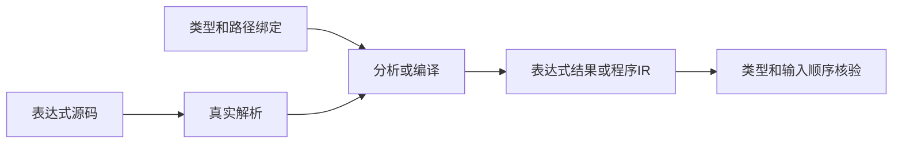
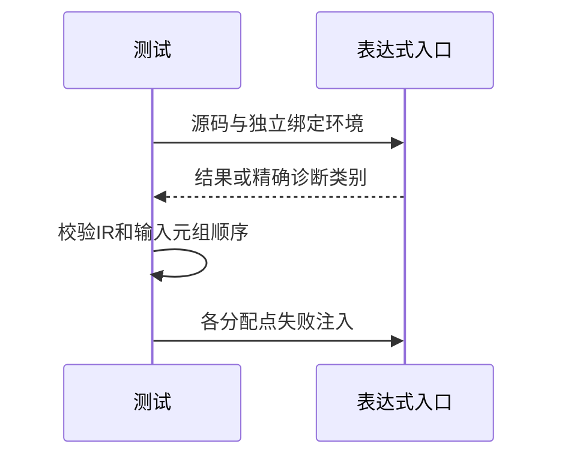

# 表达式绑定入口验证

## Intent：最终目标

为RX调用点依赖的公开表达式分析与编译入口补独立测试，验证路径绑定与类型约束。

## Data：可用证据

当前 compiler.expressions 提供 analyze 与 compile；Options接受共享类型、具名路径绑定和期望类型。编译入口将绑定按声明顺序装入输入元组。现有测试包只间接使用无绑定表达式。

## Edges：边界与限制

RX调用点仍在实现，当前测试不修改其源码，也不宣称调用点组件完成。测试仅调用公开编译器API，不复制生产路径匹配算法。

## Answer：交付与成功标准

两入口均验证合法路径、相邻前缀、重复和祖先冲突、无效名称、缺失类型、void、结果类型不匹配及分配失败。编译成功必须通过IR验证，输入元组顺序需与独立给定绑定一致。

## 实施结果

新增40个Zig测试：18种输入分别走analyze与compile（36项），另有两入口成功/拒绝的4个逐分配点故障注入测试。

合法场景为普通变量、$input.value路径、兄弟路径、root.a与root.ab相邻前缀、bool/u64不同类型绑定顺序和bool期望类型。负例覆盖重复路径、祖先/后代两种登记顺序、空名称、空路径段、关键字段、数字段、void绑定、越界绑定类型、越界期望类型、不兼容结果与缺失路径。预期诊断分别指定name、type_mismatch或contract，未将任意失败计为成功。

compile成功时调用validateIr，并独立检查程序Input元组各项与给定绑定类型顺序一致、Output类型正确；analyze成功时检查符号名、符号类型与结果类型。

`zig build test-expression-bindings --summary all`：4/4步骤40/40通过，日志 `/tmp/zxc-expression-bindings.log`。目录审计通过，日志 `/tmp/zxc-expression-bindings-audit.log`。格式检查、本次diff检查及2份草稿与正式文件逐字节一致性通过。新增专项已接入全包test步骤。

## 自我复核

本轮不修改生产代码，未发现新的生产缺陷。Input元组形状正确不证明生成代码实际按正确顺序求值，后续仍需宿主运行验证。没有测试XML属性位置映射、Context覆盖或Call.in联结；这些能力不能由表达式API通过推断完成。Test262审阅仍661/53597，JSONL目录仍63323，本轮40个API测试单列，不增加这两个数量。没有重跑全仓库回归。
