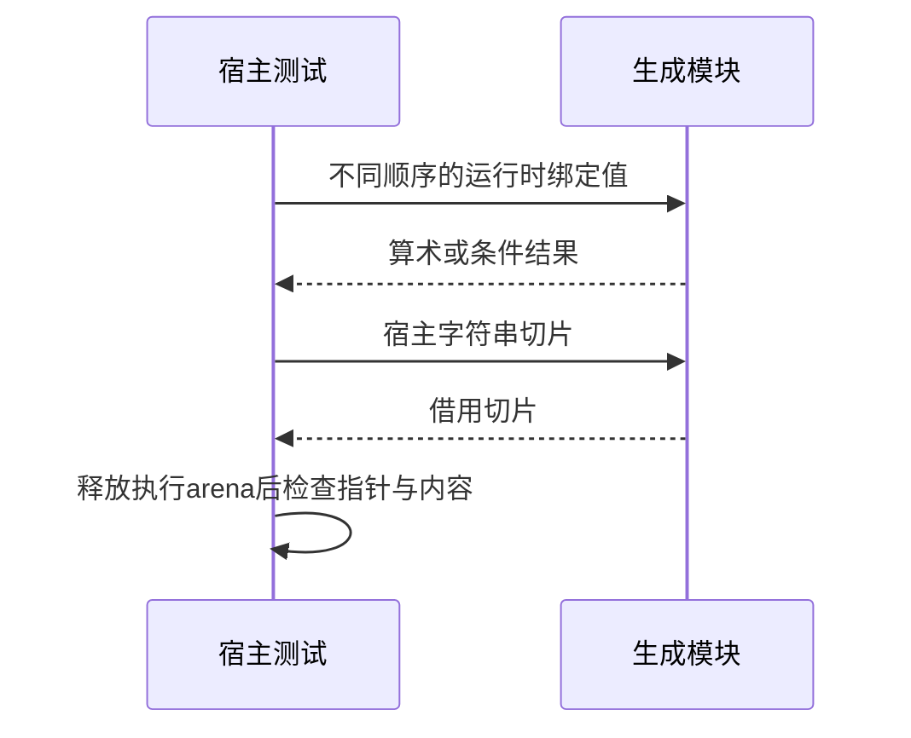

# 表达式绑定实际运行验证

## Intent：最终目标

通过生成代码的宿主执行验证表达式绑定顺序、短路分支和借用字符串。

## Data：可用证据

沿用现有Context运行构建机制，使用真实parseExpression、expressions.compile、validateIr与emitBundle。宿主输入和预期独立编写。

## Edges：边界与限制

不修改生产代码，不宣称RX调用点或完整应用已接通。用例单列为运行测试，不增加Test262审阅与JSONL目录数量。

## Answer：交付与成功标准

三个表达式模块：相邻路径名与声明顺序、带危险未选分支的条件、返回两路借用字符串。实际编译和执行成功，逐项检查值与字符串指针。

## 实际结果

新增9个独立运行测试：4个绑定顺序/相邻路径测试、3个动态条件测试、2个借用字符串测试。算术绑定顺序与表达式出现顺序相反，独立检查73、37、9、90。条件输入包括未选分支除零，另两次实际除法结果为9、25。中文与ASCII字符串分别走左右分支，释放执行arena后核对宿主指针及完整内容。

`zig build test-expression-runtime --summary all`：12/12步骤9/9通过，日志 `/tmp/zxc-expression-runtime-typed.log`。生成器先释放parse结果再验证IR并生成bundle。已接入全包test。审计通过，日志 `/tmp/zxc-expression-runtime-audit.log`；目录63323、上游661/53597不变。格式、草稿与正式5文件字节一致性、本次diff检查通过。

## 发现的工具链边界与自我复核

首次宿主直接传入 `&.{right,left}`，9项均失败，日志 `/tmp/zxc-expression-runtime.log`。读取实际生成代码确认其按公开Input布局读取字段；随后以显式 `std.meta.Child(program.Input)` 局部变量构造输入，9项全通过。

独立纯Zig `tuple_probe.zig` 不导入zxc，仅定义 Pair=struct{u64,u64} 和 noinline evaluate，仍复现隐式指针输入错误、显式布局输入正确。`zig run docs/2026-10-04/表达式运行测试草稿/tuple_probe.zig` 输出typed=73和37，inferred为异常大数，日志 `/tmp/zxc-expression-tuple-probe.log`。因此当前证据定位到所用Zig工具链的隐式元组指针转换路径，而非zxc表达式语义；尚未调查Zig内部根因或其他版本。保留原始失败证据和探针，不把它算作zxc通过用例。

已向用户指定实现会话发送复现和宿主构造建议。没有更改编译器生产代码；没有断言该工具链问题已修复。最终测试显式使用公开ABI布局，并未改变表达式或预期结果。RX调用点、XML诊断和完整应用流程仍需后续验证。
