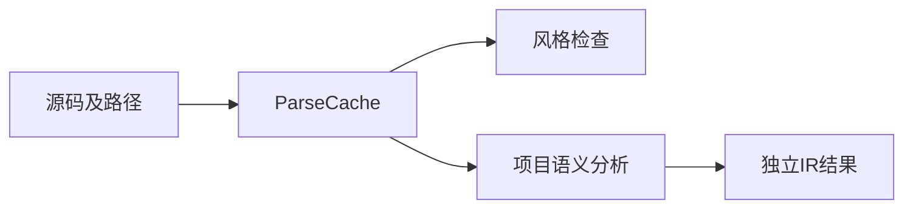
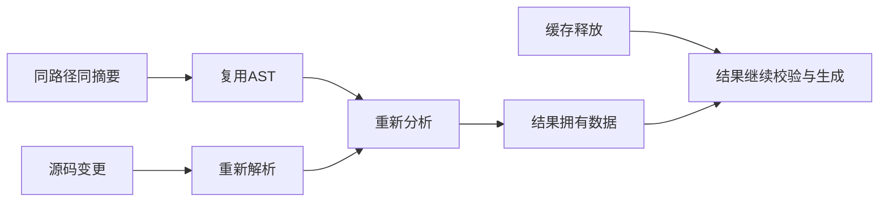

# 解析缓存复用与生命周期验证

## IDEA

- Intent：为新ParseCache建立复用、失效、路径身份和结果生命周期的独立测试。
- Data：当前ParseCache.get及compiler.analyzeProjectWithCache，缓存只复用解析，语义分析仍重跑。
- Edges：不证明持久语义缓存或热重载；直接get按传入路径缓存，路径规范化由项目入口承担。
- Answer：独立具名Zig测试、分配失败轨迹、缓存释放后IR校验与生成、专项日志。

## 执行计划

1. 验证内容命中、等长更新、路径隔离、输入复制及错误修复。
2. 验证项目规范化、root隔离、未变化AST的语义重检与旧IR存活。
3. 注入分配失败，运行专项并报告可复现缺陷。

## 执行结果

新增14个独立Zig测试：6个直接缓存行为、6个项目入口行为及2条分配失败轨迹。

直接缓存检查同路径同内容指针复用与计数、等长内容失效、不同路径隔离、调用者源码/路径被改写后的拥有关系、错误解析复用与修复、返回旧内容时重新解析。只对仍有效的缓存借用结果做断言，没有在条目替换后继续解引用失效parse指针。

项目入口检查风格检查与分析共享AST、第二次分析复用、规范化路径别名、不同root隔离、依赖签名变化触发未变化入口的类型错误、来源顺序变化时diagnostic.source_index更新，以及缓存替换/销毁后旧IR仍独立。两轮helper源码等长但增量分别1和2，明确检查新IR含2而旧IR始终含1，避免仅以validateIr通过掩盖旧数据被改写。旧IR在缓存销毁后仍能校验并生成Zig。

分配失败轨迹覆盖插入、命中、有效替换、无效替换、修复，以及多轮项目分析和依赖更新。只对这两条实际轨迹穷举，不将分配次数计入测试数。

最终在packages/test执行 `zig build test-parse-cache --summary all` 退出0，8/8步骤、14/14测试通过，日志 `/tmp/zxc-parse-cache-final.log`。新专项接入test包根依赖。格式、diff、草稿一致性通过；未修改生产实现，也未发现需通知实现会话的缺陷。

JSONL仍61,614，上游400/53,597，最新完整根阶段122。本轮14个Zig API测试独立于JSONL计数。

## 自我批判

- parsed/reused断言属于当前公开计数语义，不能推出持久缓存、语义产物缓存或热重载已经完成。
- 缓存不支持并发读写，本轮没有伪造并发安全结论。
- IR常量检查和代码生成验证了旧结果独立性，本轮未新增生成代码运行案例。
- 项目用两个模块验证失效和身份，未穷举native接口、包作用域与所有可达图组合。
- 新增模块记录与枚举来源元数据需要后续专门检查，不能从解析缓存通过外推。
