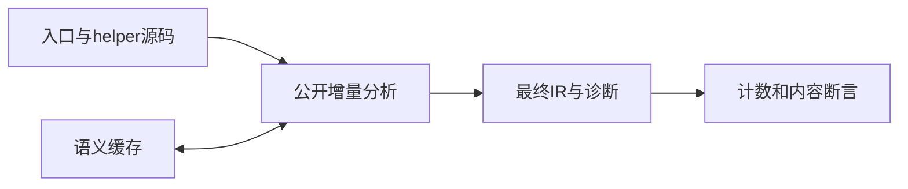
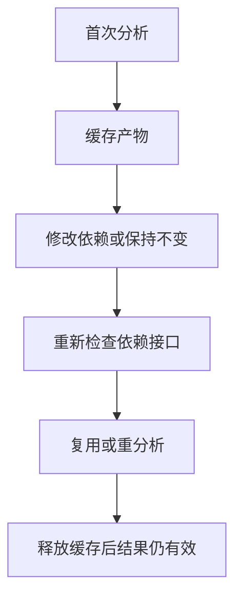

# 语义缓存复用失效验证

## IDEA

- Intent：确认语义缓存复用当前接口与函数体，避免命中旧结果掩盖依赖变化。
- Data：公开project.analyzeIncremental、现有双模块解析缓存夹具、最终IR校验。
- Edges：本轮测试进程内语义缓存，不冒充持久CLI命中；不修改生产。
- Answer：重复命中、函数体变化、签名变化与修复、路径/顺序、生命周期及分配失败测试。计数与有效IR内容同时断言。





## 结果

新增7个Zig测试：5个项目复用/失效/生命周期场景、2条分配失败轨迹。命令：

```sh
cd packages/test
zig build test-semantic-cache --summary all
```

专项6/6步骤、7/7测试通过，日志 `/tmp/zxc-semantic-cache.log`，已接入根test。

- 首次分析两个模块后analyzed=2/reused=0；第二次相同项目analyzed仍2、reused=2，完整IR有效且helper常量为1。
- helper函数体从加1改成加2：累计analyzed=3、reused=1。新IR常量为2，旧IR仍为1，说明入口复用没有把旧helper带回结果。
- helper参数/输出改成bool：未变化的入口报type_mismatch，source_index=0，未错误命中。恢复原helper后两模块复用成功。
- 源码输入反序及路径规范化后，两个模块继续复用。
- 命中得到的结果在缓存条目替换与缓存销毁后仍保持原内容，完整IR检查和生成成功。
- 逐分配失败覆盖首次填充、命中、替换，以及命中后签名拒绝的完整流程。

正式测试 `packages/test/tests/incremental/semantic_cache/`，对应3份草稿 `docs/2026-10-04/语义缓存测试草稿/`。格式、diff及草稿一致性检查通过，无生产修改和新缺陷通知。

## 自我批判

命中计数只作为辅助证据，最终IR和helper常量同时检查。尚未把增量结果生成的Zig重新编译执行，因此不把常量检查等同于端到端运行证明。未覆盖Context摘要、native声明更新、依赖导入绑定改变及损坏缓存恢复，下一步应分别增加。

本轮只验证进程内缓存，不代表CLI持久读写和跨进程命中。目录61,614、上游400/53,597不变，最新完整根阶段122；阶段125四个失败未回归。

