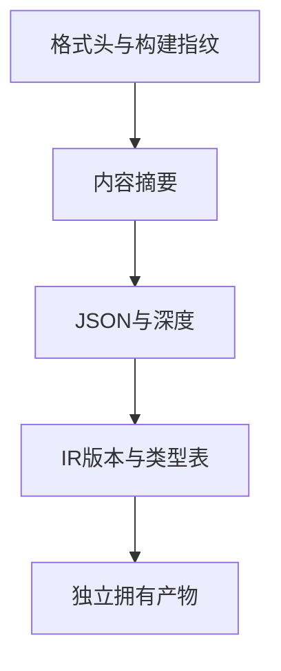

# 语义缓存编解码验证

## IDEA

- Intent：验证持久缓存格式的完整性、版本边界、独立拥有数据及恢复后的可联结性。
- Data：公开SemanticCache.codec与真实四模块产物夹具。
- Edges：本轮直接测试编解码，不把内存轮转当作跨进程CLI缓存命中；不修改生产。
- Answer：往返联结、损坏/版本拒绝和分配失败测试；日志、草稿和可续接记录。解码后能释放输入字节，完整项目可联结校验；非法载荷拒绝且无泄漏。




## 结果

新增13个Zig测试：2个往返/生命周期、9个格式及载荷边界、2条分配失败轨迹。执行：

```sh
cd packages/test
zig build test-cache-codec --summary all
```

专项8/8步骤、13/13测试通过，日志 `/tmp/zxc-cache-codec.log`。已接入根test。

往返使用真实四模块夹具，检查源码摘要、上下文摘要、导出、枚举名称/成员/来源；缓存字节被覆盖释放后，解码结果仍可读取。四份解码产物在原分析及编码字节释放后反序联结，检查两个函数、一个名义来源、完整IR及Zig生成。

拒绝空/截断数据、其他编译器指纹、未知格式标记、载荷摘要不匹配、损坏分隔符、有效摘要下的非法JSON、IR版本0、无效类型表，以及2050层嵌套JSON。正常编码、正常解码分别穷举分配失败并释放。

测试位于 `packages/test/tests/incremental/cache_codec/`；4份对应草稿位于 `docs/2026-10-04/缓存编解码测试草稿/`。格式、diff与草稿一致性通过，无生产源码修改或新缺陷通知。

## 自我批判与后续

本轮格式测试明确绑定v1缓存协议的头部长度与分隔位置，格式升级时需要同步审阅；不是生产用例硬编码。额外构造合法摘要旨在隔离校验阶段，内容摘要不构成来源认证。

2050层数组被拒绝只证明该深度的输入安全返回InvalidCache，不能仅凭同一错误码区分深度门禁与schema门禁，也不证明2048是完整可用深度。本轮decode仅检查类型表，不要求它独立完成全部模块IR验证；完整IR由后续联结检查。

未覆盖真实文件写入、跨进程命中、缓存新旧替换和CLI损坏恢复，也未执行解码后的生成程序；这些需进一步独立验证。目录61,614、上游400/53,597不变，最新完整根阶段122；阶段125四个失败本轮未回归。

