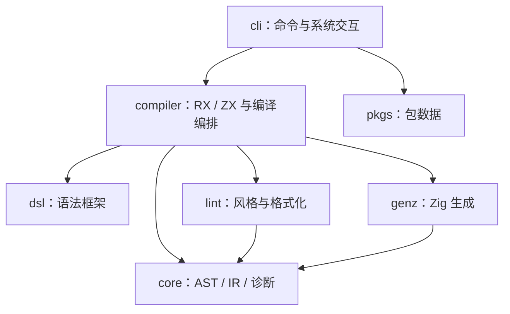
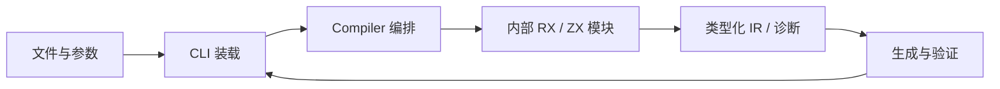

# 语言与命令行包边界调整计划

## Intent：最终目标

以用户最新决定为准：RX 与 ZX 合入 compiler，语言实现按内部目录组织；CLI 独立为 packages/cli；仅共享 AST、IR、诊断数据下沉到轻量 core。保留 dsl、lint、genz 独立职责，避免包依赖环。

## Data：可用证据

- 原 application 混放了 RX 编译语义与 CLI 装载；用户要求消除歧义。
- 用户随后选择合并 RX/ZX，并确认共享数据保留 core 的方案。
- lint 与 genz 都需要 ZX AST/IR；若其依赖完整 compiler，而 compiler 又调用它们，会形成包依赖环。
- 旧 RX 推导直接引用 ZX 内部源码，导致相同 Zig 文件属于两个模块；需改为同包语言模块接口。
- compiler 构建原先通过 zxc 可执行文件生成运行用例，CLI 拆包后必须迁移这组执行测试，避免 compiler→cli→compiler。

## Edges：边界与限制

不新增测试、不做 UI 验证、不改变语言契约、不恢复 Context。保留其他会话工作。core 不含解析、类型检查、格式化、代码生成或文件 I/O。未完成自动推导单独验证，不能因包合并宣称 RX 流程全部可运行。

## Answer：交付格式与成功标准

- compiler/src/zx：ZX 解析、分析、模块联结、所有权、IR 校验。
- compiler/src/rx：RX 语法、模块图与语义分析。
- core/src：共享 AST、IR、源码位置、诊断数据。
- cli/src：命令分发、文件装载、包管理命令、工具链和 watch。
- 根构建、发布、缓存身份、既有测试及文档引用同步；不存在旧 application 目录、RX/ZX 独立包或反向依赖。
- 既有相关回归、独立包构建、根构建验证后记录实测结果与自我复核；按原授权提交并 push。

## 执行记录与自我复核

包迁移进行中。命名规则保持在 lint；不将行为算法塞进 core。构建模块可继续命名 zx / rx 以表示语言，不再代表独立包。CLI 驱动的既有运行回归及示例迁至 CLI 包。旧“语言包独立”与“application 改名 rx”方案被本计划替代。

## 完成内容与验证

RX/ZX 源码、测试和契约已按最终方案迁移；旧独立包配置与 application 模块删除。CLI 独占 zxc artifact、命令入口、YAML/工具链资源与执行回归。规则文档、网站示例路径、CI 独立验证脚本和现有审计记录的 IR 契约路径同步。core 无解析或类型算法；命名规则仍在 lint。八个本地包依赖图检查无环。

按既有用例验证，未新增测试：

| 范围                            | 结果                                                        |
| ------------------------------- | ----------------------------------------------------------- |
| 根构建                          | 14/14 steps                                                 |
| compiler 的 RX/ZX 与 API 回归   | 352/352                                                     |
| CLI 的实际生成程序与 Store 回归 | 34/34                                                       |
| 独立表达式、XML 与 RX 文本      | 184/184                                                     |
| 后端协议、发布与 app/lib 模式   | 61/61，23/23 steps；节点脚本亦通过                          |
| 包归档与存储                    | 59/59，15/15 steps                                          |
| 既有生成器 --check              | 107/107                                                     |
| audit_matrix                    | 通过；该审计不代表运行时验证                                |
| 空 PATH 独立发行                | 内嵌 Zig、标准库、C 模块真实构建与执行通过                  |
| 只包含本次暂存内容的独立副本    | 根构建 14/14、compiler 352/352、CLI 34/34、既有表达式 64/64 |

验证输出位于 [验证目录](语言包与命令行职责调整/验证)。独立副本的表达式检查复用工作区已有测试，仅复制既有入口与构建接线。

整仓回归第一轮启动早于最后几处测试私有源码引用及契约路径同步，报告了旧路径失败，也仍包含此前四项 legacy 名义类型失败。旧路径所涉命令行、发布、归档、存储和生成器已针对修正后的状态通过上述回归。本记录不将整仓状态写成全部通过。

## 自我批判

本次按证据修正了最初“只改目录名”和随后“拆出语言包”的思路，最终以用户确认的 compiler + core + cli 边界为准。保留独立构建模块用于共享 Zig 类型身份，不用复制源码或兼容目录绕过循环。没有恢复 Context，没有声称包调整改善了运行时性能，也没有将尚未完成的 RX 自动推导草稿纳入本次提交。
