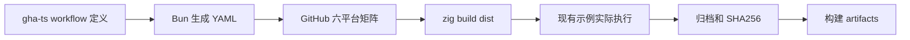

# 跨平台构建发布实施计划

## Intent：最终目标

使用 Bun 执行 TypeScript workflow 源码，通过 `@jlarky/gha-ts` 生成 GitHub Actions YAML；构建 Linux、macOS、Windows 的 x86_64 与 aarch64 zxc 分发包。

## Data：可用证据

- 已阅读用户指定 polywise/.github/tsflows/standalone.ts 及 scripts/build_workflows.mjs：workflow 定义调用 createSerializer，并使用 Bun YAML 输出。
- 当前根 install 还关联 DSL 示例与 RX 测试构建，不适合作为纯分发入口。compiler 产物运行时需要配套 standard 源码；静态 libyaml 许可证必须包含。
- [GitHub runner 官方列表](https://docs.github.com/en/actions/reference/runners/github-hosted-runners)提供 Linux、macOS、Windows 两种架构 runner；[Bun setup](https://github.com/oven-sh/setup-bun)与 [Zig setup](https://github.com/mlugg/setup-zig)用于安装固定版本工具链。

## Edges：边界与限制

- 新增 dist 构建步骤只安装 zxc、标准库源码与许可证，不执行目标程序或顺带运行测试。
- 每个目标在对应架构 runner 上构建并执行现有示例，不能仅以 workflow YAML 能解析证明二进制可用。
- 工作流依赖独立放在 .github，锁定 Bun 与 gha-ts 依赖；不为生成 YAML 安装整个应用 monorepo。
- GitHub Actions 引用固定提交，默认权限只读；上传构建 artifacts，不擅自创建版本标签或公开 release。
- 归档保留 bin/share 目录布局和 Unix 可执行权限，校验和随包输出。用户生成应用仍需 Zig 0.16.0，当前不将 Zig 编译器捆绑入 zxc。
- 不新增测试用例，不执行浏览器 UI；复用仓库现有示例进行分发验证。GitHub 平台运行需以真实任务结果为准。

## Answer：交付与成功标准

交付独立 `zig build dist`、Bun workflow 生成入口、固定依赖锁、六平台矩阵、归档与校验和，以及生成文件一致性检查。先完成本地构建与 smoke，再提交并 push，检查六个平台实际 job 结果；失败优先修复。

## 自我复核

生成 YAML、交叉编译成功与目标系统可执行是三个不同的验收层次。每层都记录真实证据，不能用本机单平台通过替代整个矩阵通过。

## 本地实施结果

- 已新增 `zig build dist`，仅 9 个步骤安装 CLI、标准库、根 LICENSE 与 libyaml 许可证；不会执行 DSL 示例或目标平台测试。
- `.github` 独立 Bun 依赖锁与 TypeScript 源码已生成 YAML，类型检查、冻结依赖安装和生成一致性检查通过。Bun YAML 输出经同版本 Prettier 规范化，消除序列化器行尾空白；源码与生成文件共同接受仓库格式检查。
- 本机 x86_64 macOS 完整打包通过，现有 quote 示例输出 `{"amount":80,"factor":0.75}`，归档 SHA256 复核通过。
- x86_64/aarch64 Linux musl、x86_64/aarch64 Windows GNU、aarch64 macOS 均交叉构建通过，和本机合计覆盖六种目标。此证据只证明其他五种目标编译成功，执行证据仍待 GitHub 对应 runner。
- 交叉构建发现尚未提交的包管理 YAML 绑定在 Windows ReleaseSafe 下会触发 MinGW fortify 内联函数翻译缺陷。局部绑定翻译时取消 `_FORTIFY_SOURCE`，避免翻译不使用的内联包装；libyaml C 库编译选项保持，Windows 双架构重建成功。该修改保留在包管理 feature 中，未混入 CI 提交。

## GitHub 验证

工作流在 master push、pull request 和手动触发时执行；六平台实际执行结果将在提交后记录。Artifacts 只包括脚本生成的 tar.gz 与 sha256；允许该明确目录位于 .zxc 下，不上传其他工作区隐藏文件。

首轮 run 37136681784 中 Linux 双架构与 macOS ARM64 已通过，Windows ARM64 的 Zig 构建进程崩溃。其工具链问题与 [Zig #31865](https://codeberg.org/ziglang/zig/issues/31865) 对应（官方 issue 标题明确为 LLVM 的 Windows ARM64 thread_local TLS 序列错误）。改用官方 x64 Zig 0.16.0 包并固定官方 SHA256，在 Windows ARM64 runner 的系统兼容层运行；zxc 与示例仍显式指定 ARM64 目标，不能以 x64 示例执行代替 ARM64 验收。

## 最终结果

[第二轮 GitHub Actions](https://github.com/MatrixAges/zxc/actions/runs/37137036964) 在提交 `e6389b1429adeca9b5ca71a3cff7871aabfbc440` 上成功：工作流校验与六个平台 job 全部 success。六个平台各自完成分发构建、现有 quote 示例构建和执行、tar.gz 与 SHA256 上传，API 确认六个 artifact 均存在且未过期。

本地另下载该轮 macOS x86_64 artifact，验证 SHA256、解压权限并实际执行下载的 zxc 编译现有 quote 源码；再下载 Windows ARM64 artifact，验证 SHA256 与 PE Aarch64 文件类型。没有将交叉编译结果冒充原生执行结果，也没有将兼容层运行的 x64 构建工具冒充 ARM64 Zig 工具链。

实现提交 `c198777` 与兼容修复 `e6389b1` 均已 push。此 feature 的代码与六平台执行验收完成；包管理、Context、GCS 对齐、增量编译等其他目标仍独立进行。
