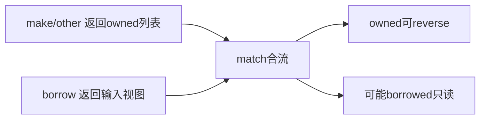
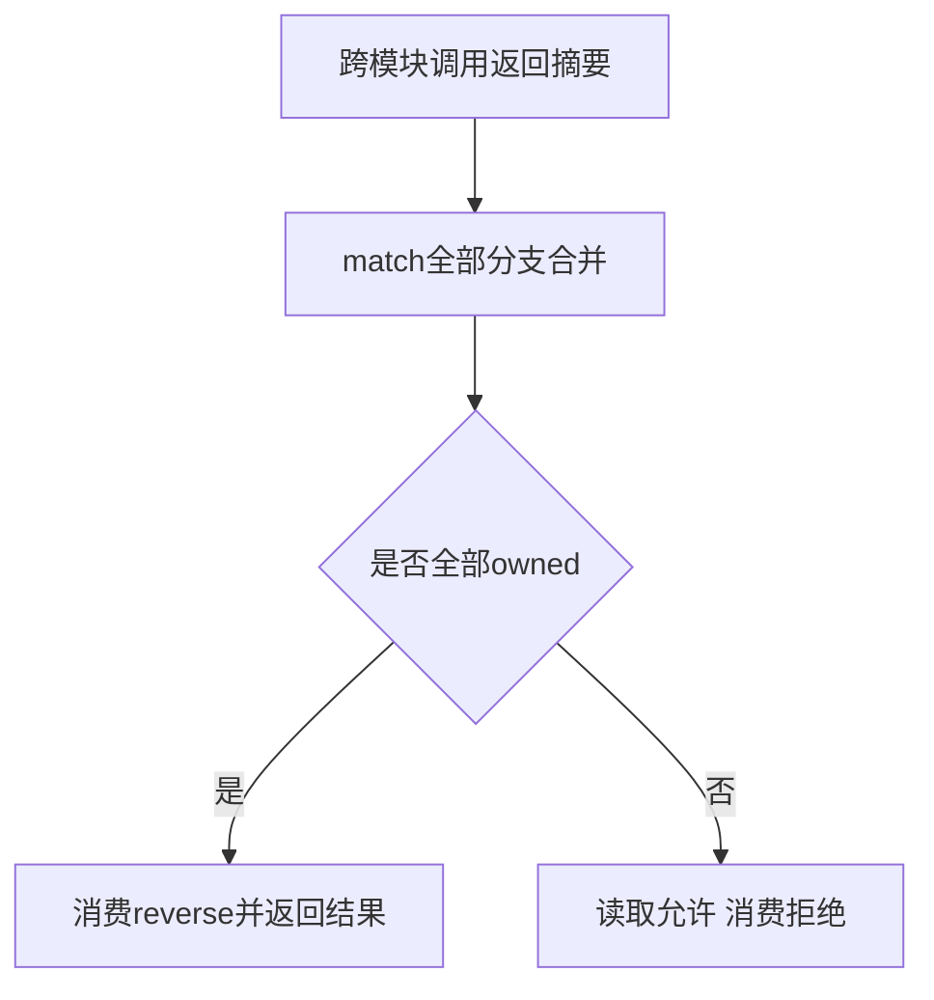

# 跨模块匹配所有权验证

## Intent：最终目标

验证跨模块列表返回值经 match 合流后保留正确所有权：全新列表各分支可继续消费，任何分支可能借用输入时只能保持只读。

## Data：可用证据

现有 ownership/returns_test.zig 已区分普通 imported call 的 owned/borrowed；阶段 91 已验证多文件 match 枚举身份与惰性。本轮连接 imported return summary、match 分支合流与消费式 reverse。

## Edges：边界与限制

不更改保守所有权策略。混合分支即使某次输入选择 owned 分支，静态上仍必须拒绝消费。执行测试核对值和列表长度，不声称已经证明全部指针身份或借用生命周期。

## Answer：交付与成功标准

真实执行两种 owned helper 选择后 reverse，以及 owned/borrowed 混合结果的合法读取；前端三组对照检验全 owned 接受、借用在首臂或 fallback 均拒绝。使用既有多文件 runtime 和编译器 API，登记全部依赖。

## 执行结果与自我批判

新增 24 个登记执行案例：6 个全 owned 分支选中后 reverse，以及 18 个 owned/borrowed 混合结果合法只读返回，覆盖空列表、单元素和多元素。两个 owned helper 返回不同长度，验证分支选择后输出顺序和长度。

另新增 3 个 Zig 前端对照：两分支 owned 接受且输出摘要为 owned；borrowed 位于首臂或 fallback 都返回主模块 ownership 诊断。已与阶段 91 的两个枚举测试共用 test-match-module-types 入口。

最终普通执行专项 **900/900 步骤、42,642/42,642 测试通过**，日志 `/tmp/zxc-match-ownership-final.log`；模块类型/所有权专项 **6/6 步骤、5/5 测试通过**，日志 `/tmp/zxc-match-ownership-types.log`。初轮 owned 夹具因 match 绑定与消费解构之间缺分组空行被拒绝，修正后完整专项重跑通过；非生产缺陷。TypeScript、生成一致性、目录审计、格式与 diff 通过。

登记 57,745（runtime 42,642、其他不变），新增 3 个 Zig 测试单独统计；上游审阅仍 328/53,597，最近完整根阶段 90。没有生产源码修改或新实现缺陷。

自我批判：混合分支拒绝体现保守静态合流，不能只因某个运行输入选中 owned 就放宽。执行验证比较结果值，没有检测全部指针身份、arena 失效后的访问或所有嵌套聚合形态；不据此声称全部所有权问题已经排除。
