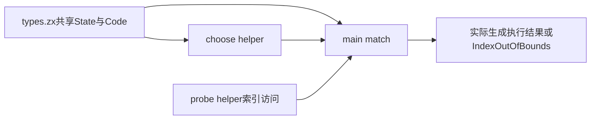
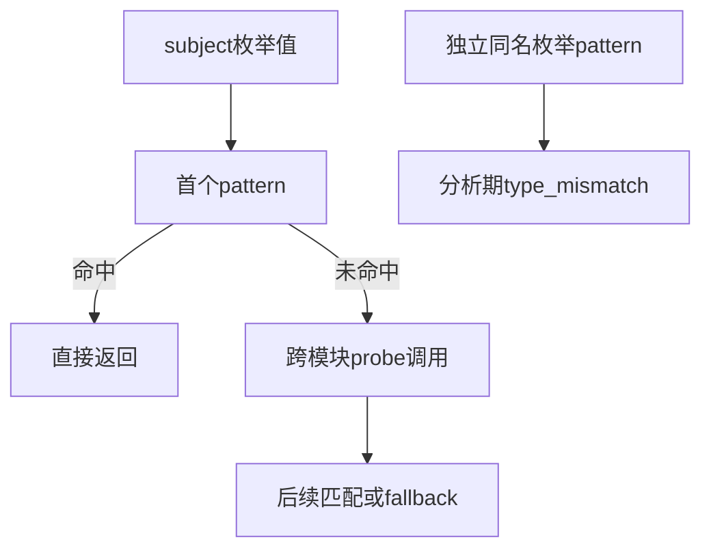

# 跨模块匹配身份与惰性验证

## Intent：最终目标

验证 match 在多文件工程中保持枚举身份、共享类型与模式调用的惰性。重点防止同名同成员枚举被错误合并，以及未选中后续 pattern 仍调用 helper。

## Data：可用证据

只读分析对照现有单模块 match 与 compiler/modules 测试：runtime 构建已支持 suite.sources 显式登记依赖，无需新执行器。project.analyze 支持多源文件诊断位置校验。

## Edges：边界与限制

不通过隐式副作用污染纯 ZX helper；以空列表访问的 IndexOutOfBounds 观察后续模式是否执行。这个观察不能证明 subject 调用次数，单次调用由既有探针测试负责。源码仅添加到测试目录。

## Answer：交付与成功标准

真实执行共享枚举和类型 alias、不同导入顺序、经不同相对路径引用同一类型文件、共享枚举 pattern helper 与惰性模式。前端测试区分两个不同文件声明的同名枚举和共享文件的正向对照，核对 type_mismatch 与 main 中 pattern 的范围。

## 执行结果与自我批判

新增 18 个登记执行案例：canonical/reordered 各4、shared_pattern 4、lazy 6。共享 State 与 Code 从 types.zx 导出，主模块与 nested helper 经不同相对路径引用；成功覆盖三枚举值、不同导入顺序及 helper 返回的 pattern。惰性组含首臂命中时跳过空列表 helper、必须调用时 IndexOutOfBounds、后续命中和 fallback。

另增 2 个 Zig 前端测试：独立 left_types.zx/right_types.zx 声明完全同名同成员 State，match pattern 的跨类型调用必须返回 type_mismatch，source_index 为 main 且 span 精确覆盖 right(in)；将两个 helper 改为共享 left_types 后接受并通过 IR 校验。

普通执行专项 **892/892 步骤、42,618/42,618 测试通过**，日志 `/tmp/zxc-match-modules-runtime.log`；前端专项 **4/4 步骤、2/2 测试通过**，日志 `/tmp/zxc-match-module-types.log`。TypeScript、生成一致性、审计、Zig 格式与 diff 通过。所有依赖源码已登记为构建输入，前端新步骤 test-match-module-types 接入根测试。无生产修改或新缺陷。

登记总数 57,721（runtime 42,618，其余不变）；两个额外 Zig 测试独立统计。Test262 审阅仍 328/53,597，本轮是 ZX 特有组合验证。最近完整根为阶段 90。

自我批判：跨模块空列表失败能观察后续 pattern 是否执行，但不能证明 subject 恰好调用一次；未将其冒充探针轨迹。枚举身份和惰性覆盖不代表聚合返回值/所有权组合已全部覆盖，后者仍需独立扩展。只读辅助分析用于定位现有框架，正式测试与结果由主会话实现验证。
