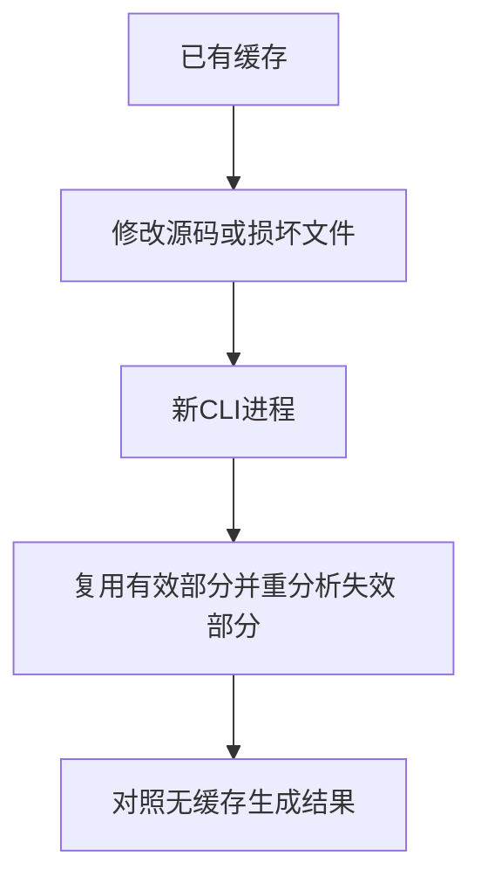

# 跨进程持久缓存验证

## IDEA

- Intent：确认CLI独立进程之间的缓存命中、失效、禁用和损坏恢复符合真实编译结果。
- Data：当前CLI --cache-stats/--no-cache、语义缓存文件与生成Zig。
- Edges：临时目录隔离，不修改生产；普通编译入口，本轮不覆盖verify/FPGA。
- Answer：Node驱动独立CLI进程，精确统计、文件内容、生成结果以及实际Zig执行共同验证。保留草稿和日志。




## 结果

新增5个Node场景，每次CLI调用都启动独立进程。专项10/10构建步骤、5/5 Node测试通过，日志 `/tmp/zxc-persistent-cache.log`。入口：

```sh
cd packages/test
zig build test-persistent-cache --summary all
```

1. 冷编译analyzed=2、written=2；第二进程loaded=2、reused=2、analyzed=0、written=0。两版生成文本一致，热缓存输出另用Zig真实编译执行，输入7得到8。
2. helper由加1改加2后，loaded=2、analyzed=1、reused=1、written=1；生成代码确实改变且与禁用缓存生成一致，再次运行全命中。
3. 一份磁盘条目截断后discarded=1，另一份加载复用；坏条目重写为v1，下一进程恢复全命中。
4. --no-cache面对两份损坏哨兵仍正常生成，报告disabled，两份磁盘哨兵未变化。
5. 两个模块缓存文件内容互换，虽然各自摘要有效，路径校验仍丢弃两份并重新分析写入，生成结果与冷编译一致。

正式测试位于 `packages/test/tests/incremental/persistent_cache/`，2份草稿位于 `docs/2026-10-04/持久缓存测试草稿/`。已接入根test。包级TypeScript检查通过（`pnpm --filter @zxc/test typecheck`，日志 `/tmp/zxc-persistent-cache-typecheck.log`），Zig格式、diff及草稿一致性通过。无生产修改或新缺陷通知。

## 自我批判

统计只是辅助证据，结合文件哨兵、生成结果比较与一条真实运行断言。helper变化场景对照无缓存生成，但未再执行变化后的程序；verify/FPGA、并发写入、只读缓存目录、构建指纹升级和Context/native失效未由本轮证明。

日志中Node测试数5不包含作为其中一项内部步骤执行的1个Zig断言，不重复增加独立场景计数。临时项目均finally清理。目录61,614、上游已审阅400/53,597不变；最新完整根阶段122，阶段125四个失败未回归。

