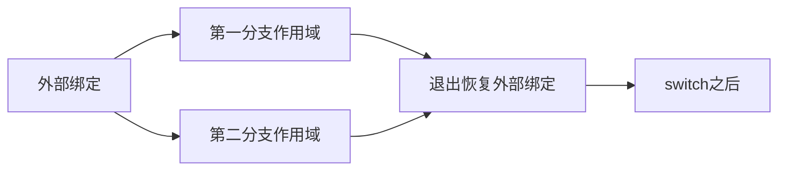
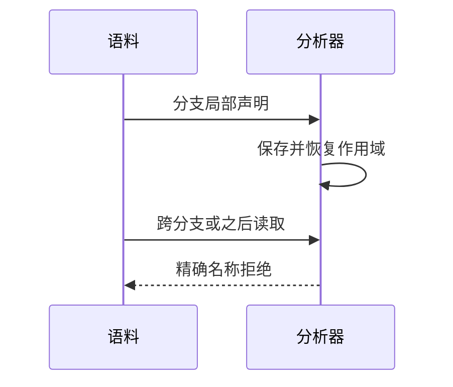

# 选择语句作用域验证

## Intent：最终目标

验证switch各分支的局部绑定不会泄漏到其他分支或switch之后，按当前无分号语法执行。

## Data：可用证据

分析器分别对每个case调用block，block退出恢复active绑定集合。当前解析器已迁移为换行结束语句；此前带分号及return跨行结果仅属历史语法证据。

## Edges：边界与限制

本轮只新增无分号语料，不并发修改实现会话正在迁移的旧生成器。ZX分支独立作用域与JS整个CaseBlock的词法环境不同，不增加虚假Test262关联。Context专项已删除。

## Answer：交付与成功标准

跨分支与分支后读取精确name拒绝，同名局部在独立分支合法，外部绑定可被分支读取；实际运行验证两个分支结果。

## 实际结果

新增10项：6前端（四种局部名称泄漏拒绝、同名分支局部与外部读取两项成功），4实际运行（两个合法形态的true/false路径）。21/21步骤10/10通过，命令 `zig build test-switch-scope test-frontend -Dfrontend-filter=language/statements/switch_scope --summary all`，日志 `/tmp/zxc-switch-scope-final.log`。

独立JS模型为每个case显式加块，再执行四个输出；四个错误span均核对为local。日志 `/tmp/zxc-switch-scope-reference.log`。生成器--check、类型检查、覆盖审计通过；六份正式文件与草稿一致，本轮文件空白检查及build文件fmt通过。

目录63887（前端5020、普通运行46653）；上游861/53597及关联4154不变。本轮是原生ZX作用域覆盖，无新增Test262关联。

## 自我复核

首轮CLI因const与return之间缺分组空行报spacing；补齐语料空行后完整链通过，没有放宽格式要求。分析器单独通过不等于CLI可编译，已分别验证。

并行无分号迁移正在批量改动旧语料，packages/test整体diff检查报告许多迁移中文件尾部空格；未擅自改写这些文件或宣称整体diff通过。本轮新增文件逐行空白检查通过。

当前return解析遇换行已为空返回，旧阶段219的ASCII跨行返回1结论仅属历史语法；已通知实现会话专项调整旧生成器及预期，并标记历史文档。未声称全套迁移完成，未运行完整入口。Context注入专项已删除。
