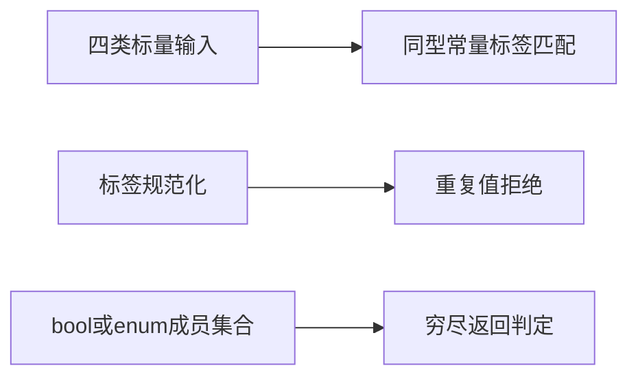
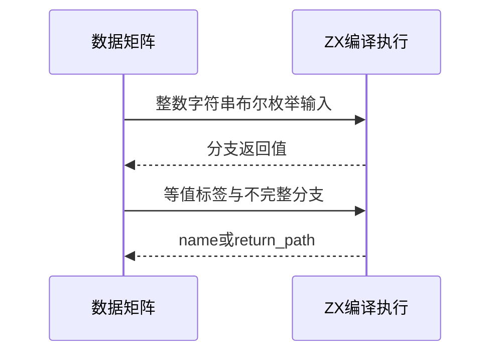

# 选择语句标量与穷尽性验证

## Intent：最终目标

覆盖switch支持的整数、字符串、布尔与枚举匹配，验证重复标签规范化及穷尽返回。

## Data：可用证据

当前switch分析按IR常量值判断重复，明确把0与-0视为同一标签；bool两个case及enum全部成员可无default完成返回。既有调用轨迹没有覆盖这些类型组合。

## Edges：边界与限制

本轮为ZX原生特性测试，不新增Test262关联或声称JS重复case规则一致。enum输入通过u8映射到成员，保持宿主JSON协议稳定。Context专项已移除。

## Answer：交付与成功标准

四类型真实运行、七种重复标签、bool/enum不完整与default补齐对照。精确执行运行值，分析失败代码，独立核对预期并审计目录。

## 实际结果

新增27项：16实际运行（整数4、字符串6、bool2、enum4），11前端（七组等值标签重复拒绝、bool/enum部分覆盖各有default与无default对照）。字符串包括空值、LF、TAB、汉字和未匹配值；enum完整成员无需default。

`zig build test-switch-scalars test-frontend -Dfrontend-filter=language/statements/switch_scalars --summary all`：29/29步骤27/27通过，日志 `/tmp/zxc-switch-scalars.log`。独立JS按实际函数体执行16个输出，并确认七组重复标签的值相等；穷尽性保留为ZX静态规则，不由JS推导。日志 `/tmp/zxc-switch-scalars-reference.log`。

生成器--check、TypeScript、审计、fmt及本轮diff通过；十份正式文件与草稿字节一致。目录63877（前端5014、普通运行46649），上游仍861/53597，关联4154；无新增上游审阅或关联。

## 自我复核

enum的u8输入255映射Third属于显式输入适配，不声称枚举允许非法序号。JS允许重复case，而此处只用JS验证标签值相等，ZX拒绝由自身契约及实际前端结果证明。

未构造超出安全整数范围的JS参考值；整数案例仅-1到2及标签1000。0/-0按整数标签等值，不外推f64 switch支持。未修改生产实现或运行完整入口；Context注入专项已移除。
