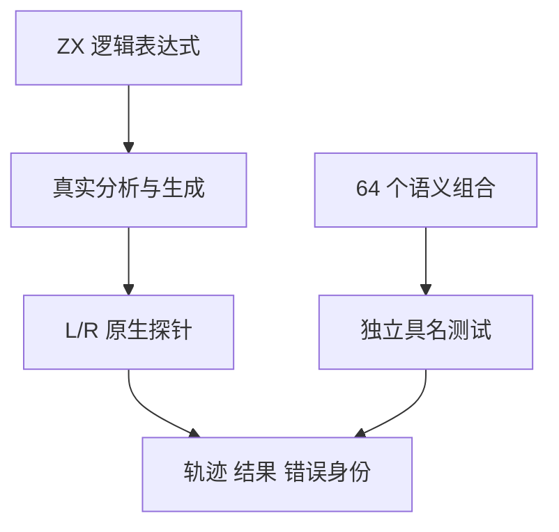
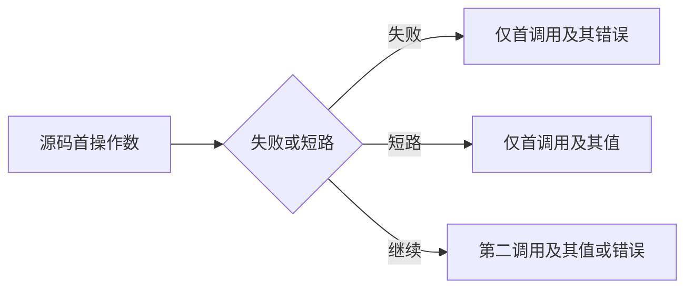

# 逻辑短路求值顺序验证

## Intent：最终目标

为 Test262 逻辑与或剩余顺序文件提供可观察的左右调用、短路及不同错误优先级证据。保持静态语言契约，不引入赋值表达式或运行 throw。

## Data：可用证据

上一阶段各保留三个 A2.4_* 文件。既有原生探针记录 L/R 调用并分别返回 LeftFailure/RightFailure，已经用于乘法求值顺序。当前 ZX &&/|| 保持短路；仅真值表不能证明被跳过的操作数没有执行。

## Edges：边界与限制

- 测试探针的调用记录只用于观测编译器行为，不作为向应用开放可变全局状态的语言能力。
- 两种逻辑运算、两个源码顺序、左右真值与各自是否失败分别组合，64 个具名测试独立失败。
- 用原生数值返回值与输入比较构造 bool 操作数，不改既有外部接口，也不以结果常量替代真实调用。
- 分开检查调用轨迹、错误身份和结果；发生首个错误后不得执行后续操作数。
- 上游赋值、隐式全局与运行 throw 仍需明确拒绝或设计差异证据，不能仅凭轨迹测试直接登记全部六个文件。

## Answer：交付与成功标准

复用既有分析/生成工具与探针，新增逻辑程序、检查器和缓存内具名测试生成器，接入 test-evaluation-order 与默认 test。运行专项后再关联上游；新增 Zig 测试与 JSONL 登记数分别计数。

## 执行与自我批判

已完成下述专项。每个参数组合生成独立具名测试；探针仅用于观测，不等同生产宿主的副作用能力。未发现生产失败，因此本阶段无需向实现会话发送缺陷通知。

## 目录登记与逐文件审查

64 条轨迹案例位于 `tests/runtime/evaluation_order/logical.jsonl`，每条含实际输入、精确 trace，以及 bool 结果或 LeftFailure/RightFailure。suites 新增 evaluation_order 分类，登记审计统一计数，专用发射器生成缓存内 Zig test；未将 64 个组合藏在单个 Zig 测试循环中。原乘法单个历史测试仍独立保留，后续全特性粒度审查继续。

另新增八条赋值表达式拒绝案例：AND/OR 各有已声明左赋值、右赋值、先读未知名再赋值、隐式全局创建四种，全部在解析期于等号的精确位置拒绝。

| 上游文件族（AND/OR 各一份） | 适配证据与差异 |
| --- | --- |
| A2.4_T1 | 真实 LR/RL 调用轨迹、仅 L 的短路轨迹和对应结果；两种赋值表达式明确语法拒绝，不声称提供共享变量更新 |
| A2.4_T2 | 两侧均失败时只出现首调用及其错误；交换源码顺序则交换首错误；仅右侧失败且需要右值时记录 LR 与 RightFailure；源级 throw 不提供 |
| A2.4_T3 | 原含赋值表达式精确解析拒绝；单独未知名读取关联既有 name 诊断；隐式全局创建另有拒绝，不假称支持运行 ReferenceError 或成功创建全局 |

六个文件均为 adapted。源码 SHA 与锁定索引匹配；结果、轨迹和诊断均由审计核对关联案例。logical-and/logical-or 查询各剩 0 个未审查文件，全局仍有 53,347 个未审查，不能外推为完整 Test262 已完成。

## 专项结果与自我批判

首次 64 条轨迹验证通过；登记为 JSONL 后复跑仍通过。联合 test-evaluation-order 与 test-frontend 为 14/14 步骤、3,121/3,121 测试通过：64 个新轨迹、一个既有乘法测试、3,056 个前端案例。日志 `/tmp/zxc-test262-logical-order-final.log`。

TypeScript、生成一致性与矩阵审计通过。目录共 52,952：runtime 38,686、frontend 3,056、evaluation_order 64、safety 464、RX 10,446、Store 236。上游已审查 250（134 adapted、102 equivalent、14 excluded），关联 713。无生产修改。

自我批判：探针能证明调用顺序与错误传播，不能证明任意副作用或并发宿主语义；原 JavaScript 赋值与隐式全局本身仍不提供。审查理由分别保留这些差异，而非把合法原生探针当作原程序完全等价替身。根回归最终为 902/902 步骤、52,948/52,948 条 Zig 测试通过，日志 `/tmp/zxc-test262-logical-order-root.log`。格式与 diff 检查也通过。
