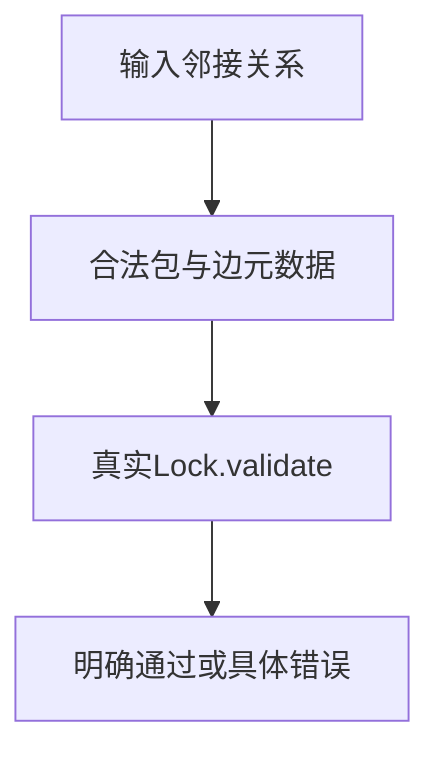
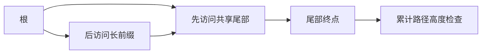

# 锁文件依赖图边界验证

## Intent：最终目标

验证真实pkgs.Lock依赖图校验在环、共享子图和深度边界上的正确性，尤其已遍历节点不能掩盖更长路径。

## Data：可用证据

当前Lock.validate为工作区节点逐一遍历，使用visiting/done状态和缓存子图高度；最大允许路径为256个节点。测试只构造输入图和明确预期，不复制生产遍历算法。参照package_index资源测试的逐分配失败方法。

## Edges：边界与限制

不修改生产源码。此轮不覆盖全部JSON字段解析、版本范围、包数量上限或磁盘安装事务；图校验成功不表示归档内容已验证。根工作区之外的工作区节点也是遍历根，未被工作区引用的归档必须拒绝。

## Answer：交付格式与成功标准

Zig测试按图夹具、行为边界和资源生命周期分层，调用生产Lock.validate。对正反排列、提前访问共享尾部、环和不合法边分别断言；专项接入根构建，保存结果、草稿及自我复核。

## 执行结果

新增17个Zig测试：15个图行为断言、2条逐分配失败路径。专项 `zig build test-package-lock-graphs --summary all` 已接入包根构建。

- 正向256节点链与反向排列、逐步命中缓存高度的256节点链均通过；257节点的两种排列都拒绝。
- 根先访问128号节点的共享尾部，再访问长前缀时，完整256节点路径仍通过、257节点路径仍拒绝；将两条根边交换顺序，同一超限图仍拒绝。
- 合法菱形共享子图通过；自环、两节点环、根之外工作区内的环拒绝。
- 越界目标、重复依赖名、未被工作区引用的归档、空包图均按具体错误拒绝。
- 菱形成功路径与环拒绝路径的逐分配失败注入通过，未发现内存泄漏。

首轮编译发现测试夹具遗漏当前Lock必填format_version；补充显式版本1后复跑，没有修改生产默认值。首轮日志 `/tmp/zxc-package-lock-graphs.log`；最终日志 `/tmp/zxc-package-lock-graphs-final.log`，退出0，**5/5步骤、17/17测试通过**。

Zig格式、diff及3份草稿逐字节核对通过。本轮没有TypeScript改动，不重复运行无关类型检查。没有生产修改或新增实现缺陷。

登记目录62,474、上游审阅533/53,597、唯一关联2,980不变；17个API测试不计入JSONL目录。最新完整根仍为阶段170，此轮新增专项尚未重新运行完整根。

## 自我批判

深度是完整路径长度，不能仅测试递归调用次数。故障注入循环不增加独立案例数，正反排列用于检查同一约束是否稳定。

资源故障注入只覆盖Lock.validate内部申请；夹具构造使用独立测试分配器，避免将输入生成失败误判为生产校验的故障路径。图预期由节点/边关系直接给定，不调用另一份DFS作为正确性判据。
