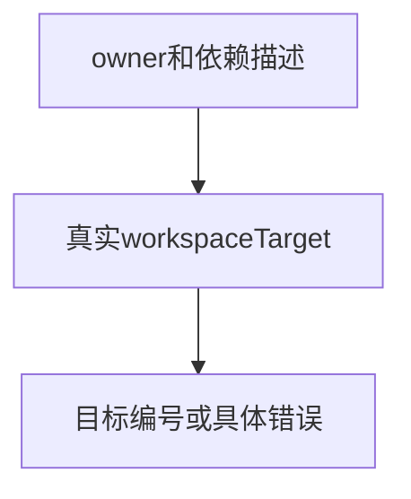
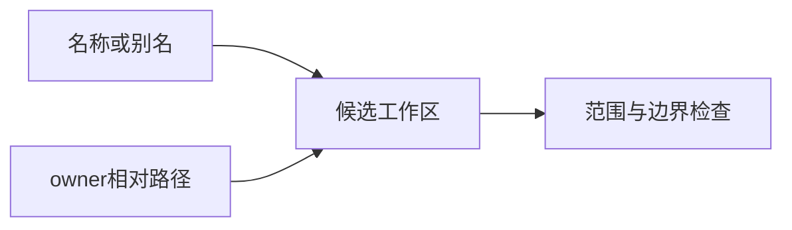

# 锁文件工作区定位验证

## Intent：最终目标

验证锁文件工作区依赖定位的名称、别名、作用域名和相对路径语义，并检查资源释放。

## Data：可用证据

直接调用当前pkgs.Lock.workspaceTarget，输入包含根、apps/a及libs/b三个工作区节点。预期节点编号由独立夹具指定。

## Edges：边界与限制

定位接口不是完整图校验：允许定位自身不意味着完整依赖图允许循环。本轮不重复版本范围全矩阵，也不覆盖磁盘路径符号链接。

## Answer：交付格式与成功标准

具名Zig测试分别断言目标或明确错误；相对路径成功和查找失败执行逐分配失败注入。接入锁文件图专项，保存源码草稿与结果。

## 执行结果

新增19个Zig测试：17项定位/拒绝行为，以及成功和失败相对查找两条逐分配失败路径。覆盖普通名称、兼容范围、普通别名、作用域别名、作用域快捷范围、根相对路径、成员间相对路径及定位自身。负例覆盖缺失名称/路径、不匹配版本、根或成员的父级越界、冒号路径、非workspace要求、越界owner和归档owner。

定位自身的成功只代表找到节点；上一阶段完整图测试仍拒绝自环。这两项契约没有混同。

联合执行 `zig build test-package-lock-graphs test-package-lock-parsing --summary all`，首轮退出0：**12/12步骤、63/63测试通过**（新增19、既有44）。日志 `/tmp/zxc-lock-workspace.log`。格式、diff及2份草稿逐字节一致性通过。本轮无TypeScript改动、无生产修改、无新增实现缺陷。

登记目录62,474、上游审阅533/53,597、唯一关联2,980不变。19个API测试不计入JSONL或上游审阅数；最新完整根仍阶段170。

## 自我批判

测试定位与测试完整图分开，避免把局部解析成功误写成可安装的完整依赖关系。
