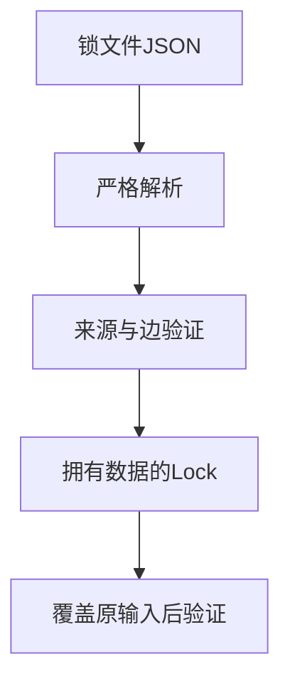
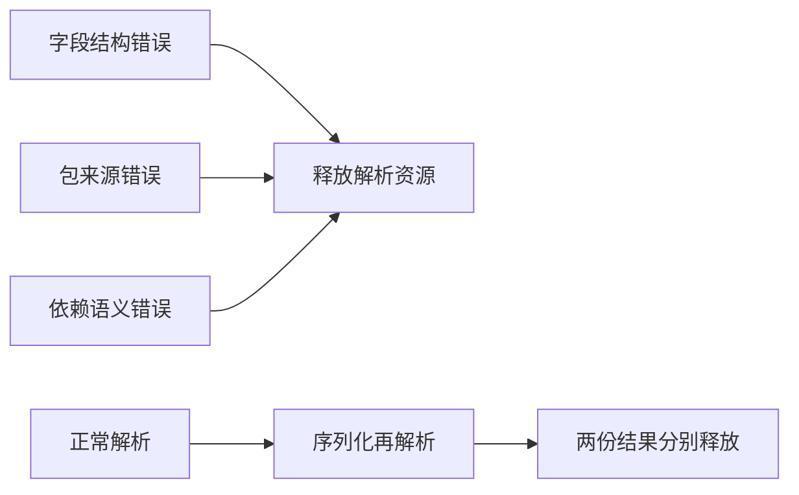

# 锁文件解析与所有权验证

## Intent：最终目标

验证锁文件JSON严格解析、来源和依赖约束，以及解析结果独立拥有输入数据并在成功/失败时释放资源。

## Data：可用证据

当前pkgs.Lock.parse使用严格JSON解析且所有字符串必须分配；format_version是必填字段，parse成功前会调用图验证。沿用索引资源测试的输入覆盖与逐分配失败方法，直接调用生产入口。

## Edges：边界与限制

本轮验证内存中的锁文件，不验证磁盘安装发布、恶意并发改写或全部版本范围组合。具体错误断言必须对应输入变化，不能用任何错误都通过的断言。JSON和验证阶段失败分别保留。

## Answer：交付格式与成功标准

解析测试放入package_lock/parsing，按基准数据、异常数据构造、行为测试和资源测试分层；根构建接入专项。通过条件包含输入覆盖后的完整字段、序列化再解析一致，以及各失败阶段逐分配清理。

## 执行结果

新增27个Zig测试：20个精确错误案例、7个所有权/往返/资源案例。专项入口 `zig build test-package-lock-parsing --summary all` 已接入测试包根构建。

字段检查包含缺少格式版本或包名、未知根字段或包字段、重复字段、空包列表、未知格式版本和截断JSON；来源检查包含错误根路径/根归档、非规范摘要、归档换行、重复摘要与重复包身份；边检查包含版本不匹配、目标名称不符、归档开发依赖、归档引用workspace以及归档自环。

成功路径先复制JSON再解析，覆盖原输入全部字节后，逐项确认工作区/归档名称、版本、路径、摘要和依赖字段仍正确。另将完整解析结果序列化并重新解析，用深比较确认嵌套联合类型和依赖数据一致。

成功所有权以及未知字段、摘要错误、版本不匹配、循环、截断JSON共六条路径执行逐分配失败注入。异常输入构造使用独立分配器，故障注入集中于生产解析及校验。

首轮联合图专项即通过：**10/10步骤、44/44 Zig测试通过，退出0**，其中本轮新增27项、上一轮图17项。日志 `/tmp/zxc-package-lock-parsing.log`。Zig格式、diff以及4份草稿逐字节一致性通过。本轮没有TypeScript改动。

没有生产源码修改，没有发现新实现缺陷。目录62,474、上游审阅533/53,597、唯一关联2,980不变；本轮API测试不计入JSONL与Test262审阅数。最新完整根仍阶段170，本轮仅执行锁文件相关专项。

## 自我批判

解析接受一份JSON不代表可以安装或编译。数据所有权必须通过覆盖输入验证，不能仅依赖allocate选项的源码推断。

范围明确限制为当前构造的两包锁文件和单一故障变化；不把这些JSON负例当作所有可能的畸形输入已穷尽。大小上限、深层JSON与实际磁盘变化仍需独立证据。
