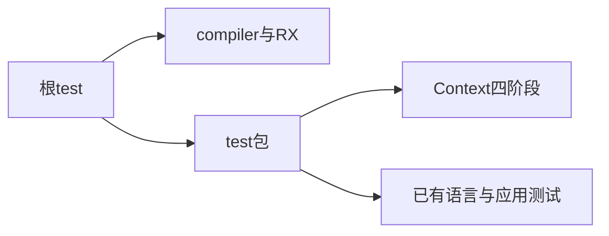
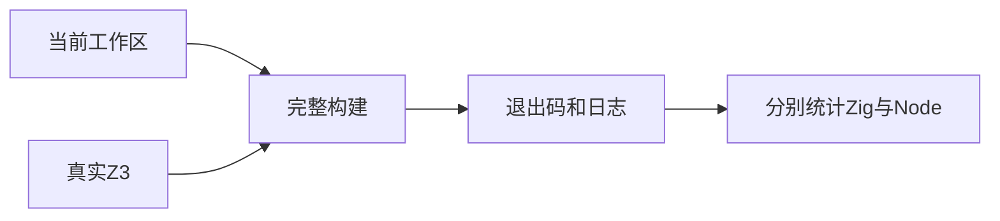

# 阶段一百一十五完整根回归

## IDEA

- Intent：将阶段111—114的Context文本、入口、运行和资源测试纳入完整根回归。
- Data：上一完整根为阶段110；当前已新增86个Context相关Zig测试，真实Z3仍可执行。
- Edges：工作区有并行实现，结果只描述本次构建所读取的状态；不把通过数当作全部特性覆盖。
- Answer：实际退出码、Zig/Node分别统计、目录审计与待补边界。

## 执行计划

1. 执行真实Z3完整根test，保留句柄直至终止。
2. 核对Context步骤、Node分组与目录审计。
3. 保存结果并更新整体证据基线。





## 执行结果

在仓库根执行：

```sh
ZXC_TEST_SOLVER=/tmp/zxc-z3-5.1.0/z3-5.1.0-x64-osx-13.3/bin/z3 zig build test --summary all
```

真实Z3版本5.1.0，本次实际退出码0。完整根1,273/1,273步骤、61,586/61,586 Zig测试通过，比阶段110增加86个，等于阶段111—114的51+21+8+6。根日志明确包含test-context-analysis、test-context-runtime、test-rx-text和test-verification成功。日志 `/tmp/zxc-stage115-root.log`。

十一组Node测试报告为96、64、32、8、1,534、28、31、1、27、69、16，合计1,906/1,906通过；失败、取消、跳过均为零。Node数量独立于Zig汇总，保留既有父容器统计口径。

独立运行 `node src/audit_matrix.ts`（packages/test工作目录）退出0。登记61,382：普通运行46,034、前端3,438、调用轨迹764、隔离执行464、模块图10,446、Store236；唯一关联1,884。上游53,597个文件中235 adapted、33 excluded、102 equivalent，共370已审阅，53,227未审阅。审计日志 `/tmp/zxc-stage115-audit.log`。

本轮没有新增测试或修改生产代码。diff检查通过，阶段115成为最新完整根基线。执行记录仍不足1,000行，无需拆分。

## 自我批判

- 通过完整根说明已登记用例在本次本机ReleaseSafe构建中通过，不证明全部语言特性或所有目标平台。
- 61,586为Zig测试汇总，61,382为JSONL目录数，1,906为Node报告数，不合并冒充同一层级案例数。
- Context已覆盖文本、绑定、宿主执行和共享类型资源，但RX自动注入与嵌套恢复、多模块共享类型重映射仍缺专门证据。
- 工作区并行实现后续变化不自动继承本次结果，需要按变化重新验证。
- 上游仍有53,227个文件未审阅；数量超过30,000不代表test262全面对齐，整体目标仍未完成。
