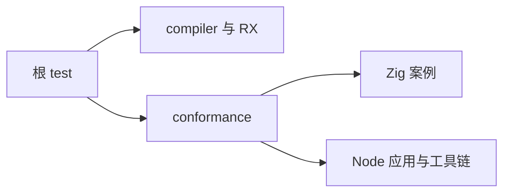
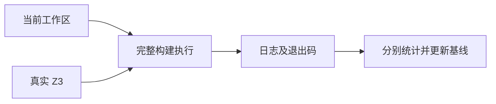

# 阶段一百一十完整根回归

## IDEA

- Intent：在阶段 100—109 新增测试后，验证当前完整根入口，更新整体证据基线。
- Data：最近完整根阶段 99；当前 JSONL 61,382，新增 JSON/应用协议 Node 156 个；真实 Z3 路径延续已验证版本。
- Edges：统计 Zig 与 Node 两套结果，不把构建汇总等同于完整语言覆盖；并行工作区以实际执行时文件为准。
- Answer：实际退出状态、完整步骤与测试汇总、失败处理或最新基线、计数口径和自我批判。

## 执行计划

1. 执行真实 Z3 完整根 test，保留运行句柄直到终止。
2. 独立审计目录及 Node 子组结果。
3. 更新 README、执行记录与覆盖清单。

## 架构



## 数据流



## 执行结果

实际命令：

```sh
ZXC_TEST_SOLVER=/tmp/zxc-z3-5.1.0/z3-5.1.0-x64-osx-13.3/bin/z3 zig build test --summary all
```

退出码 0，完整根 1,249/1,249 步骤、61,500/61,500 Zig 测试通过。十一组 Node 报告合计 1,906/1,906 通过：64、1,534、28、32、8、69、31、16、27、96、1；失败、取消、跳过全为零。日志 `/tmp/zxc-stage110-root.log`。

根结果明确包含 test-json-enum、test-json-integer、test-app-protocol 与真实求解器 test-verification。目录审计仍为 61,382，Test262 370/53,597，唯一关联 1,884；本轮不增加案例数。执行记录 758 行，尚未达到 1,000 行拆分阈值。

Context 注入现已移除，本阶段数字仅为当时的回归记录。

## 自我批判

- 61,500 是 Zig 构建汇总，61,382 是 JSONL 登记，两者口径不同；Node 1,906 另外统计，且含既有父容器报告。
- 完整根没有穷尽新 Context 功能，下一步应覆盖真实文本嵌套约束、模块依赖扫描、绑定身份和普通调用隔离。
- 并行工作区变化后需要新的验证，不将此次结果视为持续有效的保证。
- 真实 Z3 与本机应用测试成功不证明所有目标平台或全部形式化语言子集。
- 上游仍有 53,227 个文件未审阅，整体目标未完成。
