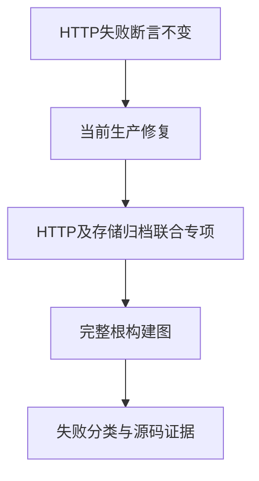
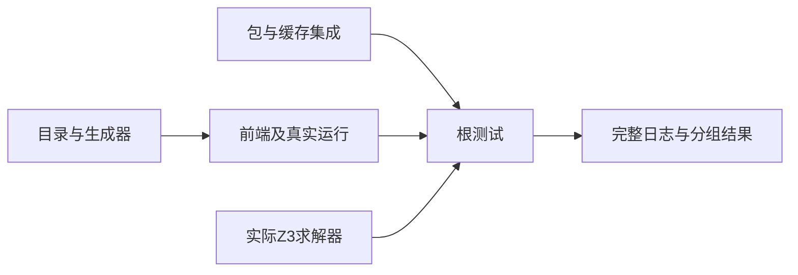

# 阶段一百七十完整根回归

## Intent：最终目标

确认HTTP头部拒绝阻塞缺陷修复，并将阶段161至169新增测试放回完整根构建图验证，避免专项通过掩盖集成回归。

## Data：可用证据

实现会话在HTTP下载错误返回前标记连接关闭，使request.deinit不再读取待拒绝的正文。未修改原有失败断言，联合专项20/20步骤、59/59 Zig测试、17/17 Node测试通过，日志 `/tmp/zxc-package-http-fixed.log`。

最后完整根执行为阶段160：4个已知legacy身份断言失败。此轮使用实际Z3求解器完整执行，不以新专项代替根结果。

## Edges：边界与限制

不修改生产源码；实现会话仍在开发包安装，工作区可能出现并行变更。必须分别记录专项通过、完整构建的失败及发生时源码状态。不能因总数增加或多数通过宣布整体Test262对齐完成。

## Answer：交付格式与成功标准

保存完整日志、退出码、Zig与Node分别统计、失败定位及必要通知。更新进度记录与覆盖清单，保留历史失败和后续修复证据。

## 执行结果

完整根实际使用Z3 5.1.0执行，最终退出1：1,499/1,506步骤成功，3个直接失败步骤；62,958/62,962 Zig测试通过（4个既有legacy失败），21组Node共1,935/1,936通过，未跳过或取消。没有分配器错误日志。

日志 `/tmp/zxc-stage170-root.log`，机器可读统计 `阶段一百七十回归结果.json`。相较阶段160，Zig总数增加101，恰为发布路径6、加法转换36、归档38、共享存储21；Node增加20，恰为watch3和HTTP17。没有把同一案例多次运行计为新增。

唯一Node失败为包图诊断文本。根构建早期捕获的CLI输出“external dependency is not installed; only workspace: sources are currently resolved”；并行实现期间，graph.zig与graph_cases.ts已同步改为“external dependency is not installed; run zxc pkg install”。当前源码与测试预期一致，本轮旧CLI和新测试读取时点不同。保留本轮失败结果，待当前源码重新构建的包清单专项复验，不使用模糊匹配掩盖差异。

HTTP阻塞修复在本轮完整根中通过，包括两个保持正文未结束的断言；不能因该项修复把整个根结果写成成功。

## 自我批判

此前只检查错误类别会漏掉错误返回阻塞，本轮保留受控时序断言。专项通过不能证明整个仓库全绿；完整根通过也不等于尚未审阅的Test262项目已完成。

## 既有legacy失败的当前源码复核

完整根运行中再次出现同四条IR契约失败。只读复核当前源码：`modules/project.zig` 的importExternal每次加载legacy签名都会追加类型，并按importer、binding、member记录外部名义来源；`ir/native_modules.zig` 的validateExport则要求相同specifier和导出名的函数输入/输出TypeId完全相同。重复导入的枚举得到不同名义TypeId，与该验证规则发生冲突。

这是分析产物与IR验证规则之间仍未统一的契约，不宜仅删除测试中的完整IR校验来获得通过。是统一legacy类型身份还是调整合法外部签名的验证规则，需要由实现方按公共接口语义处理；本轮只记录当前证据，不擅自改变语义。单次legacy导入和原生声明的重复身份控制项仍保留在同组测试中。

## 静态检查与状态

TypeScript和目录审计通过，日志 `/tmp/zxc-stage170-typecheck.log`、`/tmp/zxc-stage170-audit.log`。登记62,474，上游审阅516/53,597，唯一关联2,980不变。最新完整执行更新为阶段170失败；最后完整全绿仍阶段122。四项legacy契约冲突已将最新源码证据发送实现会话，本轮不改变其预期。

## 当前CLI的独立复验

完整根进程终止后，重新构建当前源码执行包清单专项，退出0：14/14 steps succeeded，5组Node共1,677/1,677通过，无跳过或取消。日志 `/tmp/zxc-stage170-manifest-current.log`。此前唯一Node失败的精确诊断案例已通过，预期未放宽；证明旧CLI/新测试的版本混用已在当前专项中消除。

该专项不能重写先前根回归的1,935/1,936结果；完整根仍记录失败，4个legacy身份契约待决问题仍在。归档、HTTP、存储和当前包清单的专项证据与完整根证据分别保存。本轮没有新增测试数量或生产代码修改。
