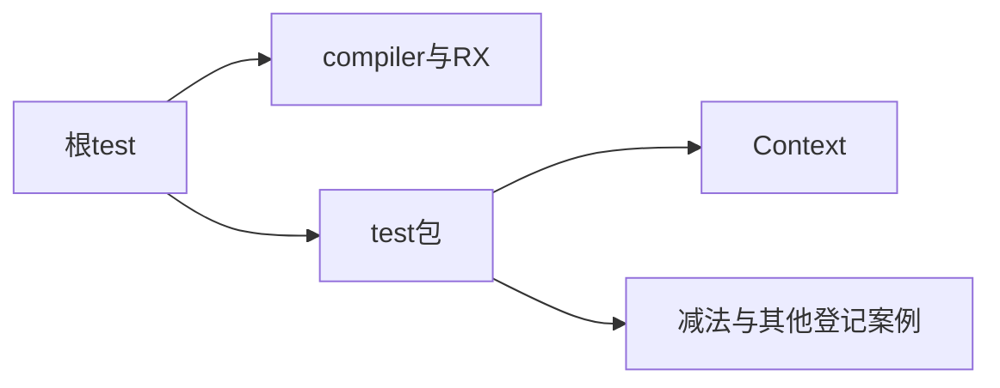
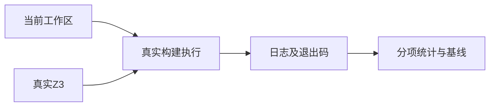

# 阶段一百二十二完整根回归

## IDEA

- Intent：验证阶段116—121更新后的完整根入口，更新整体执行基线。
- Data：阶段115完整根61,586个Zig测试；随后新增30个Context测试及232个目录案例，上游审阅增至400。
- Edges：不把excluded或审阅数计为执行通过；工作区并行变化只能按本次实际构建验证。
- Answer：真实Z3、进程退出状态、Zig/Node分别统计和目录审计。

## 执行计划

1. 检查真实Z3后运行完整根test。
2. 等待同一进程终止，核对失败及分组统计。
3. 保存最新基线和未完成边界。





## 执行结果

仓库根执行：

```sh
ZXC_TEST_SOLVER=/tmp/zxc-z3-5.1.0/z3-5.1.0-x64-osx-13.3/bin/z3 zig build test --summary all
```

真实Z3版本5.1.0。完整根进程实际退出0，1,291/1,291步骤、61,848/61,848 Zig测试通过。比阶段115的61,586增加262，等于阶段116新增30个Context测试加阶段117—120的26+20+72+114目录案例；阶段121仅审阅，不增加测试。

日志 `/tmp/zxc-stage122-root.log` 明确包含Context分析/运行、减法names与whitespace、求值轨迹及真实验证器步骤成功。十一组Node报告64、16、8、28、96、32、69、27、1,534、1、31，合计1,906/1,906通过；失败、取消、跳过均为零。Zig与Node独立统计。

独立目录审计实际退出0，日志 `/tmp/zxc-stage122-audit.log`：登记61,614，上游400/53,597（257 adapted、102 equivalent、41 excluded），未审阅53,197，唯一关联2,116。当前登记数与Zig汇总口径不同。

本轮未新增测试或修改生产代码。diff检查通过；阶段122成为最新完整根基线。执行记录仍不足1,000行。

## 自我批判

- 完整根通过证明当前已登记路径在本机ReleaseSafe构建中通过，不证明所有平台、所有特性或ECMAScript兼容。
- excluded是语言范围的适用性决定，不属于运行通过数。
- 减法目录审阅完毕不减少其他目录的实际工作；仍有53,197个上游文件未审阅。
- Context多模块共享类型重映射、RX自动注入和作用域恢复等仍需专门证据。
- 并行实现产生后续修改时，应重新按变化验证，不能永久继承本轮结果。
