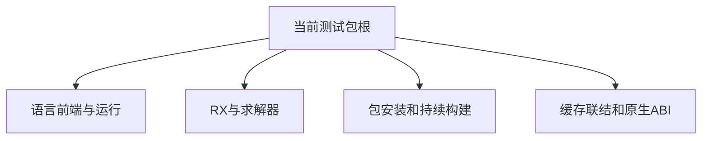

# 阶段一百八十一测试包全量回归

## Intent：最终目标

在原生包声明身份和ABI视图修复后执行完整测试包根回归，检查跨功能影响，并保留可续接证据。

## Data：可用证据

阶段180原生包专项4/4通过。上次完整根为阶段170，存在4项既有枚举身份失败及1项后来专项已通过的清单诊断快照失败。其后新增关系运算、锁文件、安装隔离、watch及原生包测试，均需进入本次根验证。

## Edges：边界与限制

使用实际Z3求解器。不修改生产实现或降低断言。实现会话可能同时变更源码，若发生编译或行为快照差异，先核对当前代码再对准确目标复验；保留原完整运行结果，不用专项通过替换它。

## Answer：交付格式与成功标准

保存完整日志、步骤和测试计数、失败名称及对应证据。遇到新实现缺陷向指定实现会话发送精确回归。完整根成功只证明现有套件，不等于Test262全面对齐。

## 执行记录

已安排命令：`ZXC_TEST_SOLVER=/tmp/zxc-z3-5.1.0/z3-5.1.0-x64-osx-13.3/bin/z3 zig build test --summary all`。结果待实际完成后填写。

### 运行中定位：清单输出新增字段

现有native_modules两项期望缺少已正式加入解析器的include_paths和abi_aliases默认null。另八项externals输出出现identity:null，但外部清单解析器不接受identity字段；已通知实现会话核对内部结构直接序列化造成的契约泄露。前者计划更新精确期望，后者保留断言待修复，不对两类问题做同样处理。

新增字段的后续验证边界：省略与显式空数组不同；路径和ABI别名项必须保留顺序、名称和值；结构类型、缺失字段、空值、重复键及未知字段应保留准确位置诊断。解析成功不代表别名目标已可在真实项目解析，该行为由原生包执行测试覆盖其具体场景。

## 完成结果与范围校准

本次命令实际工作目录为packages/test；属于完整测试包根，不是仓库根。最终退出1：1484/1490步骤成功，3个直接失败步骤；Zig为63091/63095通过，失败4项既有legacy枚举身份用例；27组Node合计1945/1955通过，10项清单失败。无Node跳过或取消。完整日志 `/tmp/zxc-stage181-root.log`，结构化统计见同目录 `阶段一百八十一回归结果.json`。

10项清单失败的性质不同：两项native_modules期望需明确补入公开新增include_paths:null及abi_aliases:null；八项externals是内部identity泄露，被实现会话确认并通过External.jsonStringify仅写公共字段修复。后八项测试断言保持原样，未把内部identity加入期望。

针对当前代码再跑test-package-manifest，14/14步骤、1677/1677 Node通过，退出0；日志 `/tmp/zxc-stage181-manifest-current.log`。该专项证明清单问题已恢复，不改写前述完整测试包失败记录。

原生包4项、安装和watch、新关系运算用例均进入本次根。TypeScript与目录审计通过，登记62930、上游537/53597（349 adapted、103 equivalent、85 excluded）、关联3436不变。

### 自我批判

核对阶段170对比时发现它的工作目录是仓库根，额外包含编译器和RX自测。因此不能直接用两次总数相减推断覆盖增减，也不能把本次宣称为完整仓库回归。现已明确记录目录范围，并单独补跑编译器与RX自测；分开运行的结果仍不是同一次仓库根成功证据。

公开字段增加可以更新精确期望，但内部实现字段泄露必须修复接口，不能机械接受实际输出。新增字段的结构与语义边界仍需扩展专门用例；本轮两项默认值及既有安装迁移行为不能证明其全部解析边界。

### 补充自测结果

编译器独立test：49/49步骤、347/347 Zig通过，退出0，日志 `/tmp/zxc-stage181-compiler.log`。RX独立test：3/3步骤、39/39 Zig通过，退出0，日志 `/tmp/zxc-stage181-rx.log`。386项补充自测与测试包统计分列，不合成为未实际执行的仓库根摘要。所有本轮启动进程已终止。
