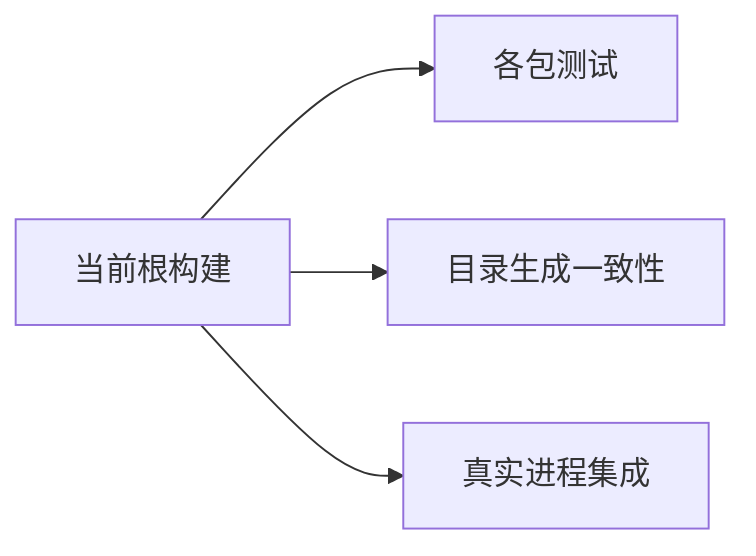
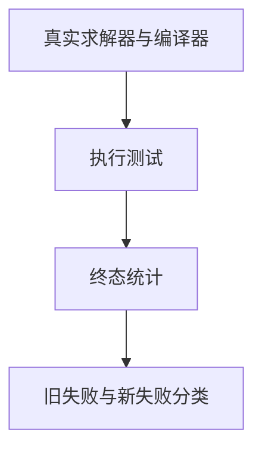

# 阶段一百六十完整根回归

## IDEA

- Intent：验证阶段145之后全部新增测试和当前实现的整体回归状态。
- Data：当前工作区根test、真实Z3 5.1.0、近期协议/发布集成与Test262目录。
- Edges：不跳过已知legacy失败；根构建进行时实现会话仍可能修改源码，结果按实际构建捕获范围报告。
- Answer：终态日志、Zig与Node分开统计、全部失败分类及新问题反馈。

## 执行

使用ZXC_TEST_SOLVER指定真实Z3 5.1.0，执行根 `zig build test --summary all`，日志 `/tmp/zxc-stage160-root.log`。等待终态后填写结果；不因中途安静日志重启任务。

## 首次完整执行

首轮退出1：417/1,477步骤成功，57个步骤失败；实际执行的11,025/11,025 Zig测试通过，只有1个Node集成组完成（1/1通过）。其余大量测试因genz语法错误未执行，不能把已运行子集全绿当作完整通过。根日志中还含build-modes子构建8/18步骤、3失败的嵌套摘要，不能混作根统计。

当前lower.zig的functionReference声明被放入binary函数体，独立zig fmt --check复现194:150语法错误。已通知实现会话，对方确认拆分提交引入该阻断并正在修复。本轮没有修改生产源码。

八个近期生成器--check及三个后端根依赖已核对完整。目录审计和TS通过，日志 `/tmp/zxc-stage160-audit.log`、`/tmp/zxc-stage160-typecheck.log`。后续结果按修复状态继续记录。

## 修复后复跑

实现会话已将functionReference恢复到binary之前的顶层，独立格式检查通过。首轮进程终态后启动第二轮真实Z3完整根回归，日志 `/tmp/zxc-stage160-root-final.log`，等待终态统计。

第二轮发现发布路径分配器长度不匹配：新增watch/output.zig的physicalDirectory擦除realPathFileAlloc返回值的NUL哨兵类型，释放时长度少1。五个测试产生11条资源错误（业务断言8/8通过仍属失败）。已通知实现方，对方改为[:0]u8并在递归分支使用joinZ；独立test-backend-publish复验通过，日志 `/tmp/zxc-stage160-publish-fixed.log`。当前第二轮根仍使用较早捕获的版本，因此其结果必须保留该失败，不能被专项修复证据覆盖。

第二轮终态退出1：1,470/1,477步骤成功，3个步骤失败；62,857/62,861 Zig测试通过，四个断言失败全部为已知legacy身份问题。15组Node合计1,916/1,916通过，无跳过。第三个失败步骤为已捕获旧版的发布资源错误，不能据12/12专项修复结果涂改该轮失败。第二轮终态后启动第三轮，日志 `/tmp/zxc-stage160-root-verified.log`，验证完整图包含路径释放修复。

第三轮15组Node共1,916/1,916通过，无失败/跳过/取消；Zig根摘要仍等待终态。不得以中途Node通过或专项通过替代完整根结果。

## 最终完整结果

第三轮终态退出1：1,472/1,477步骤成功，2个步骤失败（其余为传递失败）；62,857/62,861 Zig测试通过，4个失败均为阶段145已知legacy身份问题。15组Node共1,916/1,916通过，无失败、取消或跳过。最终日志 `/tmp/zxc-stage160-root-verified.log`，机器可读结果 `阶段一百六十最终结果.json`。

相对阶段145，Zig总量增加457=402个登记案例增量+55个协议/发布定位API；Node增加1个真实后端集成。目录仍62,438，上游508/53,597。新语法阻断和释放长度错误在第三轮完整图中均未再出现，不只依赖单项复验；已向实现会话反馈最终证据。

最新完整根执行更新为阶段160，仍为失败状态；最后完整全绿仍阶段122。四个legacy断言未跳过、未删改，仍需对应语义决策/修复。未将最终已执行测试中通过的子集称为全部通过。

## 自我批判

工作区有并发实现与提交整理，前两轮捕获了不同时间的源码状态，不能混合统计；三份结果独立保存。第一轮11,025个测试全部通过仍被编译阻断，第二轮业务断言之外的分配器错误同样必须视为失败。最终第三轮证明本次两个回归消失，但既有四个失败仍阻止完整全绿，Test262和全特性总目标也远未完成。
