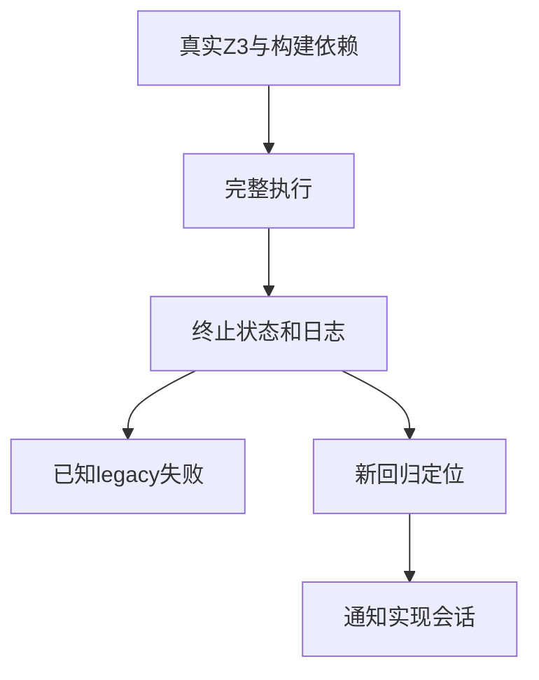

# 阶段一百四十五完整根回归

## IDEA

- Intent：检查新增联结/缓存及运算符测试与并行生产变更在完整根入口下的整合状态。
- Data：阶段122最后完整通过；阶段142已知4个legacy枚举失败；阶段144最新专项。
- Edges：保留已知失败，不能跳过它们来宣称全绿；运行期间工作区可能由指定实现会话继续更新。
- Answer：真实Z3、根test退出码、完整日志、Zig与Node分开统计；新缺陷通知指定会话。执行记录拆分至第二册，保留原文。

## 结果

首轮真实Z3 5.1.0完整根退出1：1,403/1,408步骤成功，62,400/62,404 Zig测试通过，4个已知legacy失败；14组Node合计1,915/1,915通过。日志 `/tmp/zxc-stage145-root.log`。

执行记录原文件984行，已将阶段121—144原文逐字迁移到 `Test262对齐执行记录（二）.md`；第一册826行，第二册170行，第一册新增后续入口。后续阶段在第二册续写。

复核发现最近新增7个乘法/除法生成器尚未加入根生成一致性列表，已补齐。首轮运行使用修改前构建图，第二轮已启动当前根入口，使新增7项--check纳入最终证据；日志 `/tmp/zxc-stage145-root-final.log`，实际退出1。

## 最终完整结果

更新后的根入口使用真实Z3执行结束，1,410/1,415步骤成功（2个测试步骤失败及其上层依赖未成功），62,400/62,404个Zig测试通过。14组Node报告合计1,915/1,915通过，失败/取消/跳过均零。新增7个生成器检查已纳入，构建步骤比首轮增加7，测试数量不变。

失败仅四项，均为阶段125已报告并在阶段142复核的legacy接口问题：

1. 默认绑定重复导入的枚举身份。
2. 具名成员同时保留绑定与成员身份。
3. 不同导入模块中的同名绑定身份。
4. 上述重复接口的分配失败资源路径。

共同失败点仍是完整IR契约校验，没有放宽、跳过或修改测试预期。本轮完整根没有出现其他失败，因此没有另发重复缺陷消息。

结构化统计见 `阶段一百四十五回归结果.json`。与阶段122的61,848个Zig测试相比，本轮总数增加556：422个登记案例加134个额外Zig测试，数量对应；Node增加9，来自跨进程语义缓存5、生成缓存3、native生成1。

目录审计仍62,036，上游461/53,597（300 adapted、102 equivalent、59 excluded），唯一关联2,538，日志 `/tmp/zxc-stage145-audit.log`。生成器接入属于测试完整性修正，本轮未增加语义案例、未修改生产实现。格式、diff及拆分阶段顺序校验通过。

## 自我批判

阶段145是最新完整根执行结果，但有失败；最后完整全绿基线仍阶段122，不能覆盖为全绿。known failure也是真实失败，不因其他62,400项通过就淡化。并行实现会话仍在改变代码，本轮只能证明实际构建执行的状态，后续修改须重新按影响验证。

目录审阅461远未达到全部53,597，excluded也不是原上游执行通过。已有62,036个登记案例满足数量门槛，不代表用户的全部语言特性与生产级目标已经完成。
