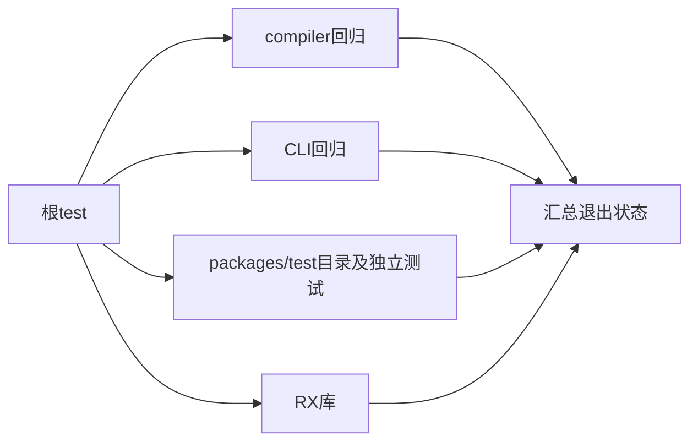
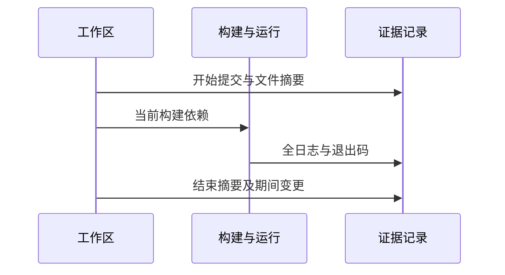

# 阶段三百三十四完整根回归

## Intent：最终目标

在新增Test262审阅、词法用例和RX Store刷新系列后验证仓库根构建图，发现专项之外的集成回归，更新真实完整回归证据。

## Data：可用证据

上一完整根通过基线为阶段293，此后新增多组运行与前端测试及实现聊天的生产变更。当前root test依赖compiler、CLI、conformance及RX库测试。开始提交、工作区状态和源码摘要归档，结束时记录并行源码变化。

## Edges：边界与限制

运行在共享工作区，测试期间实现聊天可能修改生产文件；必须说明最终通过针对实际构建读取的状态，不能宣称冻结提交已全部证明。测试发现夹具或清单漂移可修复测试；确定生产缺陷才通知实现聊天。完整回归通过不等于Test262全量语义对齐或全部未实现功能已具备。

## Answer：交付格式与成功标准

使用已有Z3，运行根`zig build test -j4 --summary all`。保留完整日志、终态退出码、Zig/Node统计及失败定位。存在直接失败或未完成目标时，不以已运行测试通过数代替整轮成功。

## 自我复核

独立记录根回归状态和Test262审阅进度；不把文件数量或矩阵审计当执行结果。任何失败先辨别夹具假设与实际契约，再按用户授权处理，不通过取消测试获得绿色结果。

## 完整根结果

根命令退出0：2324/2324步骤、66028/66028 Zig测试通过；31组Node合计2041/2041通过，失败、取消、跳过、todo均为0。真实RX CLI 11场景、Z3 Verification CLI 20场景及原生库迁移、资源、四类路径拒绝检查通过。测试包TypeScript类型检查和矩阵审计通过。完整日志、终态和机器统计均已归档。

本轮2026-10-04启动，2026-10-05完成，证据保留在启动日期目录。没有修改生产实现或测试代码来取得通过，也没有发现需通知实现聊天的生产缺陷。

## 并行源码变化与结论边界

开始提交2cb8dc2647971d8c60dfeb704ab1af6d73743fc7；运行期间新增提交cf699f04（不可变URL查询参数）。源码摘要比较显示2个既有文件变化：standard/src/root.zig与standard/modules.json；新增接口及6个实现文件，共7个。没有删除文件。本轮是共享工作区的一次成功执行，不能声称对固定cf699f04快照做过从头到尾的完整回归。

结束后在packages/test执行`zig build test-native-declarations test-standard-resources -Doptimize=ReleaseSafe -j4 --summary all`，22/22步骤、47/47测试通过。这补验已有原生声明与标准库资源检查，不证明新URL API全部语义。下一步须对新增接口单独建立操作、顺序、编码和错误输入的真实运行测试。

矩阵保持65194 JSONL；上游2036已审阅，51561未审阅。独立RX运行197项已纳入本轮根构建。完整回归通过不改变尚未完成Test262逐项审阅与zxc全特性覆盖的事实，整体目标继续进行。
