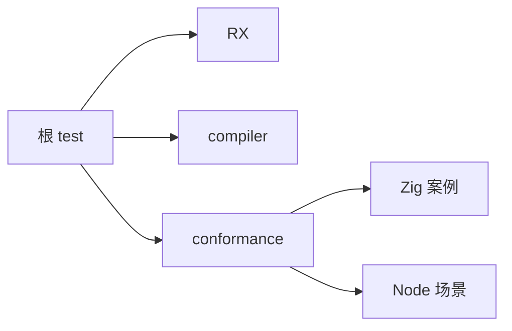
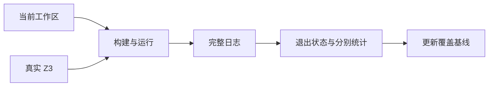

# 阶段九十九完整根回归

## IDEA

- Intent：在阶段 91—98 新增测试后，重新验证当前完整根测试入口，更新覆盖清单中的整体证据。
- Data：根 build.zig 同时依赖 RX、compiler 和 conformance 测试；当前登记 57,981 个案例，RX 真实文本 120 个独立 Zig 测试；固定真实 Z3 可执行文件仍可用。
- Edges：工作区存在并行实现。完整根通过也不等于全部语言行为已覆盖；Node 子进程测试数与 Zig 汇总分别统计。并行会话当前正在修改 translib 草稿辅助脚本，不能据此推断正式实现已接通。
- Answer：实际命令退出状态、完整汇总与 Node 报告，若失败则分析并通知实现会话；成功后更新最新根基线和自我批判。

## 执行计划

1. 核查根构建依赖和真实 Z3 路径。
2. 运行完整根测试，保留进程句柄直到实际终止。
3. 检查各子测试汇总及覆盖审计，更新证据。

## 架构



## 数据流



## 执行结果

实际运行：

```sh
ZXC_TEST_SOLVER=/tmp/zxc-z3-5.1.0/z3-5.1.0-x64-osx-13.3/bin/z3 zig build test --summary all
```

退出码 0。完整根 1,168/1,168 步骤、58,099/58,099 条 Zig 测试通过。八组 Node 报告合计 1,750/1,750 通过（含 standalone 的父容器）：64、1、1,534、16、27、8、31、69；失败、取消和跳过均为零。完整日志 `/tmp/zxc-stage99-root.log`。

本次覆盖 test-match-module-types、test-rx-text、test-verification、test-verification-resources、test-toolchain 与 test-toolchain-concurrency 等根依赖。Node 脚本与 Zig 汇总分开记录，不把 1,750 再并入 JSONL 数量。目录审计仍为 57,981，Test262 已审阅 360/53,597，唯一关联 1,797。

更新覆盖清单中的三处滞后摘要：match 跨模块和借用证据、包版本范围/初始化/索引证据、已取消的动态插件能力。历史 plugins fixture 尚未清理，明确不计为当前公开能力。本轮没有新增生产代码、没有新增测试，也没有发现需通知实现会话的新缺陷。

## 自我批判

- 根回归验证的是当前已登记入口，不代表清单已穷尽全部 zxc 特性；尤其历史未登记夹具不能借此获得通过结论。
- 真实 Z3 成功不代表全部输入语言均支持证明；保留验证器当前支持范围。
- 58,099 是本次 Zig 构建汇总，57,981 是 JSONL 目录数，两者统计口径不同，不能混用。
- 本机通过不构成其他平台、交叉目标或所有宿主环境的证据。
- 上游仍有 53,237 个文件未审阅，整体目标保持进行中。
