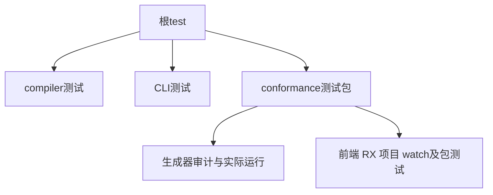
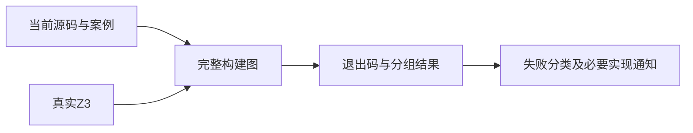

# 阶段二百九十三完整根回归

## Intent：最终目标

在当前源码上执行完整根回归，验证阶段171至292间累计测试与RX、CLI、编译器实现的整合状态，恢复有时效的完整基线。

## Data：可用证据

根build.zig的test包含compiler、cli及conformance完整测试；最近根回归记录为阶段170失败，部分旧问题已在后续专项修复。当前HEAD为dcdc202，含可迁移C资源打包；使用既有真实Z3 5.1.0。

## Edges：边界与限制

共享工作区可能存在并行变更；记录开始版本与结束状态，不把专项与根结果混写。失败时保留精确断言与原始日志，先区分测试、环境、实现问题；实现缺陷才通知指定会话。根回归不证明所有未审阅Test262项目完成。

## Answer：交付与成功标准

执行PATH包含既有Z3的zig build test -j4 --summary all，保存退出状态、Zig/Node结果、失败定位与修复复验边界。完成后更新完整回归基线与IDEA记录。

## 首次运行中的构建遗漏

完整图首先发现后端发布三个Zig测试及后端真实进程驱动缺少cli/watch/directory.zig。当前watch/snapshot.zig已经引用该文件，而测试包observed_sources仍按旧清单复制源码。已仅在packages/test/build.zig复制清单补入这个依赖；根运行已捕获旧构建图，保留当前失败并待终止后重新执行。该问题属于测试接线遗漏，没有向实现会话报实现缺陷。

## 构建遗漏的独立复验

补齐复制清单后，`zig build test-backend-publish test-backend-runtime -Doptimize=ReleaseSafe -j2 --summary all`退出0，11/11步骤、18/18 Zig测试及1/1 Node真实进程测试通过。日志已归档。TypeScript类型检查、构建文件格式及diff空白检查通过。

首次完整根仍在运行，尚无终态与完整计数；不得把上述独立复验写成完整根全绿。完整日志持续写入`/tmp/zxc-stage293-root.log`，待本轮结束后保留首次结果，再执行修正后的整轮。

## 新契约与旧预期

首次完整图发现package manifest / native header bundled files期待退出1但实际0。dcdc202明确删除了header模块不得设置bundle_files的限制，packages/pkgs/README.md也声明纯C模块可打包文件与目录。已将同一命名测试改为成功解析并精确比较name、header、path、dependencies、bundle_files、include_paths和abi_aliases字段，案例数量不变。此项是测试对新公共契约的同步，不是放宽失败诊断，也未报作生产缺陷。

## 清单新契约复验

更新header bundle_files成功断言后，当前源码包清单专项14/14步骤、五组Node合计1,727/1,727通过，没有跳过或取消。根首次运行仍保留旧断言失败，终态尚待取得。

## 首次完整运行终态

首次运行已终止，日志明确退出1：2,017/2,031步骤成功，5个直接失败；65,240/65,240个已运行Zig测试通过，29组Node报告2,023/2,024通过，无跳过/取消。另有真实Z3的20场景、RX CLI的11场景及原生资源迁移检查通过。

五个直接失败为三个后端发布测试编译、一个后端驱动编译和一个清单测试进程。由于四个编译目标未成功，该轮Zig通过数不包含其18项，Node不包含后端驱动的1项；不得因已运行Zig全通过而将整轮改写为成功。两类问题的修正均已单独验证，现启动当前修正构建图的完整复验，保留独立日志。

## 复验版本边界

复验启动提交为000a0b9。与首次开始dcdc202相比，期间RX实现增加Task/Switch控制流程；相关源码变化统计已保存。复验使用当前完整图，不将首次运行的通过结果直接外推到新增控制流程。复验日志为`/tmp/zxc-stage293-root-fixed.log`，当前仍在运行。

## 修正后完整复验终态

完整复验退出0：2,031/2,031构建步骤、65,258/65,258 Zig测试通过；30组Node合计2,025/2,025通过，失败、取消、跳过、todo均为0。另有真实Z3的20场景、RX CLI的11场景和原生资源迁移检查通过。日志与机器统计保存在本阶段回归证据目录。

## 自我复核

首次失败没有被覆盖，两项测试基础设施与契约修正均保留前后证据。本次通过更新完整根基线，但并不代表Test262全部对齐：上游仍仅审阅1,312/53,597项；RX控制流草稿在本次根结束后才接入正式集合，其新增结果必须另行报告。
