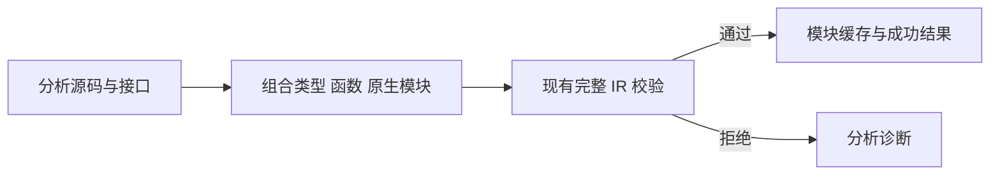
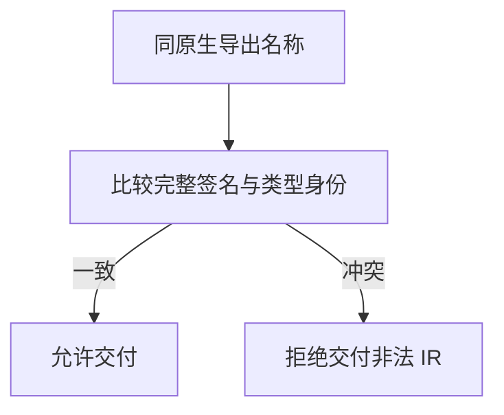

# 项目分析结果门禁修复

## Intent：最终目标

项目分析的成功结果必须是可通过现有完整 IR 校验的 Program。不能将内部声明联结冲突包装成分析成功，交给每个消费者再次发现。

## Data：可用证据

独立回归再次复现四个 legacy external 枚举来源案例：analyze 返回 ir，但 validateIr 返回 contract。项目分析最终组合类型表、原生模块和函数表后没有执行统一校验；原生导出校验要求同身份、同导出名称的 Input/Output ID 一致，而 legacy 绑定目前仍各自创建枚举身份。

## Edges：边界与限制

在项目分析的公共汇合点调用已有 ir/validate，在交付 Analysis.Result 和写入新的源码模块语义产物之前拒绝无效 IR。验证使用调用方 allocator，临时工作数组由验证器释放；失败继续返回拥有 arena 的诊断结果，分配失败仍向上传递。

这个修复不替用户决定 legacy 枚举应共享声明身份还是按绑定独立。四个期望成功的旧案例仍未满足，但其可观察行为应由“成功返回非法 IR”变为明确的分析诊断。不能以提前拒绝宣称已完成 legacy 功能支持。

## Answer：交付与成功标准

最小生产改动为公共项目分析出口的一次现有 IR 校验。复用编译器和名义来源回归，确认正常项目仍通过、失败案例在分析入口被拒绝、缓存路径同样遵守门禁。不新增测试用例、不改宽既有预期。

## 执行与自我复核

已在项目分析汇合点接入完整验证。compiler 既有回归 347/347 通过；nominal-origins、semantic-cache、type-merge 组合回归为 27/31，仍为四个既有 legacy 成功预期失败。失败现在发生在检查分析结果必须为 ir 的断言，不再先接受非法 IR。

通过独立 inspect-project 工具复用默认双绑定、命名双绑定输入，返回均为 contract 诊断；原生共享接口对照返回 ir 且再次 validateIr 通过。DebugAllocator 未报告泄漏。输入、驱动和返回记录位于同名目录，可先 zig build，再以 JSON 路径作为 inspect-project 参数复现。

自我批判：这个修复保证结果门禁，不保证旧 legacy 场景已得到所需语义。四个旧成功预期未放宽或跳过。一般完整验证会增加项目分析工作量，但复用既有校验器，未增加平行规则或针对用例的分支。
