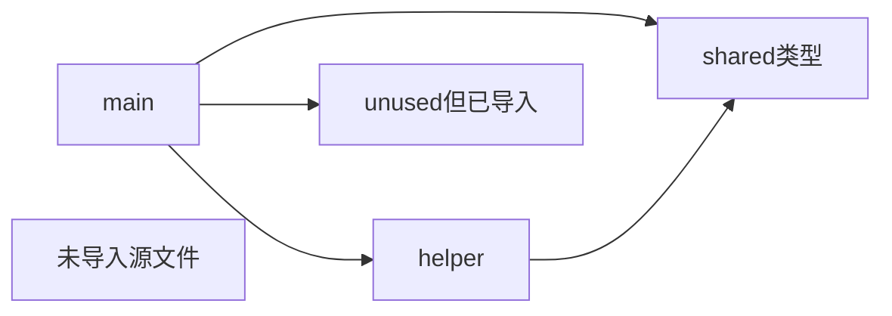
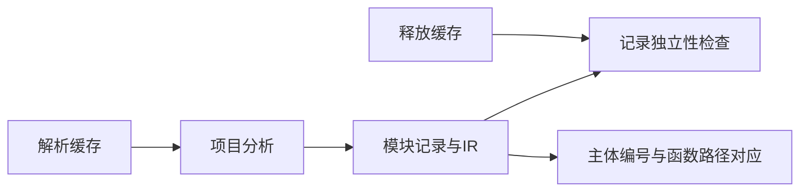

# 项目模块记录验证

## IDEA

- Intent：验证新AnalysisResult.modules准确保存可达模块、原始导入与主体身份，供后续模块产物使用。
- Data：当前module_record和project分析实现，记录拥有分析arena中的数据；原生/legacy和名义来源另行验证。
- Edges：本轮验证source模块图，不宣称持久缓存或重新联结已完成。
- Answer：拓扑/导入顺序、类型导出、函数编号、源码摘要、生命周期、失败结果及资源测试。

## 执行计划

1. 建立共享类型依赖图，包含未调用但已导入模块和不可达源文件。
2. 对每条记录核对源码摘要、路径、主体、导出及原始import范围。
3. 缓存释放后复核，并注入成功/失败分配轨迹。

## 执行结果

新增10个独立Zig测试：7个记录行为、1个失败结果边界及2条分配失败轨迹。

五个源文件构成四个可达模块：shared类型模块被main/helper同时导入但只记录一次；unused虽未调用仍因导入而记录；detached源文件未被导入，不进入结果。记录顺序为shared/helper/unused/main，与输入数组顺序不同，符合依赖完成顺序。main直接导入仍按源码helper/shared/unused顺序保留，验证function/enumeration/type_only分类、绑定名、原specifier、解析目标及包含分号的完整源码范围。

类型模块导出Mode/Count对应最终类型表中的枚举和u64，两个非入口函数记录的FunctionId均指向对应路径；入口body为entry，没有悬空函数编号。纯类型入口body保持types，函数表为空。逐模块SHA-256分别对照其原始源码。缓存释放后依赖路径、绑定名和IR仍有效。

在helper与shared已成功装载后制造缺失导入，验证module诊断源编号0，modules与nominal_types都为空，不暴露部分结果；成功和该失败路径均执行分配失败穷举。

首次夹具局部名误用Zig关键字unreachable，改为detached后修复，仅修改测试夹具。最终在packages/test执行 `zig build test-module-records --summary all` 退出0，6/6步骤、10/10测试通过，日志 `/tmp/zxc-module-record-tests-fixed.log`。格式、diff、草稿一致性通过，专项已接入根依赖。无生产修改或需通知实现会话的新缺陷。

JSONL61,614、上游400/53,597不变，最新完整根阶段122；本轮10个Zig API测试单独统计。

## 自我批判

- 本轮只验证source模块记录；native/legacy external依赖分类和名义来源另需专项。
- 摘要采用标准SHA-256重算，主要检查记录关联了正确源码，不宣称独立验证哈希库本身。
- 类型导出与函数编号被验证，不代表模块局部IR、编号重新映射或持久联结已完成。
- 失败路径选取装载部分依赖后缺失目标，不等于覆盖全部解析、类型、所有权失败路径。
- 生命周期证据覆盖缓存释放后的读访问；缓存并发安全和跨进程保存不在本轮范围。
