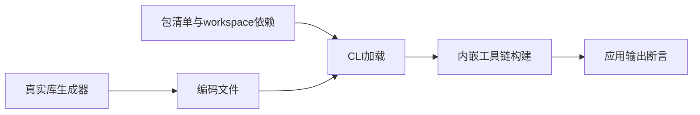
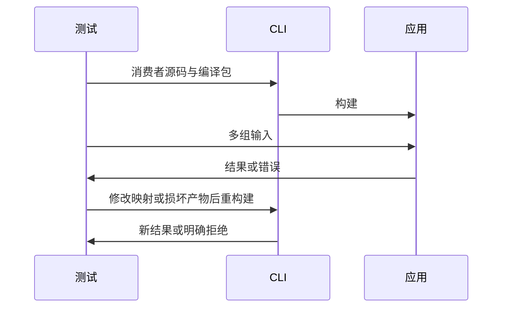

# CLI 已编译包消费验证

## Intent：最终目标

阶段三百五十七：验证60e083bd新增的CLI已编译包消费，从实际pkg.yaml和编码产物构建并运行消费者，覆盖公开选择、类型接口与损坏/越界拒绝。

## Data：可用证据

前几阶段已覆盖compiler.project API，尚未证明CLI依赖作用域、物理路径、产物读取、缓存与应用构建组合正确。现有package_manifest测试可作为命令调用和临时工程风格样例。

## Edges：边界与限制

依赖包只提供manifest和编码文件，没有实现源码回退。编码文件由已有真实库生成器产生，运行使用CLI内嵌工具链。固定测试输入和数学预期独立于生产输出。只修改测试，不修改生产。

## Answer：交付格式与成功标准

新增compiled_packages专项，正常路径实际构建运行，拒绝路径要求非零退出且不发布新应用；相同工程重构建检查缓存不能遮盖已变更或损坏的产物。全部通过后提交push。

## 自我复核

不把源代码模式通过算作编译包通过，不通过临时恢复源码让失败用例变绿。实际运行结果与失败时旧输出保留分开验证；本轮不等于完整包发布安装、原生资源或Store初始化已经支持。

## 验证结果

新增test-compiled-packages构建目标，真实编码生成器产出纯ZX和RX混合库。测试临时workspace的依赖包仅含pkg.yaml和library.zxcir，消费者通过正常CLI命令构建，不手工注入compiler.project配置。

4项运行场景全部通过：三个公开入口结合公开类型导入并组合计算；同工程默认公开映射从alpha改为beta后输出随之改变，随后破坏产物导致构建拒绝且原应用字节保持不变；RX分支按输入选择并传播IndexOutOfBounds；作用域workspace包使用依赖别名消费。累计5次成功应用构建、14次实际应用执行，其中1次为预期错误。

9项拒绝场景全部通过：缺失产物即使旁边存在可用源码也不回退、payload校验失败、指定公开名不存在、缺省公开导出不存在、产物符号链接越界、library父目录越界、缺exports、compiled库使用源码导出路径、源码包使用compiled模块选择。各项要求退出1且未创建应用。

`zig build test-compiled-packages --summary all` 14/14步骤通过，13项Node测试全部通过。TypeScript类型检查、Prettier和Zig格式检查通过。最初两项正常场景因测试ZX字符串缺少语义空行被正确拒绝；已整理为独立ZX fixture后通过，未改动生产格式检查或语义规则。

没有生产缺陷，因此未向实现聊天发送消息。本轮不运行完整根回归，不扩展为发布安装、原生资源、Store初始化或watch的完成证明。JSONL和Test262审阅计数不变。草稿目录包含源码、输入产物哈希和结构化结果；完整运行日志本地保留。
