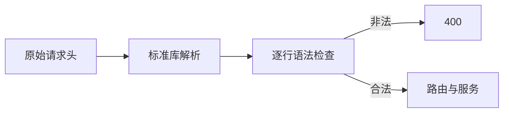

# Gateway 原始头校验修复

## Intent：最终目标

在服务执行前拒绝非法 HTTP 请求头，避免底层解析器忽略坏字段后仍执行业务。

## Data：可用证据

测试会话第 393 部分通过真实回环 TCP 发现 BrokenHeader、Bad Name: x、含 NUL 的头值均被接受并返回服务结果。std.http.Server 的解析成功并不证明每个原始字段都符合头部语法。现有 Request.head_buffer 保留读取到的完整原始请求头，且在读取正文前仍有效。

同轮定义分析发现 listen="127.0.0.1" 也被意外接受。Zig 的 parseLiteral 允许省略端口并使用 0，但当前公开契约要求明确的数字 IP 与端口；不能让底层默认值改变上层配置契约。

## Edges：边界与限制

只校验原始 HTTP 头部的语法边界，不限制合法的未知字段。字段名必须是非空 ASCII token，冒号前不允许空白；字段值允许 SP、HTAB、可见 ASCII 与 obs-text，拒绝其余控制字节和 DEL。按 CRLF 分行，不接受折行或孤立 CR/LF。底层解析器继续负责方法、版本、声明长度及传输编码的语义。

校验放在静态 HTTP dispatch 最前面，在路由匹配与服务执行之前；返回 400 时不发送 100 Continue、不读取剩余正文、不提交 Store。原生 HTTP 客户端与其他未提交优化不混入本修复。

listen 必须采用 IPv4:port 或 [IPv6]:port，端口部分非空且只包含十进制数字，然后继续交给 parseLiteral 校验地址及 u16 范围。显式端口 0 保留系统分配语义；省略端口不再被默认为 0。省略 listen 属性仍使用原有 127.0.0.1:8080。

## Answer：交付与成功标准

genz 的 HTTP 模板提供原始头部检查，生成入口统一调用。复用已有 test-gateway 定向回归，不新增测试、不运行全量测试。补齐真实非法头、合法 HTAB 与 obs-text、以及拒绝后无业务副作用的证据后独立提交推送。

## 自我复核

不能用 UTF-8 校验替代 HTTP 字段值语法，也不能把标准库宽松解析成功当成完整校验。当前计划对应真实反馈，修后结果另行追加。

## 连接关闭与修后结果

非法头与缺失端口修复后，对应断言通过，但超大请求头场景触发 ECONNRESET。独立本机 TCP 观测显示：发送完整 431 后直接 close，或只 shutdown 写端再 close，仍会因未读入站数据重置；shutdown 读端或双向后 close 则正常结束。宿主现统一先 shutdown(.both)，再释放连接；对已失败连接的 shutdown 为尽力清理，close 始终执行。不排空剩余正文、不增加等待。

最终在 packages/test 执行 `zig build test-gateway -j4 --summary all`：16/16 构建步骤、46/46 定义检查、86 项真实应用请求检查全部通过。覆盖非法头先于 Store 更新、合法 token/HTAB/obs-text、512/513 字节头边界、空 Gateway、请求恢复和跨请求状态。测试由独立测试会话维护，本次未新增或修改测试，未执行全量测试。关闭行为的运行证据来自本机，不据此宣称所有操作系统网络边界均已获证。
