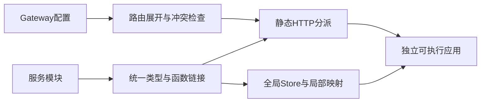
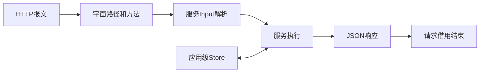

# Gateway 执行参考

## Intent：最终目标

将 HTTP 路由静态连接到普通 RX/ZX 模块，生成独立可执行应用。服务保留各自的输入输出类型，共享同一个应用级 Store。

## Data：可用接口

```xml
<Gateway name="api" listen="127.0.0.1:8080">
  <Group prefix="/api">
    <Route method="POST" path="/echo" service="echo" />
  </Group>
</Gateway>
```

```sh
zxc check-rx --entry main.gateway.rx
zxc build main.gateway.rx --out server
./server
```

Gateway 默认使用 HTTP；listen 默认 `127.0.0.1:8080`，支持数字 IPv4 或带方括号的 IPv6 地址及显式十进制端口。不接受省略端口的 `127.0.0.1` 或 `[::1]`；显式端口 0 由操作系统分配。它不执行 DNS 解析。`service` 相对 Gateway 所在目录解析，Group 只组织 URL 路径。

每个服务仍是普通 Module，例如：

```xml
<Module>
  <Call fn="echo" in="$in" out="ctx.result" />
  <Return value="ctx.result" />
</Module>
```

```ts
export type Input = i32

export type Output = i32

export default function (in: Input): Output {
  return in
}
```

该服务接收正文为 `42` 的 JSON 请求，返回 JSON `42`。路径、query、请求头不会自动拼入 Input；void 输入要求空正文。Output 为 void 时返回 JSON `null`。原生服务可以使用显式 I/O 和进程能力；进程参数和环境属于服务器进程，不随 HTTP 请求伪造。

| 属性             | 默认值与语义                             |
| ---------------- | ---------------------------------------- |
| protocol         | 省略等同 http；其他协议暂不支持执行      |
| listen           | 127.0.0.1:8080；数字 IP 与端口           |
| max_header_bytes | 8192；支持 1 至 16777216                 |
| max_body_bytes   | 1048576；可设为 0，按解分块后的正文计算  |
| Route.method     | 省略表示任意已识别的 HTTP 方法           |
| Route.path       | 完整字面路径；必须以 / 开始              |
| Group.prefix     | 递归拼接路径前缀；拼接处裁去前缀末尾斜线 |

相同路径可以配置多个不同 method；重复方法、任意方法与具体方法重叠会在编译时拒绝。GET 与 HEAD 独立配置；HEAD 会执行对应服务，但 HTTP 层不发送响应正文。路由尾斜线保留，`/a` 与 `/a/` 不同。query 不参与匹配，百分号不解码，路由配置中的百分号编码必须完整。

## Edges：边界与限制

正文按 Content-Length 或 chunked 标记读取；这也适用于明确携带正文的 GET 等方法。两者均无时按空正文处理。支持 `100-continue` 握手；过大的声明长度在发送继续信号前拒绝。请求体不能使用压缩编码。

原始请求头在路由执行前校验：字段名使用非空 ASCII token，冒号前无空白；值允许 HTAB 与非 UTF-8 的 obs-text 字节，拒绝 NUL 等非法控制字节。非法头返回 400，不执行服务或更新 Store。

| 情况                                               | 响应                                                      |
| -------------------------------------------------- | --------------------------------------------------------- |
| 正常执行                                           | 200 与 application/json                                   |
| 非法 JSON、类型不符、void 输入带非空正文、无效报文 | 400                                                       |
| 路径不存在                                         | 404                                                       |
| 路径存在但方法不符                                 | 405，附 Allow                                             |
| 正文超限                                           | 413                                                       |
| 已识别的压缩编码输入                               | 415；无法解析的编码头按无效报文返回 400                   |
| 不支持的 Expect                                    | 417                                                       |
| 请求头超过缓冲区上限                               | 431                                                       |
| 服务执行错误                                       | 500，详细错误记录到服务器 stderr                          |
| JSON 输出含 NaN 或正负 Infinity（包括嵌套值）      | 500、正文 service failed；stderr 记录 NonFiniteJsonNumber |

一个服务器进程只初始化一次 Store。路由访问同一物理 Object 时共享该 Object，局部名称和槽位编号由编译器映射。每个请求的输入、临时数据与响应在独立 arena 中分配；发送完成后结束借用。有提交的请求仍保留其 arena 到应用结束，因而**写请求长期有界回收尚未完成**。后续调用失败不回滚此前已成功提交的 Call。

当前宿主顺序处理连接，每连接只接收一次请求，然后关闭；没有并发、请求超时、TLS 服务端、参数路由、通配路由、压缩、协议升级或多个 Gateway 合并。慢连接可占住处理循环，这一版不能被理解为完整生产 HTTP 服务器。空 Gateway 可以构建，所有合法路径返回 404。

Gateway 仅支持 app 构建；源码输出、verify、fpga、lib 和 `--result discard` 不属于当前执行接口。CLI 返回值输出选项不会控制路由 HTTP 响应。`--watch` 使用既有构建与产物发布流程；更换可执行文件不自动接管已经运行的服务器进程。

## Answer：交付与成功标准

实现按职责分为路由分析、统一服务链接、Store 映射、静态代码生成和 CLI HTTP 宿主。实现与验证过程见 [实施计划](Gateway执行实施计划.md)，真实材料位于 [Gateway执行](Gateway执行/应用/main.gateway.rx)。





自我复核：路由模型通过、构建通过与实际共享状态成功是不同证据。当前真实请求覆盖基础路由、双 Store 槽位映射、数组跨请求保留、EOF 截断、100 Continue、原生能力、空入口与 watch 更新；Windows 仅完成交叉构建。不能据此抹去并发、超时与长期回收缺口。
