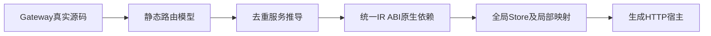
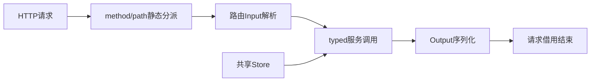

# Gateway 执行实施计划

## Intent：最终目标

从真实 .gateway.rx 入口生成可监听并调用 RX/ZX 服务的 HTTP 应用。路由静态展开，服务类型独立，多路由共享同一应用级 Store，不引入专用运行库。

## Data：可用证据

现有 Gateway/Group/Route schema 已定义 protocol/listen、prefix、method/path/service，CLI collection 会跟踪 Route.service，但推导仍只接受普通 Module 入口。统一 library.link 与 backend/library 可合并公开服务类型、原生依赖和初值。当前 State 绑定单个 application，服务局部 Store slot 不能直接当全局编号。

## Edges：边界与限制

- HTTP（含省略 protocol 的默认值）先生成静态模型：source_path/name/protocol/listen/routes，路由含完整 path、可选 method、规范化 service 与源码位置。
- Group.prefix 只拼 URL 路径，service 永远相对 Gateway 文件目录解析。Group 的末尾斜线在拼接处合并；路由尾斜线保留，因此 /a 和 /a/ 不同。
- method 省略表示任意方法。同路径相同 method，或任意方法与具体方法重叠，编译阶段拒绝。GET 与 HEAD 独立，不隐式回退。
- 第一阶段为精确路径模型：必须以 / 开头，不含 query/fragment、空白、控制字符和反斜线，百分号编码须完整。参数与通配模式显式拒绝，不能假装已经实现动态路由。实际请求只以 query 之前的 path 匹配。
- 非 HTTP 协议的既有 Schema 检查保留，HTTP 执行分析拒绝未支持协议。collect/check-rx 接入 HTTP 语义模型后可校验 Group 展开冲突；通用 rx.validate 仍承担 Schema 校验，不把结构检查当作应用执行验证。
- 第二阶段去重分析每个服务，用统一 library.link 合并；多个 facade 共享 canonical ABI，原生依赖取并集。
- 第三阶段建立物理 Store 表、服务局部到全局 slot 映射和单实例初始化；每请求独立 arena，JSON 输入在请求 arena 中解析。不得每路由各建 State，不做隐式全量深复制。
- 第四阶段生成 HTTP 循环和静态 typed 分派，普通业务 Output 转 JSON；解析错误400、无路径404、方法不匹配405、业务错误500。HTTP之外协议必须明确报未实现。并发与长期 Store 回收仍需独立证明，不能用顺序运行掩盖这些缺口。
- 不新增测试、不跑全量测试、不用浏览器；使用真实文件、定向构建和本地请求记录验证各阶段。

## Answer：交付与成功标准

compiler 负责路由、类型、Store身份与链接，genz 负责静态分派与适配器，CLI 负责装载和构建。每阶段保留代码草稿与证据；只有真实 Gateway 应用执行并满足共享状态契约后才称执行链路完成。以下按阶段记录实现过程，最终范围和证据见末节。

## 自我复核

Gateway schema通过、路由模型通过、服务单独可编译、HTTP监听成功是不同层次证据。尤其当前请求提交后的区域保留不能证明长期有界回收，正式报告必须保留这一缺口。

## 阶段一实际结果

新增 rx_analysis.gateway.analyze，返回拥有独立 arena 的路由模型。编译器 dist 与模型展示程序构建成功。真实 XML 得到 /api/echo(GET) 和 /api/v1/echo(POST)，两者 service 均相对 Gateway 所在目录归一。Group 展开同方法冲突、任意方法重叠拒绝；同路径 GET/POST 通过；参数模板与无效百分号拒绝，并提供属性位置。非 HTTP 既有 Schema 检查保持通过。源码包边界复核发现并修正了跨 Zig module 直接导入 rx 私有 checks 的问题，现使用分析层既有属性读取接口。

阶段一不提供监听或服务执行；后续仍需统一服务链接、共享 Store 映射与 HTTP 宿主。未新增测试，未运行全量测试。

## 阶段二与三接入中

CLI 已保留 Gateway 原始节点，并添加服务去重分析器复用统一 library.link。genz 新增 renderStorage，保留原有 render/renderWithCapabilities 与 Request.write 契约；共享存储无需绑定单个 execute。新增全局 pending 契约和各服务局部槽位适配器，编译后端按物理 Store 身份去重并合并可写需求；局部适配器仍检查各服务权限。dist 构建通过，但新服务分析器与映射器尚未由完整 Gateway 构建路径调用，不能据此认定这些延迟分析函数已通过编译或执行。下一步接 HTTP 分派与 CLI 构建入口。

## HTTP 接入边界

HTTP 默认监听 127.0.0.1:8080，listen 只接受带端口的数字 IP 地址；max_header_bytes 默认 8192，允许 1 至 16777216，max_body_bytes 默认 1048576，可设零。每连接只处理一次请求并关闭连接，先按方法与 query 前的原始路径选择服务，再按 Content-Length 或 chunked framing 读取 JSON。无长度且无分块标记按空请求体处理。void 输入只接受空请求体，void 输出为 JSON null；HEAD 输出由 HTTP 层省略报文体。方法不匹配返回 405 并带 Allow。当前不解压输入、不解析路由参数、不提供 TLS 服务端与并发处理。

新增编译入口、静态分派生成器和 HTTP 宿主，生成模块共享原生 ABI。应用 State 通过独立 pending 契约避免与 HTTP application 循环依赖。构建缓存把 runner 内容纳入身份，Gateway 复用既有 backend 与 watch 发布流程。

## 首次运行证据

完整 dist 构建、Gateway 应用构建成功。真实请求确认 GET JSON、POST JSON、query 路径匹配，以及 400、404、405、415、417 响应。第二个应用包含两个服务，共享计数 Store：启动读取 3，POST 更新至 7，独立 GET 读取 7，chunked POST 更新至 9，后续 GET 读取 9。HEAD 只返回头，405 列出 GET、HEAD，void 输入拒绝非空请求体，过大 Content-Length 在读取请求体和发送 100 Continue 前返回 413。

最初对截断分块报文的手动请求未关闭发送端，因此底层等待后续字节，客户端超时；修正探测方式为发送完毕后关闭写端，服务器返回 400 并继续服务后续请求。这也说明当前没有请求超时，不能把顺序宿主描述为生产并发服务。

## 最终核对

- 完整 dist 构建通过。空 Gateway 返回 404；128 字节头上限返回 431。超长头的连接关闭后客户端还能观察到 reset，记录保留该传输行为，不把它描述为连接复用。
- 原生服务共用 ABI，实际读取服务器环境变量、读取文件和写 stdout 成功；void 输出为 JSON null；FileNotFound 返回 500，具体错误只写 stderr。Windows x86_64 原生服务交叉构建成功，未在 Windows 执行。
- 双 Store 服务的局部槽位与全局槽位顺序相反，实际生成 `store_0 → store_1`、`store_1 → store_0` 映射。更新 counter 后，另一路由返回新 value 和新 history 数组，另一 Object 保持 100。证明了当前样例中的跨路由状态共享和请求内存保留，不是长期有界回收证明。
- 32 字节正文边界成功，33 字节分块正文返回 413。Content-Length 与 chunked 提前 EOF 均返回 400，不执行更新；请求前后 Store 相同。该检查来自同步 HTTP 截断反馈的根因复核，独立客户端修复已另行提交。
- 混合大小写 `Expect: 100-CoNtInUe` 先收到 100 Continue，发送正文后收到 200。实现同时规范化 Zig 标准库内部的大小写敏感判断。
- 无输出模式、verify、fpga、lib、discard、非法监听地址、非法上限与非 HTTP 执行均拒绝。最初三个模式探测漏带 --out，仅触发参数检查，已补齐命令重新执行，最终证据来自完整命令。
- 实际 watch 运行经历首次发布、修改 Gateway 路径、恢复原文三次发布。新程序匹配 /api/mirror 并拒绝旧路径，恢复后可执行文件 hash 与初始相同；路由变化复用全部三个服务生成单元，generated=0、reused=3。

修正取消传播时曾直接比较 Zig 可选错误与错误字面量，生成应用编译不通过；已改为先解包，再判断 Canceled。修后空入口、原生服务、共享状态、Windows 交叉构建和 watch 均通过。所有源码草稿与最终实现同步，未新增测试、未运行全量测试、未用浏览器。

自我复核结论：HTTP Gateway 的声明到实际执行链路已接通；其他协议、并发、超时、TLS 服务端及 Store 长期回收仍未完成，也未启动编译器自举。
