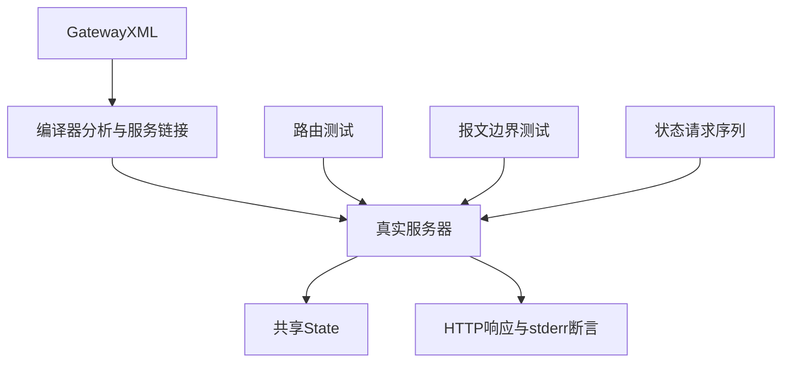
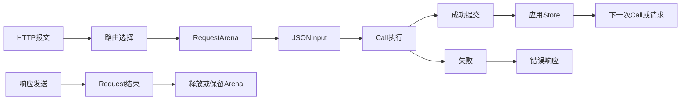

# Gateway 请求验证计划

## Intent：最终目标

第 393 部分针对 63915630 的 HTTP Gateway 新执行链路建立回归，验证路由、请求输入边界、显式原生能力与应用共享 Store 的跨请求行为。

## Data：可用证据

读取 Gateway 执行参考、rx Gateway Schema/分析、CLI runner_gateway、genz gateway 分派与 adapter、State.Request 提交机制。沿用 tests/runtime/http 的本地网络和临时构建组织。State 保存指向应用值槽的稳定指针；成功 Call 提交，后续失败不回滚之前 Call，写入请求 arena 保留至应用结束。

## Edges：边界与限制

本地回环独立进程，测试宿主控制端口、进程参数、专用环境变量与临时 cwd。HTTP 宿主为顺序服务；不声称并发、超时、TLS 或长期有界回收已实现。测试仅写 packages/test/docs，缺陷交指定实现会话修复。已实现契约和测试夹具错误必须区分。

## Answer：交付格式与成功标准

按路由、报文、状态与分析分组，建立 test-gateway 入口并加入总测试。覆盖正常与失败路径后的恢复；用精确 JSON/原始 HTTP 断言观察实际服务。Debug/ReleaseSafe 通过，保存执行记录、源码草稿、自我批判后提交 push。

## 执行结论

完成 134 项新检查（48 定义分析 + 86 实际应用场景），Debug 与 ReleaseSafe 均通过。发现并验证修复非法请求头、显式端口和超限连接关闭边界，生产提交 530b944d。详细语义、剩余边界与自我批判见 Gateway请求验证记录。
