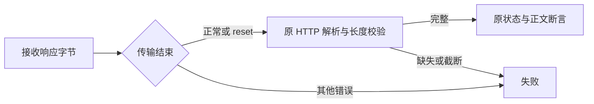

# Gateway 连接复位核验

## Intent：最终目标

让 Gateway 测试按照已接收的完整 HTTP 响应判断结果，区分完整响应后的 TCP reset 与响应传输失败。

## Data：可用证据

专用组合在 513 字节请求头边界报 ECONNRESET，单独复验的 86 项通过。`确定性故障注入/Gateway连接复现.mjs` 对真实 Gateway 交替发送 512/513 字节请求头共 100 次，`Gateway连接结果.json` 记录 35 次 reset，全部收到完整 431 响应且 content-length 为 0，未出现空响应。

## Edges：边界与限制

只调整测试客户端的 ECONNRESET 处理，保留实际状态、头边界和正文长度校验。重置时没有完整响应仍会失败；其他网络错误立即失败；不重试请求、不改服务端、不放宽预期状态。此结果只描述已实际观测的场景，不证明服务端所有关闭行为都正确。

## Answer：交付与验证

`tests/runtime/gateway/request.ts` 在 ECONNRESET 后等待 close，再由原解析器验证已接收字节。`zig build test-gateway -j2` 复验退出码 0，86 项全部通过，日志为 `确定性故障注入/Gateway响应复验.log`。

## 自我复核

调整依据是 reset 前的完整响应证据，而非通过放宽断言消除失败。没有把 ECONNRESET 直接当作成功，它仍须经过原有协议校验；固定长度体被截断和完全没有响应不会通过。
