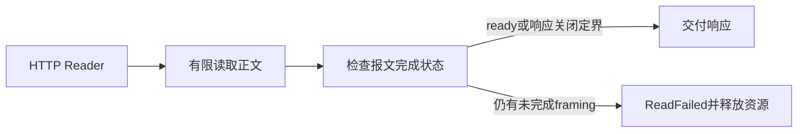
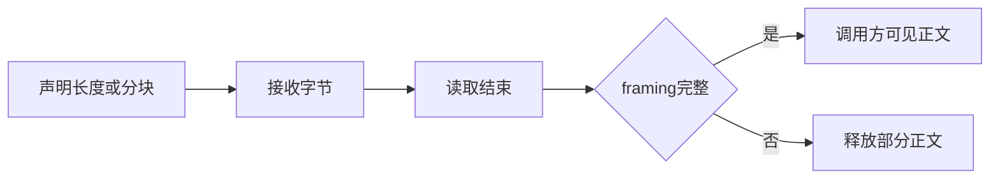

# HTTP 报文截断修复

## Intent：最终目标

拒绝提前 EOF 的不完整 HTTP 报文，不将读到的部分正文返回为成功响应。

## Data：可用证据

独立测试会话第 392 部分发现：响应声明 Content-Length 为 10，只发送 abc 后 EOF，std:http.request 返回成功。底层 allocRemaining 把 EndOfStream 视为读取结束，而 Content-Length reader 在尚有剩余字节时透传该错误；底层 HTTP Reader.state 仍为 body_remaining_content_length。chunked 的完成条件则是完整零长度终止块与 trailers，完成后同样进入 ready。

## Edges：边界与限制

不比较特定正文或固定长度。读取完成后按 HTTP framing 状态判断完整性：ready 表示已完整读完声明长度或分块；body_none 表示合法的连接关闭定界。其他状态不能成功交付。HEAD、204、304 没有正文，继续按既有规则跳过读取与完成状态检查。长度超限仍优先返回 StreamTooLong，错误路径释放已分配正文与响应头。

同一根因也适用于尚未提交的 Gateway 输入读取。Gateway 对无 framing 的请求显式使用长度零，因此它的成功状态必须为 ready；截断请求返回 400，不调用业务服务。

## Answer：交付与成功标准

std:http.request 增加 framing 完成检查，不改公共接口与成功响应形状。复用测试会话已经提供的 test-http 定向回归，不新增测试、不执行全量测试。Gateway 修改保留在其独立 feature 变更中。

## 自我复核

EOF 与报文完成是不同概念。修复依赖底层明确状态而非特定复现长度；仍须以定向回归及真实 EOF 证据确认。本文初次写入时尚未运行修后回归。

## 修后验证

在 packages/test 执行 `zig build test-http -j4 --summary all`，8/8 构建步骤成功、54/54 回归通过，包含声明长度截断、分块数据截断和终止块截断。未新增或修改测试，未执行全量测试。首次在仓库根调用同名步骤因根构建不提供该步骤而退出，随后改为规定的 packages/test 目录；不把工作目录错误计为产品失败。真实 TCP 验证由独立测试会话继续执行，本次不提前声称已通过。
