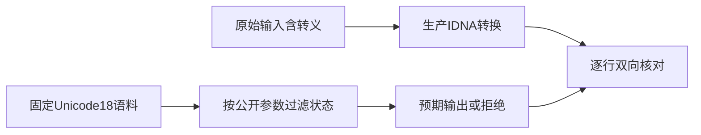
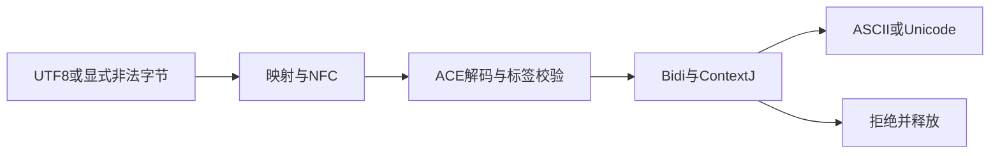

# IDNA 一致性验证计划

## Intent：最终目标

阶段408：对 Unicode 18 官方 IdnaTestV2 全量输入验证当前 URL 所需 IDNA 参数组合，补齐映射、NFC、ACE、Bidi 与 ContextJ 联合路径。

## Data：可用证据

生产 de6b79b3；官方 [UTS #46 第8节](https://www.unicode.org/reports/tr46/#Conformance_Testing) 与 [WHATWG IDNA 参数](https://url.spec.whatwg.org/#idna)。原始 IdnaTestV2.txt 固定在测试包 upstream/unicode/18.0.0，另存摘要和 profile；沿用同目录 Unicode License V3。

## Edges：边界与限制

启用 Bidi、Joiners；不启用 Hyphens、STD3、DNS 长度、transitional；不忽略无效 Punycode。依数据头规则过滤 A4_1、A4_2、V2、V3、U1，其余错误必须拒绝。所有 6396 行参与，不因实际结果失败而删行。

内部 toUnicode 是有效域名的严格转换，不提供 UTS 通用 ToUnicode 的错误恢复文本；其接受/拒绝与本 profile 的 ToASCII 共用校验。成功时比较官方 Unicode 输出，失败时验证错误。空域名和空标签留给外层 host 处理，因此不把 ToUnicode 的 X4_2 错误恢复约定当成本接口契约；以过滤后的 ToASCII 状态确定两方向校验结果。这一范围区别明确记录，不宣称完整 UTS 参数化接口。

## Answer：交付与成功标准

新增 test-url-idna，逐行双向检查输出或拒绝，失败定位官方行号；固定摘要与完整数量，配套无效 UTF-8 和分配失败回归。Debug、ReleaseSafe 通过后提交推送；实际缺陷反馈实现会话。





## 语料与读取正确性

固定官方文件 776,565 字节，SHA-256 为 0236b75c5b20dfd857b3b5cf75509887959d6ab00d6c7bda9b7dc3df518c1fde。逐行读取七列，按数据头处理空字段继承及显式空字符串；转义支持 uXXXX 和 x{XXXX}，单次展开，不递归解释展开结果中的反斜杠。

过滤当前未启用的五类状态后，预期接受 847 行、拒绝 5,549 行。两个孤立代理输入转为显式非法 UTF-8 字节，以验证字节接口拒绝它们，没有悄悄替换为 U+FFFD 或跳过。所有 6,396 行均执行 toAscii 和内部严格 toUnicode，共 12,792 次语料转换。

独立 Python 读取器展开输入、两类期望和接受状态，采用长度分帧计算摘要；Zig 读取器对同一逻辑流计算相同摘要 36015d2470100ed26eb5e6c4525c2e876caff7102026737088b74e983fd28a53。该核对避免测试读取器同时错解输入与预期而误报通过。

## 资源与参数边界

资源回归覆盖 Unicode 映射到 ACE、ACE 解码、偏差字符非 transitional、NFC 合成、virama 允许的连接字符，以及参数允许的空标签、连字符位置和非 STD3 ASCII。无效 UTF-8、无效连接上下文、Bidi 与混合数字、初始组合字符、空/损坏 ACE 均执行两方向失败路径及逐分配故障检查。

核心函数失败时，临时 arena 和已构造的输出都必须释放。正例精确比较输出，负例仅接受 InvalidDomain 或 InvalidPunycode，OutOfMemory 等其它错误不会伪装成语义拒绝通过。

## 最终验证

Debug 与 ReleaseSafe 各 6/6 步骤、14/14 回归组通过，其中四组语料/完整性检查、十组资源及参数边界。每模式的 12,792 次语料转换不重复计作 12,792 个独立 Zig 测试。独立语料核对、Zig 格式和自有修改的 diff 检查通过；未修改生产实现，没有发现生产缺陷，未向实现会话发送消息。

## 自我批判

此结果只证明已记录参数组合和内部严格转换契约。它不是 UTS 全参数矩阵，也没有实现通用 ToUnicode 的带错误恢复输出、transitional 转换、DNS 长度或 STD3 检查。尤其 X4_2 的通用输出状态与内部空标签行为已明确区分，未依据测试结果临时放宽过滤规则。

本轮测试直接调用 IDNA，未通过 host 层的 ASCII 快捷路径，避免该路径绕过 ACE 检查而让 IDNA 错误隐藏。完整主机处理与 URL 状态机需要下一阶段单独验证。没有新增 Test262 适配或修改既有 JSONL 计数，整体目标仍未完成。

## 复验命令

仓库根核对语料及 profile：

```sh
python3 docs/2026-10-05/IDNA一致性验证/核对语料.py
```

在 packages/test 执行：

```sh
zig build test-url-idna --summary all
zig build test-url-idna -Doptimize=ReleaseSafe --summary all
```

官方 IdnaTestV2 原文有七行行尾空格，保留原始字节和锁定摘要；diff 空白检查仅排除此原始数据文件，自有代码及文档正常检查。
