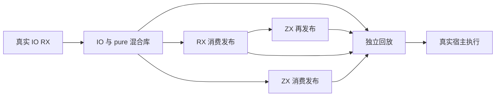
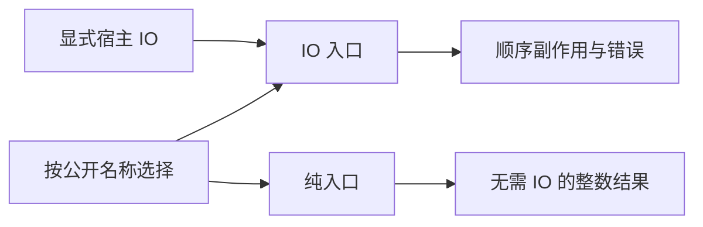

# IO 统一库消费者验证计划

## Intent：最终目标

第 382 阶段验证 IO 能力和 evaluate 语句跨统一库发布、解码、导入及再发布后仍完整保留；同时检查同库纯计算入口不会因为存在 IO 函数而被错误要求传入宿主 IO。

## Data：可用证据

上一阶段 8 种 RX 入口、54 项执行组合已通过源码生成运行。现有 Parallel 的 library archive/replay/consume 工具使用正式链接、编码、解码和编译包导入接口，本身不依赖 Parallel 语义，可用于相同契约类型的 IO Program。std:fs 使用注册模块 zxc_standard；回放必须让正式标准库和宿主夹具共享生成 ABI。

## Edges：边界与限制

只新增测试路径及纯入口断言，不修改库 codec 或 IO 生产实现。不复制原生标准库，不把实现对象保留在同一进程冒充产物加载。IO 执行沿用上一阶段真实文件预言和宿主故障注入。当前所有权实现有并行工作，记录真实验证基线，不混入其生产改动。

本阶段不覆盖 Store.Request IO 或 Gateway；也不把编译路线组合算成新增 Test262 原文数。

## Answer：交付与成功标准

- 复用成熟的 archive/replay/consume 工具，只给 IO 编译驱动增加归档出口；统一库同时包含 scalar 纯函数、workflow 和 alias 两个 IO 导出。
- 正逆链接顺序分别取不同 IO 导出；走直接回放、RX 导入发布、ZX 导入发布、RX 发布后 ZX 再发布四条路线。
- 同时沿四条路线选择 scalar 导出，用无 IO 参数的 execute 调用验证纯能力隔离；覆盖零值、普通值和最大安全整数。
- 所有消费者仅接收 `.zxlib` 与最小消费者源码。解码原 bytes 覆盖释放，原库和消费者分析对象先销毁，再编码消费者产物，最终在独立进程回放。
- 原有 source 专项保留，新增 library 专项并接入 IO 聚合；运行新聚合并核对真实计数、格式与本次 diff，完成后提交 push。

## 自我复核

当前为实施计划。源码路径通过不等于发布后通过；纯入口单独验证也不能替代 IO 入口的宿主故障测试。只有全部真实执行结束后填写实际结果。

## 第 382 阶段执行记录

已新增归档出口及 IO 库专项。每种 IO 模式均经过正/逆两种导出顺序、直接回放/RX 导入/ZX 导入/RX 后 ZX 再发布四条库路线，保留原来的 54 项源码执行。共享前述 Parallel 的成熟 archive/replay/consume 工具，没有复制 codec 或导入实现。

IO 库路线实际执行 432 项副作用断言组合；混合库中的 scalar 导出沿同样路线运行 192 项纯入口组合，覆盖零值、普通值和最大安全整数。总 IO 聚合为 678 项，其中本阶段新增路径组合 624 项；纯入口只新增 3 个测试声明，不把重复路线统计成新的语言语义。

遇到并修正两处测试接入问题：

1. 构建矩阵最初把 inline for 与运行时 case 循环混用，Zig 报 comptime control flow inside runtime block；改为普通枚举/布尔数组循环，见首轮日志。
2. 共享 RX 消费者假定返回值非 void，绑定真实 void 导出时被编译器正确拒绝。现在按库公开导出的真实 output_type 选择 consumer.rx 或无 out 的 consumer_void.rx；没有按测试模式名硬编码，也没有修改生产端的 void 绑定规则。该轮其余 666 项已通过，见聚合结果日志。

最终运行 `zig build test-rx-io test-rx-parallel-import --summary all`，退出 0：**1495/1495 步骤、1128/1128 测试通过**，见 [最终日志](IO统一库消费者测试草稿/最终结果.txt)。其中 IO 聚合 678 项、共享消费者工具的既有 Parallel 导入回归 450 项。新入口 `test-rx-io-library` 与原有 `test-rx-io-runtime` 由 `test-rx-io` 聚合，再通过既有 RX runtime 接入根 test。

真实文件顺序、失败后停止、旧输出存活及逐次分配失败断言均保留；传入宿主 IO 的 dirOpenFile/dirRename 故障也贯穿库与消费者执行，证明保留了实际 IO 传递，而非只保留一个序列化标志。pure 测试以两个参数实际调用 execute，不接受多余 IO 参数。

验证基线为 a2c268a5 加实现聊天的并行所有权改动，归档时涉及 analysis/expressions.zig 和 ownership/check.zig，记录验证后文件指纹，不称固定 HEAD 或根全量回归。本阶段未发现需反馈的生产缺陷。

自我复核：消费者选择 void 夹具依据正式产物契约，未放宽错误检测；没有跳过 void 场景。运行矩阵展开只用于不同链接与消费路径验证，不增加 Test262 原文数。下一阶段补 Store.Request IO 的请求生命周期和失败前后提交边界。
