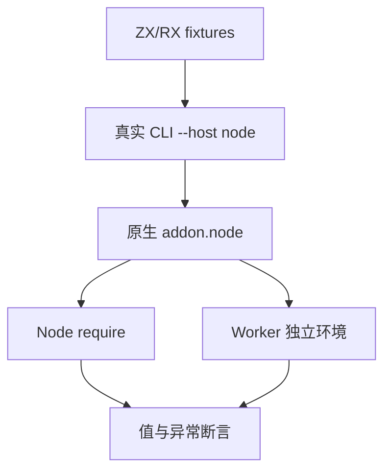
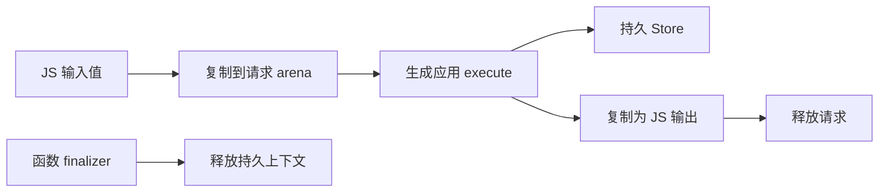

# NAPI 协议验证计划

## Intent：最终目标

对 `--host node` 产物进行真实 Node 加载与执行，验证直接值转换、错误传播、请求内存所有权及 RX 状态隔离。测试集中于宿主边界，不以编译成功代替执行成功。

## Data：可用证据

已阅读 `NAPI参考.md`、`NAPI实施计划.md`、`packages/napi/src/{read,value,write}.zig` 与 CLI Node runner。基线为 `3e1a3f34`。既有 WASM 测试提供真实 CLI 构建与临时目录管理的成熟结构，但 Node 参数域和结果类型有独立契约。

## Edges：边界与限制

- Number 窄整数检查范围、有限性和整数性；u64/i64 仅接受无损 BigInt，不能沿用 WASM 自动按位截断的预期。
- 字符串、字节、数组、元组、记录、nullable 与枚举均走真实 JS 值；不通过 JSON 序列化替代宿主转换。
- getter 异常必须保持同一异常对象，重入同一 execute 必须拒绝；失败后验证下一次合法调用恢复。
- 输入和输出字节内存必须独立。持有 execute 引用时上下文应存活；GC 压力只作为具体工作负载证据，不宣称证明所有内存生命周期。
- Worker 内状态独立；不以 require.cache 删除模拟动态库卸载。
- 本机运行不能证明 Linux/Windows 运行。TypeScript 声明与模块入口仍由实现会话开发，待稳定后新增对应验证。

## Answer：交付格式与成功标准

在 `packages/test/tests/targets/napi/` 按标量、复合值、状态和 Worker 划分用例，新增 `test-napi-protocol` 构建入口。Debug、ReleaseSafe 实际编译和运行，遇到生产问题反馈指定实现会话；本阶段通过后独立提交推送。

## 执行记录

正式样例和 Node 宿主断言已加入 `tests/targets/napi/`，构建入口已接入。实际运行与限制见《NAPI协议验证记录》。
