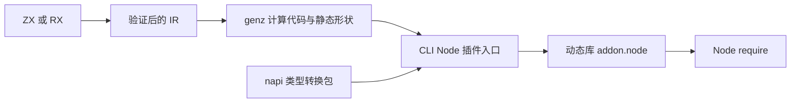
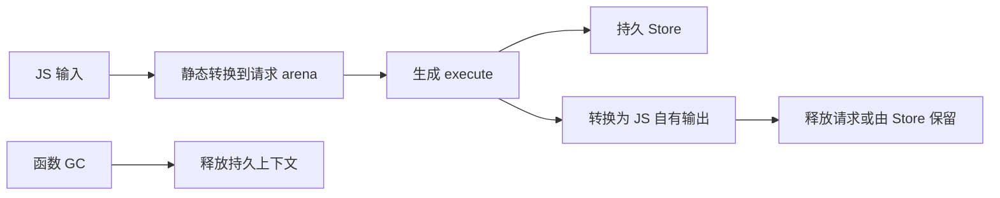

# N-API 实施计划

## Intent：最终目标

将 ZX/RX 应用构建为 Node 可加载的 .node 插件，使用 Node-API 稳定 C ABI，参考 napi-rs 的静态类型转换与 JavaScript 生命周期关联方式。新增 --host node 选择宿主，保留 app/lib 模式；计算代码仍由现有 genz 生成。

## Data：可用证据

现有 ModuleBundle、共享 ABI、staged 发布、Store Request 可复用。WASM 已证明独立宿主入口无需改写计算语义。当前生成类型将 string 和 u8[] 都映射为 []const u8，因此 Node 边界不能单靠 Zig 类型反射猜测语义，需由 genz 保留静态输入输出形状。

官方依据：[Node-API](https://nodejs.org/api/n-api.html)、[napi-rs 类型转换](https://napi.rs/docs/concepts/type-conversions)、[napi-rs 生命周期](https://napi.rs/docs/concepts/understanding-lifetime)。使用 napi_register_module_v1，绑定回调的上下文通过 napi_add_finalizer 与函数对象共同存活；BigInt 转换必须核对 lossless。

## Edges：边界与限制

宿主边界转换有必要成本，不宣称 JS 对象到原生结构体完全零拷贝。没有 ZX 解释器，不调用 JSON.stringify/parse 代替直接转换。输入复制进请求 arena，返回值复制为 JS 自有值，防止宿主 GC 与 Store 借用形成悬挂引用。getter 抛出的已有异常必须保持，不吞异常；回调重入应拒绝。

初始接口同步执行，长计算占用调用线程；不把同步 API 伪装为异步。I/O 和 process 能力需要明确的宿主实现，不借用不存在的 std.process.Init。原生依赖仍须适合选定目标。跨平台构建能力与实际验证平台分别记录，不以 macOS 实跑声称 Windows/Linux 已运行。

## Answer：交付与成功标准

- packages/napi 承担 Node-API 声明与静态输入输出转换；CLI 承担插件入口、构建、资源嵌入；genz 保留语义形状。
- --host node 生成动态库；插件导出 execute，接受真实 JS 值并返回真实 JS 值，void 返回 undefined。
- string、布尔、整数、浮点、可空值、数组、字节数组、记录、元组与枚举有明确映射；64 位整数使用 BigInt，不截断。
- Store 在同一插件执行函数内跨调用保留，各 Node Worker 的模块实例隔离；函数 GC 释放持久状态。
- 完成实际 require、复合数据、BigInt、void、Store、错误恢复与 Worker 消费证据；不生成正式测试或执行全量测试。

## 实施结果

新增 packages/napi，CLI 将包源码嵌入发行文件并按内容摘要写入构建目录。源码、宿主入口及项目配置共同参与产物身份，napi 包也纳入编译缓存实现摘要。资源未变时保留原文件。

genz 为 IR 类型生成编译期形状，以常量引用共享子形状，避免重复展开。入口公开 input_shape/output_shape；字符串与字节列表的区分来自 IR。计算函数、共享 ABI 与 Store 事务复用已有实现。

| 实际验证                                                          | 证据                                                        |
| ----------------------------------------------------------------- | ----------------------------------------------------------- |
| 对象、元组、枚举、nullable、内嵌零字节、BigInt、Buffer/Uint8Array | NAPI/类型边界.json                                          |
| 输入 Buffer 修改后的返回值独立性                                  | NAPI/类型边界.json                                          |
| BigInt 溢出、getter 原始异常、同步重入与错误后恢复                | NAPI/类型边界.json                                          |
| Store 连续调用及 Worker 初始状态隔离                              | NAPI/Store与Worker.json                                     |
| URL 示例 12 个公开接口                                            | NAPI/URL标准库.json；除显式 Buffer 表示外逐字段等于原生记录 |
| void 返回 undefined、void 输入无参数                              | NAPI/空值与观察构建.json                                    |
| watch 初始构建与插件加载                                          | NAPI/空值与观察构建.json                                    |
| 新增形状后 WASM 构建与执行                                        | NAPI/WASM生成兼容.json                                      |
| macOS 实际加载，Linux/Windows 交叉编译                            | NAPI/跨平台构建.json                                        |

Windows 的 node.lib 下载至临时目录，SHA-256 与官方校验清单一致，不纳入仓库。Linux 和 Windows 未实际运行，证据只证明交叉构建成功。本机 Node v25.8.1 已实际 require 和 Worker 执行。发行构建 13/13 成功。

## 自我批判

只靠 Zig 类型会误把 string 和 u8[] 合并，已从生成源头保留语义形状。实际观察还发现 napi_is_buffer 不足以限定字节类型：宽 TypedArray 曾被接受。现改用 napi_get_typedarray_info 核对 uint8/uint8clamped，Uint16Array 已被明确拒绝，复验记录已更新。

没有用 JSON 中转、BigInt 截断或借用 JS 缓冲区替代类型转换。尚未验证所有原生依赖、异步宿主接口和真实跨平台执行；I/O/process 与 Gateway 是未接入的能力。未声称 GC 和无界 Store 工作负载已有全面内存压力证明。未新增正式测试或运行全量测试。

## 用户追加要求

2026-10-05：自动导出 TypeScript 类型定义文件，像普通模块一样使用 Node 插件。现有 .node 直接加载不是这项要求的完整交付。后续需从真实公开输入输出类型生成声明，提供可由 TypeScript/Node 直接解析的模块入口，并验证类型补全、编译期调用检查和真实加载。与插件二进制共同安全发布，避免声明与二进制不一致。

## 类型与模块入口完成

已从 IR 签名生成 `.d.cts`，随 `.node` 发布 `.cjs` 普通模块入口。覆盖 ESM/CommonJS、strict/NodeNext、void、Store、观察构建和失败发布保护。实现边界、自我复核与证据见 [类型实施计划](NAPI类型实施计划.md)。用户最终明确对齐 napi-rs 的使用方式，即原生插件、类型导出和普通模块导入；不要求照搬 napi-rs 的异步能力。Promise/任务调度草稿已撤销，现有宿主能力边界继续如实记录。

## 后续异步授权

用户随后明确要求 Zig 执行到 Node 异步的桥接。新增 executeAsync、Promise 类型声明及原生工作队列，保留 execute；实现与宿主 I/O 未完成边界见 [异步实施计划](NAPI异步实施计划.md)。本项不是扩展为 napi-rs 全特性对齐。
