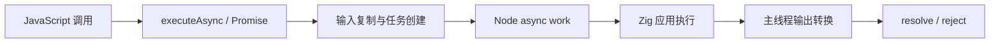
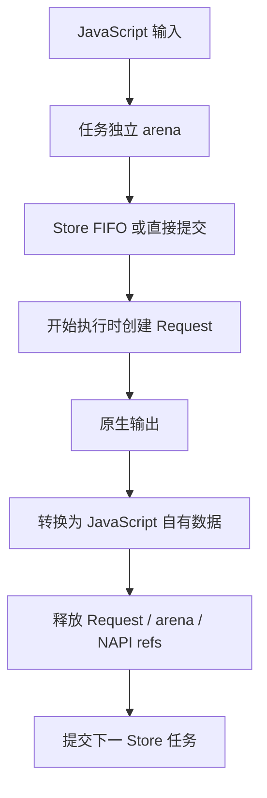

# NAPI 异步实施计划

## Intent：最终目标

把已生成的 Zig 应用执行交给 Node 原生工作队列，在 JavaScript 中提供 `executeAsync` 与 `Promise<Output>`，保留 `execute`。这是真实异步执行，JavaScript 线程只负责输入复制、输出转换和完成通知。

## Data：可用证据

- 当前 Node runner 只导出同步 execute，NAPI 已有类型转换与自动生成 cjs、d.cts。
- Node N-API async work 的 execute 回调不能访问 JavaScript；complete 在环境线程运行，退出时仍须释放原生资源。
- 生成的 Store Request 在创建时捕获状态指针，必须在任务实际开始时创建；排队时创建会捕获旧状态。
- Zig 0.17 Threaded.init 修改进程级 SIGIO/SIGPIPE；InitOptions 没有禁用选项，取消阻塞系统调用依赖 SIGIO。多个插件不能各自任意初始化和恢复这些处理器。
- Zig 0.17 macOS Dispatch 未实现网络操作，Kqueue 有取消和分组任务 TODO。现成 Evented 后端不能作为完整替代。

## Edges：边界与限制

- 本阶段实现现有可编译 Node 应用的异步执行；`requires_io`、`requires_process` 的编译限制暂时保留。不能把本阶段报告为完整 Zig std.Io 宿主适配。
- 同一 Store 的异步调用按提交顺序执行；有待处理异步调用时，同步调用明确报错，避免越序或数据竞争。无 Store 的任务可以由 Node 工作池并行执行。
- 输入在调用时复制。工作线程不持有 JavaScript 数组、Buffer 或字符串的借用引用。
- 不新增公开取消 API，不承诺 Node Worker.terminate 能抢占正在执行的 Zig 计算；退出须等已开始的原生工作完成。
- cjs 薄层创建 Promise，并把 resolve/reject 交给原生 executeTask；原生持有可删除的函数引用。规避环境退出时 deferred 无公开销毁接口的问题。
- 不新增正式测试用例、不跑全量回归；使用现有应用构建和直接运行检查。

## Answer：交付格式与成功标准

交付正式 NAPI ABI、异步任务生命周期与 Store FIFO、自动类型声明、模块入口和实施记录。成功标准是实际异步调用结果正确、错误拒绝 Promise、计时器可在原生任务期间继续执行、Store 顺序一致、Worker 退出不崩溃，并明确 I/O 仍未完成。

## Zig 0.17 并行分配器兼容修复

现有 Parallel lists 示例实际构建暴露 genz 生成的四个 Allocator 回调仍调用 mutexLock；0.17 此函数返回 error{Canceled}!void。Allocator 的 alloc/resize/remap/free 不能传播 Canceled，且临界区管理共享 arena，改用 std.Io.Threaded.mutexLockUncancelable，保持原来的互斥与内存所有权。测试目录中 tracking.zig 也检索到旧调用，测试层由另一会话负责，本次不修改。

## 实施结果

- node/context 管理函数与任务共同持有的状态；node/enqueue 复制输入并创建任务；node/task 执行、完成、释放与顺序提交下一任务。新宿主源码列入构建身份并嵌入 CLI 发行物。
- cjs 新增 executeAsync，声明新增 Promise<Output>，空输入生成零参数签名。同步 execute 保留；存在活动 Store 任务时同步调用拒绝。
- 工作线程只读写原生数据，不调用 NAPI。Store Request 在任务开始时创建，任务 arena 转移给 Request，结果转换后再结束请求并启动下一任务。
- 每个任务使用可删除的 NAPI 函数引用；完成失败与环境 cleanup 清理未提交队列，已提交任务由 Node 完成回调释放。
- 实跑与边界见 [验证记录](NAPI异步/验证记录.json)。应用构建、1,000 次无状态并发、Store 顺序、12 轮 Worker 退出、10 万元素 Parallel、返回错误与恢复、无参数入口、NodeNext 类型检查通过。

## 自我复核

这次实现没有改变生成计算的算法和 Store 事务提交时机，也没有引入解释器；增加的是 Node 宿主所需的调度、生命周期与数据转换成本。不能把这些成本说成 zero copy 或零成本。

验证中纠正了三个脚本假设：类型转换错误的实际名称是 InvalidNodeValue；ZX pop 返回“剩余列表、末项”的元组，而非 JavaScript 的单个末项；整数溢出属于 Zig panic，而非可返回的 error union。第一次大列表断言误比较整个元组导致 Node 构造巨大断言差异，已停止该诊断进程，再按真实返回结构完成验证。类型检查还需要显式 --types node；复制过来的 cjs 文件名必须与本地 node 产物匹配，最终以正常构建重新生成。没有为这些错误假设修改生产语义。

完整 std.Io 异步适配仍未完成：Zig 0.17 的现成后端存在进程信号所有权或功能缺口。不能用静默降级、伪造环境或改写标准库内部标志掩盖。未新增正式测试，未执行全量回归；跨平台运行、长期内存稳定性和任意 native panic 隔离不在本轮证据覆盖内。
