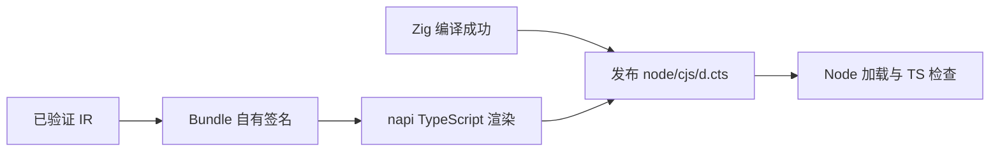

# N-API 类型与模块入口实施计划

## Intent：最终目标

构建 Node 插件时自动生成 TypeScript 声明与普通模块入口，支持代码补全、调用检查、CommonJS 和 ESM 使用。

## Data：可用证据

ModuleBundle 已由完整类型检查后的 IR 生成；napi 包掌握 JS 类型转换契约。新增独立拥有生命周期的入口签名副本，避免从 Zig 文本猜测类型或让声明依赖已经释放的分析 arena。

## Edges：边界与限制

以 --out addon.node 为基名，输出 addon.cjs 与 addon.d.cts。声明扩展名与 CommonJS 入口对应，支持 NodeNext 解析。输入可空值允许 undefined，输出可空值只为 null；输入字节列表与返回 Buffer 分别建模。数值范围仍需运行时校验，TypeScript 的 number/bigint 不表达所有位宽限制。

已有非生成的同名入口或声明不覆盖，返回明确错误；新文件带生成标记。编译失败不发布新声明。watch 会检查派生文件与输入路径冲突，并在稳定构建后发布；不是已加载动态库的热替换协议。

## Answer：交付与成功标准

```javascript
import { execute } from './addon.cjs'

const output = execute(input)
```

输出的 .d.cts 声明 Input、Output 和 execute，void 输入无参数。类型渲染属于 napi 包，Zig 代码生成仍属于 genz。普通构建在暂存目录生成配套文件，随产物发布；观察构建保留同样的目标检查。

完成证据包括真实生成声明、Node ESM/CommonJS 加载、TypeScript NodeNext 编译及错误类型的编译诊断。沿用现有应用示例，不新增正式测试或执行全量测试。



## 实施结果与自我批判

Bundle 通过既有 type_table.copy 保存独立签名，声明生成器以共享别名表达类型图，避免递归内联放大。输入与输出分开描述，保留 BigInt、Buffer、枚举字符串联合、readonly 输入数组/元组和可空字段差异。没有通过执行插件推断接口，交叉构建同样可以生成声明。

consumer.mts 在 strict/NodeNext 下通过类型检查，并以 ESM 命名导入执行成功；CommonJS 入口也已加载。number 与未知枚举名称被 TypeScript 拒绝，诊断保存在 NAPI类型/类型诊断.log。void、无输入函数、Store 和 watch 的配套模块均已加载。失败编译保留旧的 node/cjs/d.cts，同名非生成文件也保持不变，证据见发布保护.json。

声明中的 number/bigint 无法表达完整位宽和有限性约束，运行时检查仍有必要。没有自动创建或覆盖使用者的 package.json，包发布映射由用户项目声明。未新增正式测试或运行全量测试。

用户随后将 N-API 目标从“参考”提升为“对齐 napi-rs”。本次类型和入口完成后，仍须逐项核对异步、宿主能力及其他转换/生命周期差距，不能据此宣称全部对齐。
