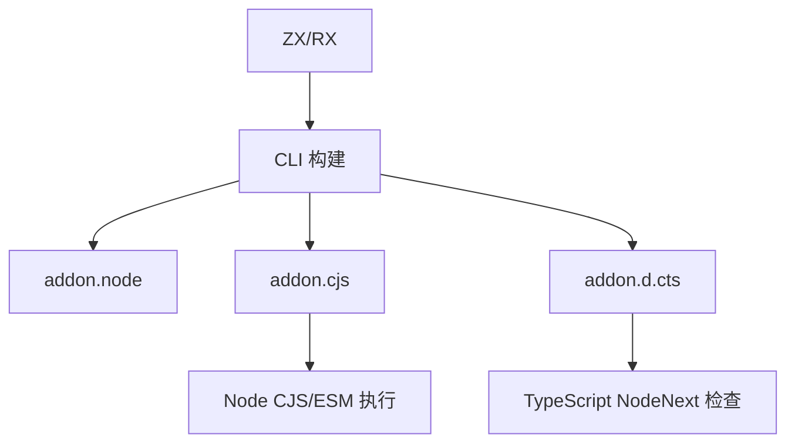
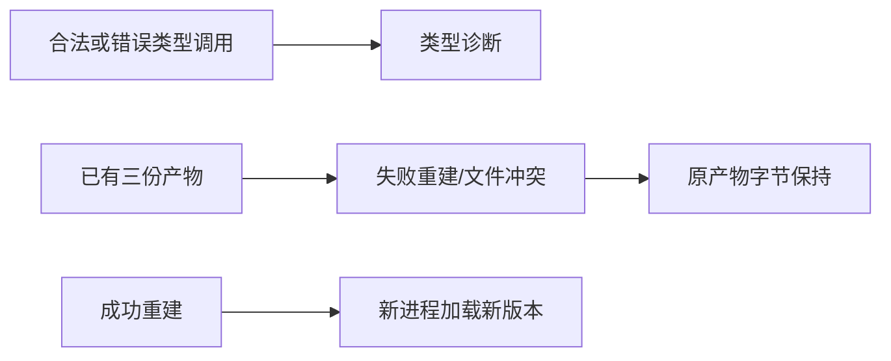

# NAPI 类型绑定验证计划

## Intent：最终目标

验证 `4f541045` 生成的 CommonJS 入口和 TypeScript 声明，使类型消费、真实加载及发布保护形成可重复门禁。

## Data：可用证据

已读取 NAPI 参考、declarations 和 CLI bindings。构建 `.node` 同时生成 `.cjs` 与 `.d.cts`；输入输出声明分别生成，输入可空字段可省略，字节输入为只读数组或字节 TypedArray，输出为 Buffer。非生成文件禁止覆盖，失败编译应保留原三份产物。

## Edges：边界与限制

- 使用真实 TypeScript 严格模式与 NodeNext 解析，不以字符串快照代替类型验证。
- 从 CommonJS、ESM 和 TypeScript 消费入口；错误调用必须出现预期诊断，合法调用必须通过并实际执行。
- 覆盖 void、复合类型、只读输入、输出可变性与 nullable 差异，避免输入输出共用宽松类型。
- 发布保护检查原文件字节保持、名称转义、错误扩展名与汇编路径冲突；不模拟任意文件系统崩溃或跨设备原子性。
- 当前 Zig 为 0.16.0；实现会话正在处理工具链升级，结果需记录实际使用环境，不把升级中的失败自动归为本功能问题。

## Answer：交付格式与成功标准

新增 `tests/targets/napi_bindings/` 与对应构建入口，复用 NAPI 样例类型。真实生成、TypeScript 检查、CJS/ESM 运行和发布失败恢复通过后独立提交推送。发现生产问题才通知指定实现会话。

