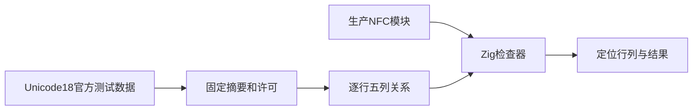
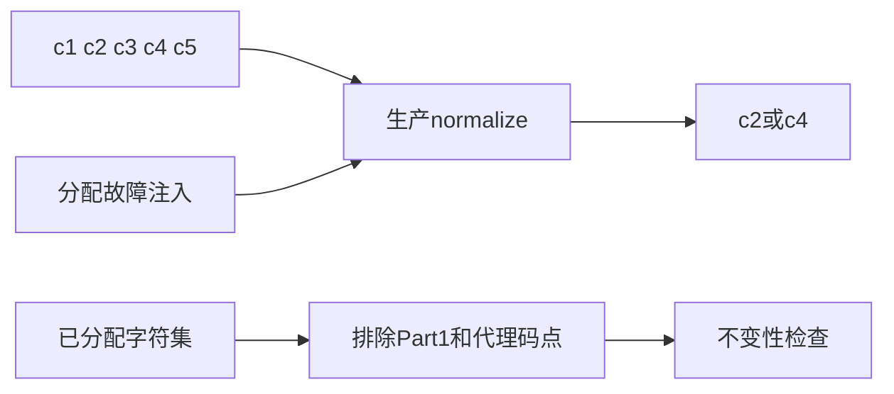

# NFC 一致性验证计划

## Intent：最终目标

阶段406：按固定 Unicode 18.0.0 官方一致性数据验证 NFC 内部实现的完整规范关系，补齐组合排序、分解、再组合及资源失败边界。

## Data：可用证据

生产 URL 域名层使用 Unicode 18.0.0，故测试同版 [NormalizationTest.txt](https://www.unicode.org/Public/18.0.0/ucd/NormalizationTest.txt) 和 [UnicodeData.txt](https://www.unicode.org/Public/18.0.0/ucd/UnicodeData.txt)。原文、Unicode License V3、URL、大小、SHA-256 固定在 packages/test/upstream/unicode/18.0.0/，运行测试不访问网络。

## Edges：边界与限制

只检查 NFC；NFD、NFKC、NFKD 列作为 NFC 输入及期望关系使用，不宣称实现了其它正规化形式。原语接收 Unicode scalar 列表，不接受代理码点。未列入 Part1 的已分配 scalar 按官方要求保持不变。测试直接导入生产 nfc 模块，不使用宿主 normalize 生成预期，不修改生产源码。

## Answer：交付与成功标准

新增 test-url-nfc，逐行执行官方五项 NFC 等式并定位原始行与列；完整已分配字符不变性独立检查，另设无效 scalar 和分配失败回归。记录实际执行数，区分数据行、等式、runner 测试，避免膨胀用例数量。Debug 与 ReleaseSafe 通过，发现缺陷反馈指定会话，完成后提交推送。





## 实施结果

生产基础模块已由实现会话提交 ee6a2c2c。本阶段只新增测试、固定官方数据与构建入口。正式数据放在测试包 upstream 中，避免正式回归依赖某日 docs 里的临时生产生成资源；原始文件不经过格式化，保留许可与原文。

NormalizationTest 六部分共 20,171 行，分布为 Part0 46、Part1 17,154、Part2 2,004、Part3 194、Part4 735、Part5 38。每行五项 NFC 关系共 100,855 项；覆盖具体序列、单字符、规范重排、PRI #29、规范闭包与链式主组合。失败时会显示原始部分、行号和输入列，不只给出汇总失败。

从同版本 UnicodeData 展开 First/Last 范围，排除 Part1 已列出的单字符和代理码点，逐个验证 293,187 个已分配 scalar 的 NFC 不变性。这部分不是随机采样，也不是把宿主较旧 Unicode 集合当作新版本字符全集。

另有空输入、相同组合类稳定性、Hangul 与递归分解输出的故障注入，以及高低代理、Unicode 上界之外和最大 u21 的拒绝及前缀分配释放。正式 runner 共 15 项测试，不把循环中的每次等式执行冒充独立 Zig 测试。

## 验证结果

Debug 与 ReleaseSafe 各 8/8 步骤、15/15 回归组通过。每模式核对 100,855 项官方 NFC 关系与 293,187 项字符不变性，合计 394,042 项规范检查，另有资源与非法输入边界断言。两模式数量不累加成新增独立案例。

独立 Python 数据核对脚本仅解析官方文件，不调用宿主 Unicode normalize；验证三个文件 SHA-256、六部分行数与所有单字符枚举数量，结果一致。Zig 格式与 diff 检查通过，没有全仓回归、浏览器验证或生产代码修改。

## 自我批判

早期定位时先查看了 Unicode 17 文件；确认生产数据版本后，正式测试完全固定为 18.0.0，未混用版本。官方一致性数据与全体已分配单字符检查提供了强覆盖，但不是任意长度字符序列的形式化证明。NFC 通过也不等于 IDNA、Punycode、完整 URL 解析或公开 std:url API 完成。

本阶段没有发现生产缺陷，未向实现会话发送消息。未增加 Test262 审阅/适配数量，未调整旧 JSONL 案例计数；整体目标仍在继续。

## 复验命令

仓库根核对固定数据：

```sh
python3 docs/2026-10-05/NFC一致性验证/核对数据.py
```

在 packages/test 执行：

```sh
zig build test-url-nfc --summary all
zig build test-url-nfc -Doptimize=ReleaseSafe --summary all
```
