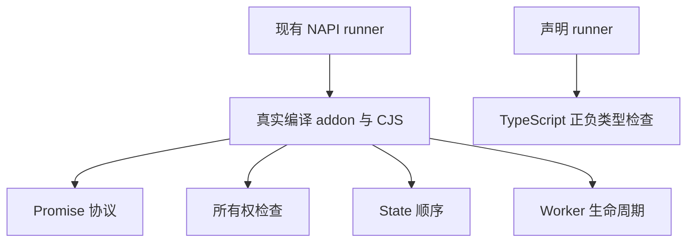

# Node 异步执行测试计划

## Intent：最终目标

为新增原生 async work 桥接提供持续回归，验证公开 `executeAsync` 在值转换、输入输出所有权、State 顺序、失败恢复及 Worker 退出时的行为。复用现有 NAPI 测试入口和真实编译产物，不建立第二套构建工具。

## Data：可用证据

- 实现提交 `d213ec91` 增加 `enqueue`、`task`、`context`，生成 CJS 的 Promise 包装和 TypeScript 异步声明。
- 接入前 `tests/targets/napi` 与 `napi_bindings` 正式入口只调用同步 `execute`；临时实施验证不替代正式回归。
- `enqueue` 返回前读取并复制输入，State 任务按链表排队；`task` 在执行时创建 Request，在主线程转换结果后释放任务；`context` 负责环境关闭和队列清理。
- 只读分析已核对源码与现有测试，尚未将静态风险认定为实现缺陷。

## Edges：边界与限制

- 测试面向生成 CJS/ESM 的公共 Promise API；原生 `executeTask` 任意 callback 抛错的恢复语义未确定，不擅自增加产品要求。
- 不用固定短延迟证明并行。并发正确性检查任务与输入对应、FIFO 前缀和输入快照；后台执行需要独立 CPU fixture 和事件循环观测。
- State 失败后的状态遵循现有提交契约，不能默认所有错误均回滚。
- Worker teardown 必须发送已提交任务握手后再终止，运行于子进程或受超时约束的现有测试进程，防止测试未实际进入任务队列。
- 不改生产实现；发现可复现问题后按用户要求通知实现会话。

## Answer：交付格式与成功标准

在 `tests/targets/napi/async/` 按 protocol、ownership、state、lifecycle 分职责组织，复用已经构建的 addon；只有缺失的通用计算或错误行为才添加 fixture。扩展 `napi_bindings/fixtures/consumer.mts` 验证异步声明，现有 bindings runner 验证 CJS/ESM 可调用性。

1. Promise：正常值、缺参、多参、无输入、无输出、错误类型，拒绝不向调用者同步抛出；getter 异常保留原值。
2. 所有权：提交后修改 Buffer、带 offset 的 typed array、数组及嵌套对象；转移底层 ArrayBuffer、丢弃输入并 GC；结果仍是调用时快照，多个输出互不污染。
3. State：多个不同增量的排队结果为累积前缀；待处理期间同步调用拒绝，队列完成后恢复；无效输入不占队列；Promise continuation 可继续提交。
4. 生命周期：独立 Worker State、正常退出、带活动任务和未提交队列的终止、反复创建销毁；父环境继续可用。
5. 声明与发布：Promise 输出与 await 后类型准确，required/void 参数保持约束，CJS/ESM 和特殊路径输出有效。

## 执行状态与自我复核

现已接入现有 `test-napi-bindings`，复用该入口生成的真实 addon 与 CJS 产物。异步检查在独立 `--expose-gc` 子进程中执行，父进程检查异常、退出信号、退出码和超时；各辅助脚本均登记为构建输入。

## 正式测试分组

- `async/protocol.ts`：18 个 Promise 参数、原始 getter 异常、同步/异步重入、continuation、void 输入输出场景。
- `async/ownership.ts`：42 个输入突变、带偏移 typed array、ArrayBuffer 转移、GC、32 项并发对应及输出相互独立场景。预期结果由输入深复制和 Buffer 协议独立构造，不依赖同步实现作为唯一 oracle。
- `async/state.ts`：11 个 State FIFO 前缀、同步互斥、无效参数不入队及后续恢复场景。
- `async/lifecycle.ts` 与 `worker.ts`：12 个 Worker 组合，覆盖有/无 State、正常退出/提交后终止和三轮重复。待终止 Worker 提交后发握手并用 Atomics.wait 阻止主线程处理 completion，保证父线程不是在空闲 Worker 上验证终止。没有断言所有原生后台计算仍未结束。
- `async/errors.ts`：8 个真实数组索引越界与恢复场景；通用 `state/select.zx` 按输入列表和索引返回元素，`selected.rx` 先读取选中增量再执行原 State 更新。失败发生在 setter 前，因此未改变 State 的断言不依赖额外事务回滚假设。
- `consumer.mts`：11 个新增异步负类型检查，连同既有检查共 33 项编译验证；新增 Promise 和 await 后类型正例。
- bindings runner：CJS/ESM 各验证 record、void、无输入、无输出和 State 异步调用，重发布与特殊文件名场景也检查异步导出。合计 64 个绑定与声明场景。

## 验证记录

Debug 最终门禁退出码 0：91 个异步场景、64 个绑定/声明场景通过，日志为 `Node异步最终Debug.log`。包含执行阶段越界失败、getter 原值异常和 Worker 终止的预期场景均通过。最终 ReleaseSafe 也已退出码 0，通过同样的 91 个异步场景与 64 个绑定/声明场景，日志为 `Node异步最终ReleaseSafe.log`。

## 自我复核与剩余边界

- 未修改生产实现，没有发现已复现的异步生产缺陷，因此没有向实现会话发送无问题消息。
- Promise 类型和主调用栈未 settlement 不能单独证明长时间计算不会阻塞事件循环。本组没有 CPU 压力/吞吐基准，也没有把固定毫秒阈值当作并行证明。
- Worker 终止覆盖未交付 completion 和 State 未提交队列，不等价于所有时间点的线程竞态证明。
- 故障注入接入阶段已提交，全量 test 包回归仍是独立运行，不能以本组通过替代整体 test262 对齐。

新增 `async/*.ts` 已在 test 包依赖环境下通过独立 TypeScript 严格检查：`--ignoreConfig --noEmit --strict --target ES2024 --module NodeNext --allowImportingTsExtensions --types node`，退出码 0，日志 `Node异步脚本类型检查.log`。这与生成声明的 consumer 检查分开，避免 Node 直接执行 TypeScript 时漏掉测试脚本自身的类型错误。
