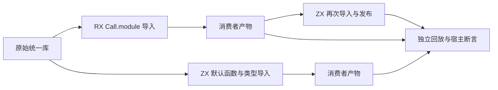

# Parallel 编译包导入验证计划

## Intent：最终目标

第 379 阶段补齐 Parallel 与 Task 从真实统一库导入、再次发布并执行的链路。上一阶段只从库选取模块并回放，未经过编译包导入器；本阶段要验证 RX Call.module 与 ZX 默认导入都能正确重映射并行分支、捕获和类型。

## Data：可用证据

已核对库链接器：每个可执行导出自动保存 Input/Output 公共契约，不需要改 RX 夹具或手写输入输出结构。现有 `tests/library/runtime/replay_import.zig` 展示 ZX 的 compiled package 接口；RX 的 `analysis/call/compiled.zig` 使用同一包实例与产物解析接口，再推导 Call.module。

复用现有 18 种 Parallel 模式及 75 项宿主断言。正逆两种原始库导出顺序、不同公开别名继续作为输入，避免把导出数组位置误当函数身份。

## Edges：边界与限制

只修改测试、构建注册和文档，生产实现由指定聊天维护。导入端只能得到编译库字节与最小消费者源码，不读取原始 RX/ZX 文件。成功后释放解码库再编码消费者，检查导入结果拥有所需内容。工作区有并行 IO/IR 改动，结果不代表固定提交或全量回归。

## Answer：交付与成功标准

1. 独立消费者进程解码产物，覆盖并释放原始字节。RX 消费者调用 Call.module；ZX 消费者从同一编译导出导入默认函数和 Input/Output 类型。
2. 把消费者通过正式 library.link/codec 发布为新产物，原解码库在新产物编码前销毁。
3. 两类一次导入产物分别进入独立回放进程执行；再加 RX 导入发布 → ZX 再次导入发布 → 回放的跨语言链。
4. 三条消费者路线 × 两种原始导出顺序 × 18 模式，新增 108 条执行路径、450 项现有语义断言的路径组合。加原有源码及回放预计 675 项测试。
5. 保留既有专项，新增编译包消费者专项并接入 Parallel 聚合。验证原有错误优先级、逐次分配失败、借用、旧输出存活及线程身份。缺陷确认后再发实现聊天，不降低断言。

## 自我复核

当前是执行计划；只有命令成功后更新实际结果。路径组合不计作新增语言语义或 Test262 原文数量，跨进程回放通过也不能证明所有编译包特性。不得因既有宿主断言失败而在消费者里补偿生产语义。

## 第 379 阶段执行记录

三条消费者路径已实现：原库 → RX 导入并发布 → 回放；原库 → ZX 导入并发布 → 回放；原库 → RX 导入并发布 → ZX 再次导入并发布 → 回放。每条路径均覆盖 18 模式和正逆两种初始导出顺序，共 108 条新运行路径，执行 450 项宿主测试组合。

消费者进程只内嵌最小 consumer.rx/consumer.zx，不携带 Parallel 原始夹具。RX 使用 Call.module，ZX 直接导入默认函数及 Input/Output 类型；均从正式 compiled package 上下文解析，不手动把导出函数接到 Program。解析库使用 page_allocator，库字节在分析前覆盖并释放，原库在消费者产物编码前销毁。消费者分析结果也在 link 后销毁；后续独立 replay 进程验证编码稳定性、IR 合法性，再编译执行。

验证结果：

- `zig build test-rx-parallel-import --summary all`：**689/689 步骤、450/450 Zig 测试通过**，见 [专项日志](Parallel编译包导入测试草稿/首轮结果.txt)。
- `zig build test-rx-parallel --summary all`：**944/944 步骤、675/675 Zig 测试通过**，见 [聚合日志](Parallel编译包导入测试草稿/聚合回归结果.txt)。其中原有源码 75、原有统一库回放 150、本次新增消费者路径 450，避免重复计数。

构建继续保留原有两个专项，新增 test-rx-parallel-import 并由原有 Parallel 聚合接入根 test。没有生产代码修改，也没有发现需反馈的生产缺陷。

自我复核：每一路径都最终执行原有数值、所有权、错误及真实线程断言；仅有类型分析或序列化通过不会使专项通过。新计数代表编译路线组合，不扩大 Test262 原文数。库 byte 清除、实际释放与进程隔离覆盖产物自持有边界，但不构成所有语言特性的内存安全证明。

本阶段 HEAD 基线为 c60ca823，另有实现聊天并行编辑 IO/IR；聚合完成后记录工作区生产文件指纹。未执行根全量回归，不把本轮纯计算流程通过写成 IO 功能已通过。后续优先对新落地的原生 IO 与无 out 的 Call 副作用执行补专项。
