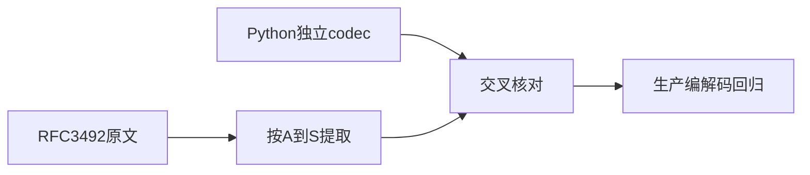
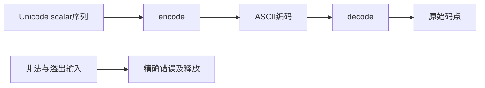

# Punycode 验证计划

## Intent：最终目标

阶段407：逐项核对 RFC 3492 示例与当前 Punycode 编解码，并验证 scalar 边界、无效输入、溢出和分配失败。

## Data：可用证据

生产接口来自 ee6a2c2c 的 url/host/idna/punycode.zig。固定 [RFC 3492](https://www.rfc-editor.org/rfc/rfc3492.html#section-7.1) 原文及 SHA-256，从 A–S 示例提取码点与原始编码，另以 Python Punycode codec 交叉核对有效 scalar 序列。

## Edges：边界与限制

不执行 IDNA 映射、NFC 或域名合法性校验。基本 ASCII 的大小写、控制符和符号保留；不因为它们不适合域名而在原语层拒绝。RFC 可选大小写标注不在当前 scalar-only 接口范围：编码数字输出小写，解码接受编码数字大小写，基本 ASCII 前缀保持原样。

## Answer：交付与成功标准

新增 test-url-punycode，RFC 编码与解码分别执行；边界与混合序列使用独立预期；无效 scalar、无效数字、未终止整数和过大整数必须拒绝并释放已分配前缀。Debug、ReleaseSafe 通过，保留生成与核对记录，发现生产缺陷反馈实现会话，每部分提交推送。





## 实施与独立核对

固定 RFC 原始文本 67,439 字节，摘要 d1848b1b4f01e20708a64f42394e5f4b840141935bed7f09ad7baeb6693b8772，原文保留版权及许可。生成器按 A–S 提取全部 19 项示例，不手工重输码点；每项编码、解码独立测试，共 38 项。

RFC I 包含可选大小写标注。当前接口没有 case_flags 参数，编码预期保留基本 ASCII 前缀，仅将编码数字部分转为小写；解码仍直接使用 RFC 原文。这项转换由 Python 原始 Punycode codec 独立核对，未将整串简单转小写，也没有改变源字符串。其余 18 个示例无需调整。

18 组 scalar 边界形成 36 项双向测试，涵盖空串、ASCII 大小写和符号、控制字符、最小非基本码点、代理区间两端、补充平面、非字符、Unicode 最大值、重复字符和不同规范化形式。256 组固定种子的混合序列由 Python 3.9.6 codec 提供独立预期，全部双向核对，计为一个组合测试。

另有编码数字大小写、全部 128 个 ASCII 值保真、保持 Unicode 规范化差异，以及 10 项拒绝路径和两组覆盖所有 RFC 示例的逐分配失败检查。非 ASCII 基本前缀、无效数字、未终止整数、整数溢出、代理码点和超出 Unicode 范围均被拒绝，已分配的前缀得到释放。

## 验证结果

Debug 与 ReleaseSafe 各 11/11 步骤、90/90 测试通过；两模式共 180 次测试执行，不重复计为独立案例。固定种子组合中的 256 个序列也不计成 256 个独立 Zig 测试。生成器 --check、Zig 格式与 diff 检查通过，无生产代码改动，没有发现生产缺陷，未发送实现会话消息。

## 自我批判

这是原始 Punycode codec，不是完整 IDNA：保留空格、标点、C0 等基本字符是本层职责，不能以域名规则误判它们。Python codec 对非法 Unicode scalar 的允许范围与此接口不完全相同，所以独立预期只用于合法 scalar；非法 scalar 的拒绝依据当前明确接口约束，不拿 Python 的宽松行为放宽实现。

256 组混合输入是固定有限样本，不是无限长度或全部 Unicode 序列的证明。RFC 可选 case_flags 不在当前接口中，本套件没有宣称该功能已实现。本轮不增加 Test262 适配或 JSONL 案例计数，整体目标继续。

## 复验命令

仓库根核对 RFC 摘要、提取及独立预期：

```sh
python3 docs/2026-10-05/Punycode验证/生成用例.py --check
```

在 packages/test 执行：

```sh
zig build test-url-punycode --summary all
zig build test-url-punycode -Doptimize=ReleaseSafe --summary all
```

## 共享提交记录

首次提交遇到并行 Git 索引锁，提交钩子未完成。核对工作区后测试主体仍完整、暂存区为空；两份验证日志已由相邻实现提交 a6f77569 收录。本阶段主体提交引用这两份原始日志，内容与实际执行结果一致。
