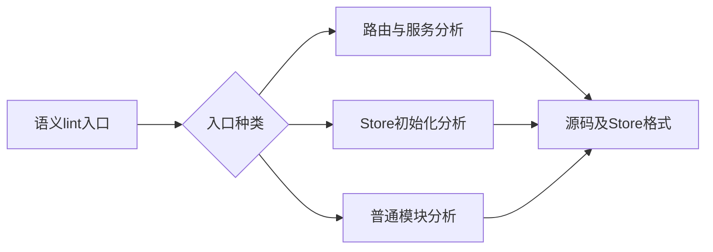
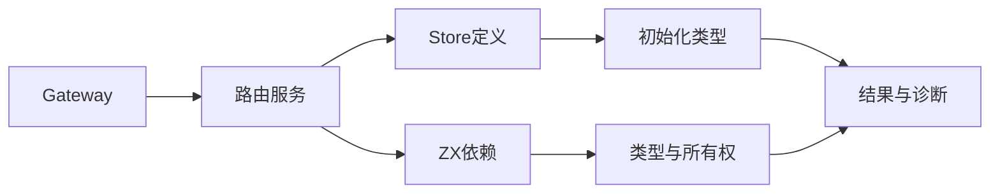

# RX 专用入口语义检查实施计划

## Intent：最终目标

使 lint --semantic 覆盖 Gateway 路由与服务、独立 Store 初始化语义，并补齐普通 RX 引用 Store 的格式检查。

## Data：可用证据

Gateway 的现有 analyze 已检查路由并分析各服务，collection.load 默认检查 Store 初始化类型；上轮 lint 只调用统一库分析，无法把这两个专用文件作为根入口。普通 RX 分析返回的 sources 不含 Store 原文，但 store_definitions 保留定义路径。

## Edges：边界与限制

复用已有 Gateway、Store 和库分析，不生成宿主、不监听网络、不运行初始化程序。Gateway 与 Store 可作为独立路径或清单 entry；exports 保持既有库公共接口语义。原生实现与 HTTP 宿主最终生成仍由 build 负责。未声明、不可达文件不扫描，不运行全量测试或浏览器。

## Answer：交付与成功标准

CLI lint 目录按入口编排与源码检查分工。合法 Gateway、空 Gateway、Store 通过；路由重复、服务类型错误、初始化类型错误被语义检查拒绝；Store 空行格式也纳入检查。记录真实命令、只读证据、代码草稿与自我复核。





## 实施结果与验证

语义入口识别独立 Gateway/Store，或清单 entry 指向的同类文件，交给 lint/rx.zig。Gateway 复用现有路由及服务分析并链接；Store 复用 collection.load 的初始化分析。lint/sources.zig 共用可达源码格式检查，并按 store_definitions 的路径检查 Store 原文。

首次构建暴露经 lint.run 回调形成的错误类型推导环，改成直接读取文本并调用已有 checkSource，消除递归派发，不扩大为不受约束错误集合。最终必要构建 14/14 步通过，没有执行全量测试。

真实 CLI 观测覆盖带共享 Store 的 Gateway、空 Gateway、独立 Store、清单 Gateway/Store entry、普通 Store 使用模块。错误路径覆盖重复路由、缺失服务、服务返回类型错误、Store 初值类型错误，以及独立/普通模块/Gateway 三入口的 Store 格式错误。普通单文件 Store lint 对 `u64` 字段的 `true` 初值通过 Schema 检查，语义模式正确拒绝，证实新增检查实际覆盖类型层。每次主观测前后全部文件路径与摘要相同，未监听网络、未执行初始化业务。

## 自我批判

Gateway 的分析与可达服务通过不保证网络绑定、原生实现或最终宿主构建成功；仍需要 build 和真实运行。独立 Store 检查只能说明声明与初始化表达式语义符合现有规则，不证明长期内存回收或并发安全。清单 exports 继续保留库语义，本轮没有将配置类 RX 文件伪装成库执行接口。尚未完成整个 workspace lint、完整运行时输入检查或自举核心迁移。

历史 Store 归档示例因当前归档版本已变化而报告 IncompatibleLibraryVersion，未把它计作成功。随后从本轮 advance.rx 重新发布到消费/counter，当前归档由消费/main.rx 导入并通过语义 lint；新归档摘要记录在运行结果.json。可按以下命令重建，不提交生成库：

```sh
zxc build docs/2026-10-05/RX专用入口语义检查/示例/advance.rx --mode lib --out docs/2026-10-05/RX专用入口语义检查/消费/counter
zxc lint docs/2026-10-05/RX专用入口语义检查/消费/main.rx --semantic
```

重新消费时先修正 workspace 依赖名，使其匹配归档包名 rx-semantic-demo；Store 调用使用 RX Call.module 保留库内部授权边界，未通过普通 ZX 调用绕过能力检查。最终 RX 消费通过。
