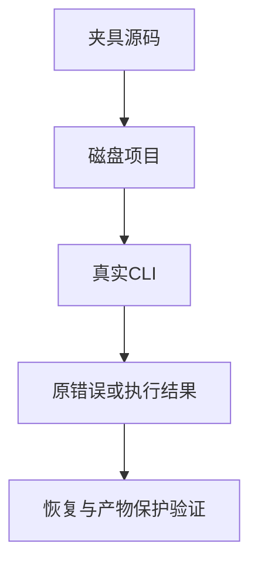

# RX 回归夹具迁移计划

## Intent：最终目标

修复全量回归中仍生成旧式引号表达式的测试夹具，使 lint、磁盘项目恢复、watch、物理Store路径和编译库授权继续验证原本语义。

## Data：可用证据

全量 `Debug复验.log` 的六个失败运行器涉及 semantic_lint 的RX/compiled、RX watch/store_paths/project、library_publish rx_compiled。报错均先出现 invalid_attribute 或输入 type_mismatch。源码仍将 version/value/in/setter 的数值或表达式写在引号中；新RX契约把引号内容当字面字符串，表达式应加大括号。

## Edges：边界与限制

只迁移已确认意图的九个TS夹具/驱动中的属性。保留 service/module/from/as 等静态字符串，以及原错误种类、路径、旧产物保存、输入文件不变和恢复断言。不能把测试期望改成当前提前发生的语法错误。

## Answer：交付与成功标准

先尝试grit做TS嵌入字符串替换，保留尝试证据；无法表达完整范围时采用限定文件和属性的计数替换。运行原六个失败入口，确认它们抵达原语义并通过后提交push。完整回归原进程继续观察，不重启替代其状态。

## 实施复核

grit 已对 Store 字符串完成一次实际替换，其余七文件 24 处属性通过限定属性和值集合迁移。随后复核两个 driver，发现它们还各自内嵌错误恢复用的 missing 表达式，补迁移 watch 一处、project 两处，保留原 name 诊断与产物哈希断言。共享 project_cases 的迁移不能代替 driver 内嵌夹具的审阅。

## 验证与自我批判

专项构建覆盖 test-semantic-lint、test-rx-watch、test-rx-store-paths、test-rx-project-cli、test-library-rx-compiled。首轮 21/23 构建步骤成功，唯一失败项目 driver 在补齐其内嵌夹具前已经加载；其最终独立复验 9/9 通过、进程退出 0。其余入口首轮均通过，watch 1/1、Store 路径 16/16、RX semantic lint 18/18、compiled semantic lint 16/16。原六个失败运行器现均有最终夹具的成功执行证据。

本次没有修改生产实现或错误断言。最初只审阅共享夹具导致漏看驱动内的错误恢复片段；已补读两份驱动并修正三处，不能将第一轮构建写为全通过。全量 Debug 进程仍执行中，保留其原失败记录，不以专项结果宣称全量通过。
