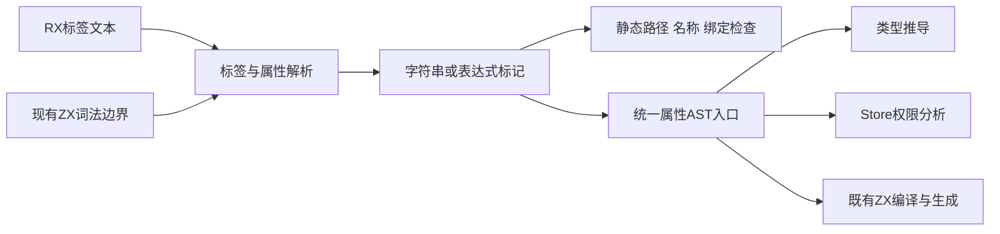
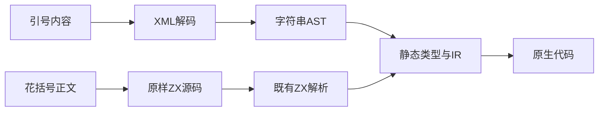

# RX 属性值语法统一实施计划

## Intent：最终目标

优化 RX 属性值语法，统一以引号表示字符串、以 `{}` 表示 ZX 表达式。call 指定 fn 或 service 时无需 .zig 后缀。作为当前整体实现与自举目标的新增需求保留，不替换既有目标。

## Data：可用证据

2026-10-05 用户更新整体目标明确提出此需求，并补充 call 目标无需 .zig 后缀；实施前核查现有标签属性读取、ZX 表达式解析入口、静态类型与生成链，读取 rules/RX开发约定.md，并定位旧语法使用位置。

## Edges：边界与限制

复用现有标签与 ZX 解析能力；迁移旧语法并保持静态契约与 zero runtime。不得为特定标签或用例硬编码表达式分支，不引入第二套表达式解析器。迁移影响范围和错误诊断需基于当前源码核查后确定。

## Answer：交付格式与成功标准

形成语法与迁移方案、正式解析实现、必要的旧用法迁移，以及应用使用文档与 reference。以实际 RX 应用构建和静态类型诊断确认新规则生效，不执行全量测试。本轮仅记录新增需求，尚未宣称实现。

## 实施架构与证据

通用 DSL Attribute 增加 string/expression 种类，普通 XML 入口保持引号语法；带表达式的入口由可选词法边界回调扩展。RX 复用 ZX 已有模板插值边界扫描来跳过嵌套对象、字符串、模板和注释，没有增加第二套表达式 parser。花括号正文原样保留并独立映射源码位置，字符串继续使用 XML 实体与换行映射。

ZX frontend 为已解码字符串创建字符串 AST；RX 类型推导、Store getter/setter 权限扫描、最终表达式编译全部通过同一属性入口区分两种值。静态路径/名称/绑定及类型文本拒绝表达式，setter 仍限制为完整 Object 列表；静态数值配置保留整数字面量范围。格式化从解析后的最后属性边界定位标签结尾，不再把表达式中的 > 当成标签结束。

## 迁移记录

先尝试 Grit HTML 模式，当前模式无法绑定引号属性变量，没有执行改写；随后使用 XML 解析器记录的标签位置和解码属性值迁移。已迁移 474 个受跟踪 .rx 文件、1584 个属性，保留路径与绑定；另外迁移 39 个既有 Zig 文件的 739 个内嵌属性，并区别 Zig 格式串新增花括号的转义。没有新增测试用例。原有手写 AST fixture 标记相应表达式种类；仍按测试自身用途保留故意无效的 XML。

使用者文档、编译器 README 和网站多语言示例同步更新。历史 Markdown 实施记录保留历史语法，实际 .rx 配套文件按新语法迁移。脚本和逐文件记录位于 RX属性值语法/迁移。

## 当前验证与自我批判

编译器 dist 13/13 构建通过。新语法应用真实构建运行：引号中的 $in 原样输出，花括号读取输入并计算；包含对象、比较、&&、嵌套模板与字符串中的右花括号；无后缀 fn 和 service 调用同时经过真实装载。迁移后的既有 Store 应用也已构建运行，连续调用仍共享状态。格式化已接受表达式中的 >、模板和多行对象。

根构建 14/14 成功（包含编译既有 RX 结构测试，但未执行测试）；迁移的 39 个 Zig 文件及手写 AST helper 通过 zig fmt 语法检查。发布 RX 库后的独立 Zig 消费者构建 3/3，实际输出与应用一致。diff 空白检查通过。没有运行全量测试，迁移数量不等于所有旧测试断言都已验证；独立测试会话的反馈仍须优先修复。静态配置未增加通用常量求值器，不能把数值字面量配置称为任意动态 ZX 表达式。

使用规则与复制命令见 [RX 属性值参考](RX属性值参考.md)。新增 SIMD、WASM、N-API 目标记录于 [新增编译目标实施计划](新增编译目标实施计划.md)，不替换本次迁移与原有自举目标。
