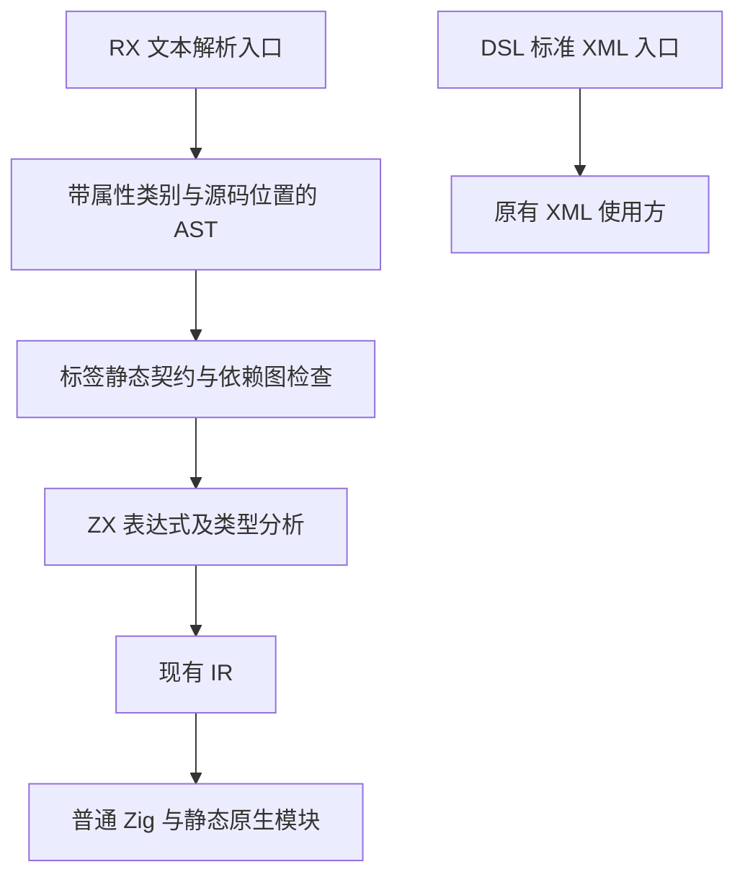
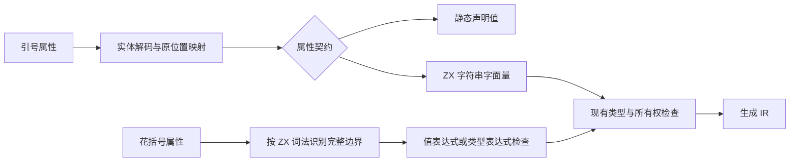

# RX 属性语法迁移方案

状态：方向已确认；本文是待实施方案，正式源码尚未修改。

## Intent：最终目标

RX 使用标签组织编排，属性通过语法显式区分字符串与 ZX 表达式。

- `value="true"` 是字符串。
- `value={true}` 是布尔值。
- `value="123"` 是字符串。
- `value={123}` 是数字。
- `value="ctx.result"` 是字符串。
- `value={ctx.result}` 读取绑定。

不根据字符串内容或目标类型猜测、转换类型。不长期并存旧属性语义。

## Data：可用证据

当前实现的关键位置：

| 文件                                                           | 证据及影响                                             |
| -------------------------------------------------------------- | ------------------------------------------------------ |
| `packages/compiler/src/rx/root.zig`                            | `parseXml` 直接导出 DSL 的 XML 解析器                  |
| `packages/dsl/src/xml/parser.zig`                              | 属性必须有引号，保存解码值与原始值                     |
| `packages/dsl/src/ast.zig`                                     | Attribute 没有字符串／表达式类别                       |
| `packages/compiler/src/rx/analysis/expression.zig`             | 属性内容直接交给 `frontend.parseExpression`            |
| `packages/compiler/src/rx/analysis/project/constraints.zig`    | 项目推导存在独立的表达式解析入口，不能只改单表达式编译 |
| `packages/compiler/src/rx/analysis/store/call.zig`             | Store 输入、setter 也解析属性表达式                    |
| `packages/compiler/src/rx/checks.zig`                          | 通用非空检查会拒绝合法的新语法空字符串                 |
| `packages/compiler/src/rx/features/store/labels/Store.zig`     | version 当前由 Schema 转换为 u32                       |
| `packages/compiler/src/rx/features/gateway/labels/Gateway.zig` | 字节上限也是数值属性                                   |

当前能够通过双层引号区分类型，但读者必须知道哪些属性会重新解析为代码。新语法把这个区别移到词法边界。

## Edges：边界与限制

### 语言边界

1. RX 不再声称兼容标准 XML；DSL 的标准 XML 入口保持原有行为。
2. 引号属性是字符串，保留单双引号与现有实体解码规则，减少无关迁移。需要 ZX 转义时使用 `{"..."}`。
3. 花括号内是原始 ZX 源码，不做 XML 实体解码和 XML 属性空白归一化。
4. 花括号不是动态求值许可。静态路径、名称、绑定声明保持静态契约。
5. 不新增裸布尔属性、属性展开、任意子节点表达式、运行时组件系统。
6. 不新增运行库、解释器或动态加载层；继续编译到普通 Zig，静态链接。
7. Store 生命周期、统一库边界、依赖图与无环约束不变。

### 属性契约

| 属性角色                                                                 | 建议写法                          | 约束                                                                 |
| ------------------------------------------------------------------------ | --------------------------------- | -------------------------------------------------------------------- |
| Return.value、Call.in、Switch.on、Emit.value、Field.value                | `value="text"` 或 `value={expr}`  | 字符串直接成为 ZX 字符串字面量；表达式按既有上下文检查               |
| Case.value                                                               | `value="ready"` 或 `value={true}` | 保留仅字面量及重复标签检查，不扩展成任意常量求值                     |
| Store.version、Gateway 数字上限                                          | `version={1}`                     | 首版只接受可表示为目标类型的整数字面量，拒绝字符串数字和运行时表达式 |
| Field.type                                                               | `type={u32}`                      | 明确的 ZX 类型表达式上下文，不作为运行时值求值                       |
| service、fn、module、from、name、as、Call.out、Task.out、event、路由配置 | `service="orders/create.rx"`      | 字符串承载静态声明；不接受花括号计算目标                             |
| Call.setter                                                              | `setter={...}`                    | 沿用现有 setter 表达式限制，不开放新的写权限                         |
| Module.in、Module.out                                                    | 待核对现有声明消费者后确定        | 不因属性与 Call 同名而归入值表达式；不能在尚未确认语义时机械迁移     |

省略属性仍沿用既有默认值与必填约束。空字符串只在值上下文合法，空名称和空路径仍拒绝。

### 破坏性迁移

旧 `value="ctx.result"` 在新语法中是合法字符串，编译器不可能仅凭新文件判断作者是否忘记迁移。这是最重要的迁移风险：类型检查不一定能发现它。

迁移工具必须按旧版语义和标签契约处理旧输入。例如旧 `value='"ready"'` 转为 `value={"ready"}`，可再格式化为 `value="ready"`；旧表达式需先解码 XML 实体，再包入花括号。

不使用全局引号替换，不为旧写法加入运行期或类型推断兜底。仓库活跃示例、已有测试输入、公开文档与应用指导需在同一次发布切换；历史执行记录保留原状并注明旧语法。

## Answer：交付格式与成功标准

### 目标示例

```jsx
<Module>
    <Call fn='orders/create.zx' in={$in} out='order' />

    <Switch on={ctx.order.status}>
        <Case value='ready'>
            <Return value={ctx.order} />
        </Case>

        <Default>
            <Return value={ctx.order} />
        </Default>
    </Switch>
</Module>
```

```jsx
<Store name='settings' version={1}>
    <Object name='config'>
        <Field name='enabled' type={bool} value={true} />

        <Field name='label' type={string} value='true' />
    </Object>
</Store>
```

以上展示新语法，不表示当前编译器已支持；Field 的实际类型名称仍以 ZX 类型环境为准。

### 架构图



### 数据流图



### 实施顺序

1. 逐一核对标签属性及消费者，补齐 Module 声明语义，确定类型与静态值边界。
2. 给 AST 增加明确属性类别。选择最小共享数据改动，不把 frontend 依赖引入通用 DSL。
3. 新增 RX 解析入口，复用可用的 ZX 词法能力识别嵌套表达式；保持 DSL XML 入口严格。
4. 在标签契约层检查属性形式，调整值属性的非空规则。
5. 统一所有表达式消费者的字符串字面量构造及源码映射，覆盖单模块、项目推导、Store、Case。
6. 更新 CLI 入口和当前文档、skills、活跃示例与已有回归输入。超过五个文件的模式迁移优先评估 grit；语义转换仍须基于旧 AST 与属性契约。
7. 执行现有构建与回归，复核本次 diff；未得到用户要求不新增测试用例，不调用浏览器。

成功标准：布尔／字符串布尔与数字／字符串数字行为明确；字符串不隐式求值；花括号中的字符串、注释、对象及模板不会误截断；诊断指向原文件；静态依赖检查不退化；生成产物没有新增 zxc 运行库。

### 自我批判

优雅并不等于解析实现更短。新语法消除了使用者需要记忆的隐式表达式规则，但增加了语言边界解析工作。实施时不能靠复制一份完整 XML 解析器或维护第二套 ZX 词法规则抵消收益。

本文尚未验证可直接复用的增量 ZX 词法接口，也尚未完成所有入口清单；因此不能作为已完成实现或精确改动量承诺。下一阶段应先解决边界复用和源码映射，再铺开迁移。
